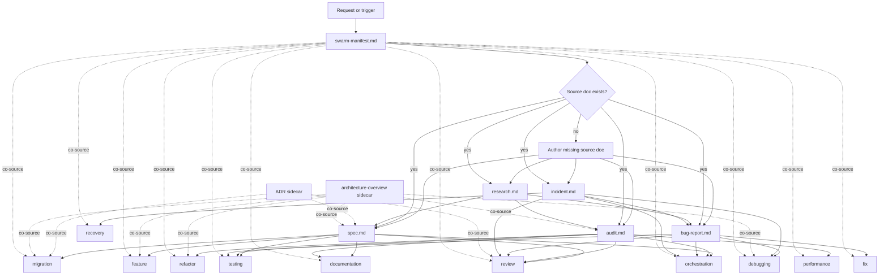
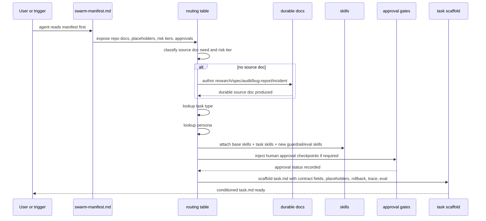

# Key Learnings from the Swarm Research

## 1. Swarm’s core identity

Swarm should be defined as a **documentation-layer contract system for agentic software work**.

It should not become:

- a CLI
- a runtime
- an orchestrator
- a protocol wrapper
- a monitoring product
- a giant prompt library

Its job is to define the documents, routing tables, personas, skills, verification gates, and evidence standards that condition agents before they write code.

The central operating model remains:

```text
source document -> task type -> persona -> skills -> conditioned task.md
```

But the enterprise-grade version adds risk, approval, guardrail, trace, evaluation, and rollback controls:

```text
swarm-manifest.md
  -> source document + risk tier
  -> task type
  -> persona
  -> skills
  -> approvals / guardrails / evals / rollback checks
  -> contract-grade task.md
```

## 2. The most important conceptual upgrade

`task.md` should not be treated as a lightweight execution note.

It should be treated as a **formal task contract**.

A task file must tell the agent:

- what work is being performed
- which durable document authorizes it
- which persona mindset applies
- which skills are loaded
- what risk tier governs the work
- what assumptions are pending or confirmed
- what ambiguity blocks execution
- what success means
- what verification commands must run
- what evidence must be pasted
- what rollback or degradation path exists
- what durable findings must be promoted before closure

The agent should not declare done by saying “tests passed.”

It should prove done by pasting verification, trace, eval, and guardrail evidence into the task file.

## 3. Swarm should beat Spec Kit by going beyond feature specs

A major weakness in existing spec-first tools is that they are too feature-centric.

Real software teams spend huge amounts of time on:

- bugs
- refactors
- migrations
- debugging
- testing
- performance work
- incident response
- documentation
- reviews
- architectural cleanup
- enterprise approval gates

Swarm should make all of these first-class.

The winning position is not:

```text
better spec-driven development
```

It is:

```text
typed, evidence-first, risk-aware agentic software work
```

## 4. Keep the document taxonomy narrow

Swarm should avoid document sprawl.

The durable trunk should stay small:

```text
research.md -> spec.md -> task.md
research.md -> audit.md -> task.md
research.md -> bug-report.md -> task.md
```

The updated enterprise-grade taxonomy adds two important documents:

```text
swarm-manifest.md
incident.md
```

Final core document types:

| Document                   | Purpose                                           |
| -------------------------- | ------------------------------------------------- |
| `swarm-manifest.md`        | Repo-local operating map for agents               |
| `research.md`              | External-source truth and option analysis         |
| `spec.md`                  | Future-state contract                             |
| `audit.md`                 | Current-state survey and issue list               |
| `bug-report.md`            | Reproducible defect input                         |
| `incident.md`              | Active failure, containment, escalation, rollback |
| `ADR-*.md`                 | Durable architectural decision                    |
| `architecture-overview.md` | Repo map and boundary reference                   |
| `SKILL.md`                 | Reusable procedural knowledge                     |
| `task.md`                  | Worktree-local execution contract                 |

Rejected or absorbed:

| Candidate           | Decision                                                                            |
| ------------------- | ----------------------------------------------------------------------------------- |
| `rfc.md`            | Absorb into `spec.md`                                                               |
| `migration-plan.md` | Absorb into `spec.md` with migration fields                                         |
| `postmortem.md`     | Usually external to Swarm; distill into incident, bug report, audit, or ADR         |
| `glossary.md`       | Absorb into `architecture-overview.md`                                              |
| `eval-report.md`    | Use eval outputs inside task/review evidence unless a repo needs a separate program |
| `mcp.md` / `a2a.md` | Do not add protocol-specific docs to core                                           |

## 5. `swarm-manifest.md` is the enterprise unlock

The manifest is the repo’s Swarm operating surface.

It should define:

- documentation roots
- source document registry
- task type registry
- persona registry
- skill registry
- risk tiers
- approval matrix
- verification placeholders
- retention rules
- redaction rules
- trace handling rules
- incident evidence handling
- monorepo or bounded-context notes

This gives agents a stable discovery layer without binding Swarm to MCP, A2A, ADK, Claude Code, Cursor, Aider, OpenHands, or any other tool.

The manifest makes Swarm portable.

## 6. `incident.md` is distinct from `bug-report.md`

A bug report is for a bounded defect.

An incident is for an active or high-risk failure.

| Artifact        | Core question                                                                  |
| --------------- | ------------------------------------------------------------------------------ |
| `bug-report.md` | What is the defect, and how can it be reproduced?                              |
| `incident.md`   | What is actively unsafe, what is the blast radius, and how do we stabilize it? |

This distinction matters because live enterprise failures should not route directly into speculative coding.

Correct flow:

```text
incident.md -> recovery
incident.md -> bug-report.md -> fix
incident.md -> audit.md -> refactor/performance/testing
incident.md -> spec.md -> feature/migration
incident.md -> ADR
```

## 7. Add `recovery` as a task type

`recovery` is the new operational task type.

It is sourced from `incident.md`.

Its goal is not to fix root cause immediately. Its goal is to:

- contain blast radius
- preserve evidence
- execute rollback or graceful degradation
- validate the system state after containment
- escalate when required
- create or link follow-on durable docs

Recovery protects the system before deeper engineering work begins.

## 8. Add `The Responder` persona

The Responder is the persona for active incidents.

They are not the same as the Bug Hunter or Builder.

| Persona    | Role                                           |
| ---------- | ---------------------------------------------- |
| Bug Hunter | Reproduce, isolate, and root-cause defects     |
| Builder    | Implement bounded changes                      |
| Responder  | Stabilize active failure and preserve evidence |

The Responder must:

- contain first
- preserve logs, traces, and state
- prefer rollback or degradation over speculative repair
- record approvals and escalation
- prove post-containment state
- route follow-on work

The Responder must not:

- erase evidence
- claim root cause without proof
- drift into broad refactors
- declare safety without pasted evidence

## 9. Personas should stay lean

Swarm should avoid persona sprawl.

Personas should exist only when they are uniquely best suited for a concrete document/task cell.

Final recommended personas:

| Persona                 | Primary role                      |
| ----------------------- | --------------------------------- |
| The Researcher          | External technical research       |
| The Architect           | Specs and contracts               |
| The Auditor             | Current-state audits              |
| The Bug Hunter          | Reproduction and diagnosis        |
| The Builder             | Feature and fix implementation    |
| The Janitor             | Behavior-preserving refactors     |
| The Migrator            | Large phased migrations           |
| The Performance Surgeon | Benchmark-backed optimization     |
| The Test Author         | Targeted confidence surfaces      |
| The Documentarian       | Durable human-facing docs         |
| The Skeptic             | Adversarial review                |
| The Lead Engineer       | Decomposition and orchestration   |
| The Responder           | Incident containment and recovery |

Rejected as standalone personas:

| Candidate         | Reason                                          |
| ----------------- | ----------------------------------------------- |
| The Surveyor      | Outside Swarm’s coding-agent core               |
| The Integrator    | Better represented as feature or migration work |
| The Reviewer      | Fold into The Skeptic                           |
| The Debugger      | Fold into The Bug Hunter                        |
| The Type Surgeon  | Better as an optional language-specific skill   |
| Guardrail Officer | Better as a skill and risk gate                 |
| Evaluator         | Better as review/eval skill, not persona        |
| Prioritizer       | Belongs to Lead Engineer                        |

## 10. Specs must become contract-grade

`spec.md` should no longer be just a forward-looking requirements document.

It should include:

- problem
- goals
- non-goals
- acceptance criteria
- success metrics
- risk tier
- guardrails
- human approval points
- rollback/degradation stance
- evaluation plan
- interfaces and contracts
- migration and rollout notes
- open questions
- assumptions
- references

A good spec should answer:

```text
Can a coding agent safely execute this without inventing intent?
Can a reviewer objectively reject or accept the result?
Can the team prove the result satisfied the contract?
Can high-risk work be stopped, rolled back, or escalated?
```

## 11. Risk tiers become part of routing

Every non-trivial task should carry a risk tier.

Recommended default tiers:

```text
low
moderate
high
critical
```

Risk tier should control:

- approval gates
- review strictness
- required verification
- whether `{{cmdGuardrails}}` is mandatory
- whether `{{cmdEval}}` is mandatory
- whether traces must be captured
- whether rollback proof is required
- whether human approval is needed before execution

This is how Swarm becomes enterprise-safe without slowing down every trivial task.

## 12. Verification must expand beyond tests

The original placeholder set is still useful:

```text
{{cmdInstall}}
{{cmdValidateDeps}}
{{cmdTypecheck}}
{{cmdLint}}
{{cmdTest}}
{{cmdBuild}}
{{cmdSmoke}}
{{cmdRepro}}
{{cmdBenchmark}}
{{cmdDocsLint}}
```

The enterprise version adds:

```text
{{cmdGuardrails}}
{{cmdEval}}
{{cmdTrace}}
{{cmdRollbackCheck}}
```

| Placeholder            | Purpose                                                     |
| ---------------------- | ----------------------------------------------------------- |
| `{{cmdGuardrails}}`    | Policy, permission, safety, compliance, or redaction checks |
| `{{cmdEval}}`          | Contract, rubric, benchmark, or quality evaluation          |
| `{{cmdTrace}}`         | Logs, trajectories, traces, observability evidence          |
| `{{cmdRollbackCheck}}` | Proof that rollback/degradation is valid                    |

The new standard is:

```text
No pasted evidence, no done.
```

## 13. Skills should be lazy-loaded procedural memory

Skills should not be always-on prompt clutter.

They should be loadable procedural docs in `.agents/skills/`.

Core skills from the research:

| Skill                      | Purpose                                   |
| -------------------------- | ----------------------------------------- |
| `personas`                 | Canonical persona catalogue               |
| `manage-task`              | Keep task files current                   |
| `documentation-gatekeeper` | Enforce sequencing and source-doc hygiene |
| `distillation-discipline`  | Control information loss                  |
| `empirical-proof`          | Require evidence before done              |
| `architecture-violations`  | Protect boundaries                        |
| `write-research`           | Research discipline                       |
| `write-spec`               | Spec contract discipline                  |
| `write-audit`              | Audit discipline                          |
| `write-bug-report`         | Reproduction discipline                   |
| `write-feature`            | Feature implementation discipline         |
| `write-fix`                | Minimal repair discipline                 |
| `write-refactor`           | Behavior preservation discipline          |
| `write-migration`          | Phased migration discipline               |
| `write-performance`        | Benchmark-first optimization              |
| `write-test`               | Targeted test authoring                   |
| `write-documentation`      | Reader-oriented docs                      |
| `write-orchestration`      | Decomposition and merge discipline        |
| `adversarial-review`       | Skeptic review protocol                   |
| `testing-file-layout`      | Test placement rules                      |
| `guardrails-governor`      | Risk-tiered controls                      |
| `evaluate-and-monitor`     | Metrics, evals, traces                    |
| `incident-response`        | Containment and recovery                  |

## 14. Distillation is Swarm’s core discipline

Swarm’s documents form a verbosity gradient.

High-verbosity documents contain context, evidence, rationale, and uncertainty.

Low-verbosity task files contain only what the agent must execute, prove, and promote.

Recommended gradient:

```text
research.md
  -> spec.md / audit.md
  -> bug-report.md / incident.md
  -> task.md
```

Sidecars:

```text
ADR-*.md
architecture-overview.md
swarm-manifest.md
SKILL.md
```

The rule:

```text
Compress narrative.
Never compress away control terms.
```

Information that must never be lost during distillation:

- risk tier
- acceptance criteria
- guardrails
- success metrics
- root cause status
- reproduction steps
- rollback conditions
- escalation rules
- approval checkpoints
- trace requirements
- evaluation requirements
- hard stop conditions
- open blockers
- behavior-preservation constraints

## 15. Task files are working memory

The research gives a useful memory model:

| Artifact                   | Memory type                     |
| -------------------------- | ------------------------------- |
| `task.md`                  | Working memory                  |
| `incident.md`              | Episodic memory of live failure |
| `bug-report.md`            | Episodic memory of defect       |
| `audit.md`                 | Episodic/current-state memory   |
| `spec.md`                  | Semantic contract               |
| `research.md`              | Semantic external truth         |
| `architecture-overview.md` | Semantic repo map               |
| `swarm-manifest.md`        | Semantic operating map          |
| `SKILL.md`                 | Procedural memory               |

This explains why `task.md` should be gitignored and worktree-local.

Task files are execution ledgers, not durable truth.

Durable findings must be promoted into:

- `spec.md`
- `audit.md`
- `bug-report.md`
- `incident.md`
- `ADR-*.md`
- `research.md`
- `architecture-overview.md`
- `SKILL.md`

## 16. Recursion remains central

The Lead Engineer can decompose large work into child tasks.

But each child task must be independently conditioned:

```text
child source doc -> child task type -> child persona -> child skills -> child task.md
```

The parent persona does not leak into the child.

Example:

```text
Large feature -> orchestration
  -> child feature task -> Builder
  -> child refactor task -> Janitor
  -> child testing task -> Test Author
  -> child review task -> Skeptic
```

Each child must have:

- source doc
- task type
- persona
- skills
- risk tier
- verification gates
- merge criteria
- review path

## 17. Kickback loops need explicit routing

When The Skeptic rejects work, the rejection becomes new conditioned work.

Correct routing:

| Skeptic finding                         | Route                         |
| --------------------------------------- | ----------------------------- |
| Implementation failed standing contract | `fix`                         |
| Source spec is wrong or incomplete      | `spec-writing` then `feature` |
| Active safety/reliability issue         | `incident.md` then `recovery` |
| Structural debt discovered              | `audit.md` then `refactor`    |
| Architectural decision missing          | `ADR` then updated spec/task  |

This prevents review feedback from becoming vague chat noise.

## 18. Enterprise adoption requires governance by default

For enterprise use, Swarm must make the following first-class:

- auditability
- traceability
- approval gates
- separation of duties
- risk classification
- incident routing
- rollback proof
- redaction rules
- retention rules
- source-doc lineage
- human-in-the-loop escalation
- reviewer accountability
- deterministic routing
- evidence-based closure

The enterprise version of Swarm should assume risk aversion, not speed-maximal autonomy.

## 19. What changed from the earlier Swarm design

| Area          | Earlier design                 | Updated design                                 |
| ------------- | ------------------------------ | ---------------------------------------------- |
| `task.md`     | Execution scaffold             | Formal task contract                           |
| Source docs   | Research/spec/audit/bug-report | Adds incident and manifest                     |
| Defects       | Bug report first               | Incident first when active/high-risk           |
| Personas      | 12-persona roster              | Adds The Responder                             |
| Verification  | Tests/build/typecheck/proof    | Adds guardrails/evals/traces/rollback          |
| Specs         | Acceptance criteria            | Contract with risk, metrics, approvals, evals  |
| Review        | Diff/source/evidence review    | Contract, eval, trace, guardrail review        |
| Orchestration | Decompose and merge            | Adds priority, dependencies, budget, risk      |
| Skills        | Task-writing skills            | Adds guardrail, eval, incident-response skills |
| Enterprise    | Supported by proof discipline  | Explicit governance surface                    |

## 20. Recommended v1 implementation focus

The next spec should focus on these deltas first:

1. Add `swarm-manifest.md`.
2. Add `incident.md`.
3. Add `task-recovery.md`.
4. Add `The Responder`.
5. Upgrade `spec.md` with risk, metrics, guardrails, approvals, rollback, and eval fields.
6. Upgrade `task.md` into a formal contract.
7. Add new placeholders:
   - `{{cmdGuardrails}}`
   - `{{cmdEval}}`
   - `{{cmdTrace}}`
   - `{{cmdRollbackCheck}}`
8. Add new skills:
   - `guardrails-governor`
   - `evaluate-and-monitor`
   - `incident-response`
9. Update routing tables.
10. Update review and orchestration rules.

## 21. Highest-confidence final thesis

Swarm should be specified as:

> A typed, evidence-first, risk-aware documentation framework for conditioning coding agents before execution.

Its defensible advantage is that it gives agents a contract, not vibes.

A good Swarm task tells the agent:

```text
Here is the source of truth.
Here is the task type.
Here is the persona.
Here are the skills.
Here is the risk.
Here are the guardrails.
Here are the approval gates.
Here is the rollback stance.
Here is the evaluation plan.
Here is what done means.
Here is what proof must be pasted.
Here is where durable findings go.
```

That is the spec-framework-killer position.

# Swarm Update from Agentic Design Patterns

## Executive summary

The accessible text of entity["book","Agentic Design Patterns","ai agents handbook"] by entity["people","Antonio Gulli","ai author"] presents a broad, code-backed pattern catalog for agentic systems rather than a narrow “prompting tricks” guide. Its core argument is that production-grade agents need explicit routing, planning, role specialization, memory, exception handling, human oversight, guardrails, evaluation, prioritization, and interoperable communication—not just code generation. The strongest chapters for Swarm are Routing, Planning, Multi-Agent Collaboration, Memory Management, Goal Setting and Monitoring, Exception Handling and Recovery, Human-in-the-Loop, Guardrails/Safety, Evaluation and Monitoring, Prioritization, and Appendix G on Coding Agents. Page spans below are derived from the paper’s own table of contents in the accessible chapter mirror. citeturn6view0turn12view6turn12view4turn12view2turn12view3turn11view2turn15view6turn12view5turn15view3turn15view4turn11view3turn22view0

The paper’s single most important implication for Swarm is that `task.md` should be treated more explicitly as a **formalized contract** rather than a lightweight execution note. Chapter 19 argues that reliable agents in high-stakes settings need a detailed task contract, negotiation over ambiguity, quality-focused iterative execution, explicit validation criteria, and hierarchical decomposition into independently verifiable subcontracts. That maps directly onto Swarm’s conditioning pipeline and strengthens it materially. citeturn22view0

The right update is not to bloat Swarm into a runtime framework or to hard-code protocol choices. Instead, Swarm should stay tool-agnostic and repo-agnostic while importing the paper’s best ideas into the documentation layer: add a repo-level `swarm-manifest.md` for discoverability, add an `incident.md` source document and `recovery` task type for production-safe containment, add a new The Responder persona, and revise `spec.md`, `bug-report.md`, and `task.md` to include risk tier, guardrails, evaluation, traceability, rollback, and escalation. citeturn19search0turn15view1turn17view8turn16view10turn12view5turn22view0

The enterprise payoff is substantial. The paper repeatedly emphasizes human oversight for high-stakes work, comprehensive audit trails for agent collaboration, continuous evaluation rather than one-shot testing, and robust recovery paths rather than brittle success-only design. Official A2A and MCP materials reinforce that interoperability and discoverability are now open-standard concerns across vendors, not product-specific quirks. Swarm can exploit that trend without becoming protocol-bound by expressing those concerns as documentation contracts, manifest metadata, and verification placeholders. citeturn15view6turn16view10turn15view3turn21search0turn21search4turn21search15

## Paper summary

Source note: because the original Google Drive viewer did not expose machine-readable PDF text to the browsing tool, this report cites an accessible chapter-by-chapter mirror of the same paper and uses the paper’s own table of contents to derive chapter page spans. The chapter structure, titles, and lengths align across the mirror and the TOC. citeturn8search2turn6view0

The paper’s main claim is that useful agents emerge from **composable design patterns**, not from a single monolithic prompt. Foundational patterns cover prompt chaining, routing, reflection, tool use, planning, and multi-agent collaboration; advanced and production patterns then add memory, goal tracking, exception recovery, human intervention, retrieval, interoperability, resource optimization, reasoning, guardrails, monitoring, prioritization, and open-ended discovery. Appendix G adds the coding-agent claim directly: “vibe coding” is useful for ideation, but production software needs structured, specialized coding agents and tighter operating discipline. This is directly aligned with Swarm’s thesis that work should be conditioned from source docs into explicit task contracts. citeturn6view0turn12view6turn12view4turn12view2turn12view5turn15view3turn15view4turn11view3

Methodologically, the paper is a **pattern handbook with implementation examples**, not a controlled benchmark paper. The accessible text shows most chapters as code-backed in the TOC, and several chapters explicitly include “Hands-On Code Example” sections, often using methods or examples associated with entity["company","Google","technology company"] ADK. It also uses case studies and external references, including the Self-Improving Coding Agent, A2A, MCP, AlphaEvolve, and evaluation frameworks. That makes it highly valuable for architectural and workflow design, but weaker as a source for comparative performance claims between frameworks or taxonomies. citeturn6view0turn10search2turn13search0turn20search1turn19search0

Its evidence base is mostly **design rationale plus worked examples**. Chapters on exception handling, HITL, and guardrails provide concrete operational control mechanisms such as logging, retries, fallbacks, rollback, escalation, tool restrictions, moderation, and oversight. The evaluation chapter goes further by describing metrics, trajectory-based evaluation, rubric-based judging, drift detection, contractor-style formalized task contracts, and iterative quality loops. The paper therefore offers strong support for Swarm’s documentation discipline, especially around verifiability and risk management, even though it does not present a single unified experimental benchmark section. citeturn11view2turn15view6turn12view5turn16view4turn16view2turn22view0

The biggest limitations for Swarm integration are also clear. The paper is runtime- and framework-aware, while Swarm must remain documentation-only; many examples are ADK-oriented; and the paper does not prescribe a concrete doc taxonomy, approval matrix, retention policy, or merge policy for enterprise coding teams. Those are exactly the points that Swarm still needs to specify. I therefore treat the paper as a strong set of **control-pattern requirements**, not as a complete documentation framework ready to adopt unchanged. citeturn10search2turn13search0turn19search0turn22view0

## Framework changes by Swarm area

### Personas

The paper supports specialization, but it also supports **specialization with explicit roles, goals, communication, and review loops**, not persona sprawl. Chapter 7 says multi-agent systems work when each agent has a defined role, aligned goals, and appropriate tools; Chapter 11 requires measurable objectives and feedback loops; Chapters 13 and 18 require human oversight and guardrails in complex or high-stakes work; and Chapter 19 reframes serious agent work as contract execution with validation and accountability. That means Swarm should add one new persona and tighten several existing ones, but it should still reject a long tail of near-duplicate personas. citeturn12view2turn17view2turn15view6turn12view5turn22view0

| Status                | Persona                                                                     | Change                                                                                                                                                             | Rationale                                                                                                                                                                                                                                |
| --------------------- | --------------------------------------------------------------------------- | ------------------------------------------------------------------------------------------------------------------------------------------------------------------ | ---------------------------------------------------------------------------------------------------------------------------------------------------------------------------------------------------------------------------------------- |
| **Add**               | **The Responder**                                                           | New primary persona for `recovery` tasks sourced from `incident.md`.                                                                                               | The paper’s Exception Handling and HITL chapters create a clear operational niche that neither Builder nor Bug Hunter owns well: contain blast radius, execute rollback or graceful degradation, preserve evidence, and escalate safely. |
| **Revise**            | **The Architect**                                                           | Now owns the **formalized contract** for high-risk work: explicit success metrics, guardrails, human approvals, evaluation plan, and rollback stance in `spec.md`. | Chapter 19’s contractor model makes underspecified prompts unacceptable for high-stakes work.                                                                                                                                            |
| **Revise**            | **The Lead Engineer**                                                       | Now owns priority class, dependency ordering, resource budget class, and re-routing rules in orchestration.                                                        | Planning, prioritization, and resource-aware optimization are explicit first-class patterns in the paper.                                                                                                                                |
| **Revise**            | **The Skeptic**                                                             | Now reviews against the contract, trace evidence, evaluation outputs, and guardrail results—not only the diff.                                                     | Chapters 18 and 19 move “done” from passing tests alone to monitored, contract-bound, auditable correctness.                                                                                                                             |
| **Revise**            | **The Bug Hunter**                                                          | Must distinguish investigation from containment; active incidents route first to The Responder.                                                                    | The paper separates recovery discipline from diagnosis and long-horizon improvement.                                                                                                                                                     |
| **Keep, but tighten** | Builder, Janitor, Migrator, Performance Surgeon, Test Author, Documentarian | No taxonomy split, but all inherit stronger obligations around rollback awareness, trace capture, and evaluation evidence.                                         | The paper’s production patterns are cross-cutting, not isolated to one implementation persona.                                                                                                                                           |
| **Still reject**      | Prioritizer, Evaluator, Guardrail Officer as separate personas              | Do not add.                                                                                                                                                        | In Swarm, prioritization belongs to Lead Engineer, evaluation to Skeptic plus domain persona, and guardrails to a loadable skill plus risk gates.                                                                                        |

### Document types

The paper’s strongest documentation implication is that agent systems need **discoverability, formalized contracts, operational recovery artifacts, and evaluation-aware specs**. MCP emphasizes dynamic discovery of tools, resources, and prompts; A2A emphasizes agent identity, capabilities, auth, and audit logs; Chapter 19 emphasizes a formalized contract; and Chapters 12, 13, and 18 require durable records of failure handling, escalation, and safety posture. Swarm should therefore add two documents and revise two existing ones. citeturn19search0turn15view1turn17view8turn16view10turn22view0turn11view2turn15view6turn12view5

| Status         | Doc type                                                     | Change                                                                                                               | Why it survives cull                                                                                                                                                                                                      |
| -------------- | ------------------------------------------------------------ | -------------------------------------------------------------------------------------------------------------------- | ------------------------------------------------------------------------------------------------------------------------------------------------------------------------------------------------------------------------- |
| **Add**        | `incident.md`                                                | New durable source doc for active live failures, containment, rollback, escalation, and evidence preservation.       | Distinct from `bug-report.md`: an incident is about **stabilization now**; a bug report is about **repair input**.                                                                                                        |
| **Add**        | `swarm-manifest.md`                                          | New repo-level discoverability and governance reference doc.                                                         | Distinct from `architecture-overview.md`: architecture-overview maps the codebase; the manifest maps **the Swarm operating surface**—routing tables, doc roots, risk tiers, placeholders, approvals, and retention rules. |
| **Revise**     | `spec.md`                                                    | Add risk tier, guardrails, success metrics, evaluation plan, human approval points, and rollback/degradation stance. | This makes the spec the contract-like upstream artifact the paper argues for.                                                                                                                                             |
| **Revise**     | `bug-report.md`                                              | Add severity, blast radius, containment status, escalation status, and recovery notes.                               | Aligns bug work with production failure handling instead of assuming every defect is a calm, local repro.                                                                                                                 |
| **Do not add** | `mcp.md`, `a2a.md`, `eval-report.md`, `monitoring-report.md` | Rejected as first-class Swarm docs.                                                                                  | Swarm must remain tool-agnostic. The right move is to absorb MCP/A2A ideas into `swarm-manifest.md`, `spec.md`, `incident.md`, and `task.md`, not to import protocol-specific runtime artifacts into the taxonomy.        |

### Task types

The paper justifies one new task type and several stronger contracts around existing ones. Chapters 12 and 13 create a clear need for **recovery** as a distinct operational mode. Chapters 11, 19, and 20 also imply that orchestration and review must carry explicit success metrics, dependency ordering, and ongoing evaluation stance. Swarm should therefore add `recovery`, strengthen `review`, and make `orchestration` more explicit about priority and resource budgets. It should **not** add a standalone `evaluation` task type yet; the paper supports evaluation as a cross-cutting contract and verification layer more strongly than as a separate workflow leaf. citeturn11view2turn15view6turn17view2turn15view3turn15view4turn15view5

| Status           | Task type                                                | Change                                                                                                                                 |
| ---------------- | -------------------------------------------------------- | -------------------------------------------------------------------------------------------------------------------------------------- |
| **Add**          | `recovery`                                               | Stabilize a live failure, contain blast radius, preserve evidence, execute rollback or graceful degradation, and route follow-on work. |
| **Revise**       | `review`                                                 | Review must check contract adherence, trace evidence, evaluation outputs, guardrail results, and risk-gate compliance.                 |
| **Revise**       | `orchestration`                                          | Must encode priority, dependencies, merge order, child risk tier, and budget class.                                                    |
| **Revise**       | `debugging`                                              | May follow `incident.md` after containment, rather than only following `bug-report.md`.                                                |
| **Revise**       | `feature`, `fix`, `refactor`, `migration`, `performance` | Each task now inherits explicit guardrail/eval/trace hooks and a rollback stance when risk tier is moderate or higher.                 |
| **Still reject** | `evaluation` as standalone core task                     | Absorb into `review`, self-review, and the new `{{cmdEval}}` placeholder unless a repo truly needs a separate evaluation program.      |

### Flow graph

The paper strengthens Swarm’s existing trunk rather than replacing it. Planning, routing, and prioritization reinforce deterministic lookup-based conditioning; multi-agent collaboration and A2A reinforce recursive delegation with declared capability boundaries; and exception handling plus HITL add a new incident branch before fix/debug paths. The result is a **slightly wider but much safer** graph. citeturn12view6turn12view4turn12view2turn15view1turn11view2turn15view6turn15view4

The biggest graph change is this: **not every defect should begin as a bug report anymore**. If the system is actively unstable, user-visible, or at enterprise risk, the first durable artifact should be `incident.md`, and the first task should be `recovery`. Only after containment should work distill into `bug-report.md`, `audit.md`, `spec.md`, or `ADR` as appropriate. This is the paper’s exception-handling logic translated into Swarm’s documentation layer. citeturn11view2

The second graph change is that every conditioned task should now read a repo-level `swarm-manifest.md` as a co-source. This is the documentation-layer analogue of MCP discoverability and A2A agent-card metadata: not runtime wiring, but typed awareness of what docs, skills, placeholders, approvals, and redaction rules exist in this repo. Official A2A and MCP docs make the broader point clear: discoverability and interoperability are now standard design concerns for agent ecosystems. citeturn19search0turn17view8turn21search0turn21search4

### Skills

The paper most strongly justifies three new cross-cutting skills and three revised ones. Guardrails are broader than sequencing, evaluation is broader than “paste command output,” and incident handling is broader than debugging. At the same time, the contractor model from Chapter 19 requires stronger `write-spec`, `adversarial-review`, and `write-orchestration` disciplines than the earlier Swarm draft defined. citeturn12view5turn15view3turn22view0turn11view2

| Status     | Skill                  | Change                                                                                                               |
| ---------- | ---------------------- | -------------------------------------------------------------------------------------------------------------------- |
| **Add**    | `guardrails-governor`  | Risk-tiered control rules, tool/capability restrictions, human approval points, redaction, and policy checks.        |
| **Add**    | `evaluate-and-monitor` | Success metrics, trajectory expectations, eval rubrics, trace capture, drift/anomaly awareness, and reporting hooks. |
| **Add**    | `incident-response`    | Containment, rollback, graceful degradation, evidence preservation, and follow-on routing.                           |
| **Revise** | `write-spec`           | Must produce a contract, not just intent.                                                                            |
| **Revise** | `adversarial-review`   | Must verify contract, traces, evals, and guardrails.                                                                 |
| **Revise** | `write-orchestration`  | Must explicitize priorities, dependencies, resource budget, and child review points.                                 |

### Distillation

Chapter 8 is especially valuable here because it lets Swarm recast its document tree as a **memory architecture**. `task.md` is working memory. `incident.md`, `bug-report.md`, and `audit.md` are episodic memory: bounded records of events and failures. `spec.md`, `research.md`, `architecture-overview.md`, and `swarm-manifest.md` are semantic memory: durable facts, constraints, and operating context. `SKILL.md` is procedural memory. That mapping makes Swarm’s existing promotion rules much more coherent and explains why task files are leaves: they are session-local working state, not durable knowledge. citeturn12view8turn16view5turn16view6turn16view7

The paper also changes Swarm’s **loss budget**. From now on, the following items can never be compressed away when losing verbosity: risk tier, guardrails, success metrics, trace requirements, approval checkpoints, rollback conditions, escalation rules, and trajectory expectations. Those are exactly the kinds of contract terms Chapter 19 says make advanced agents trustworthy in high-stakes settings. citeturn22view0

### Synthesis

The paper does not overturn Swarm’s organizing principle. It sharpens it. Swarm should now be specified as a **documentation-layer contract system for agentic software work**: deterministic routing, typed source docs, recursive subcontracting, explicit risk controls, trajectory-aware evaluation, and controlled recovery for live failures. The framework remains tool-agnostic and repo-agnostic; what changes is the rigor of the contract carried into `task.md`. citeturn22view0turn11view3

## Updated templates and skills

The templates below cover only changed or added artifacts.

### New `incident.md`

```md
# {{slug}} Incident

## Status

reported | contained | stabilized | handed-off | closed

## Severity and risk tier

- severity: SEV1 | SEV2 | SEV3 | SEV4
- risk_tier: low | moderate | high | critical

## Active symptom

Describe the current user-visible or system-visible failure.

## Blast radius

- affected users/systems:
- data integrity impact:
- security/compliance impact:
- time sensitivity:

## Current containment status

- containment strategy: rollback | graceful degradation | kill switch | traffic reduction | none
- status:
- owner:
- timestamp:

## Rollback and degradation status

- rollback candidate:
- rollback attempted:
- result:
- remaining degraded behavior:

## Evidence preserved

- traces/logs:
- failing commands:
- screenshots:
- related alerts:
- relevant commits/branches:

## Human approvals and escalation

- escalation owner:
- approval checkpoints:
- approvals received:
- outstanding approvals:

## Working hypotheses

- [pending] ...
- [confirmed] ...

## Immediate open questions

- [CRITICAL] ...
- [MINOR] ...

## Routed follow-on work

- recovery:
- debugging:
- bug-report-writing:
- audit-writing:
- spec-writing:
- review:

## References

- related spec:
- related bug report:
- related audit:
- related ADR:
```

### New `swarm-manifest.md`

```md
# Swarm Manifest

## Purpose

This file is the repo-local discovery surface for Swarm. It tells agents what documentation surfaces, skills, routing tables, risk tiers, approvals, and verification placeholders exist in this repository.

## Manifest metadata

- manifest_version:
- routing_table_version:
- last_reviewed:
- owning_team:

## Documentation roots

- research_root: .agents/research/
- specs_root: .agents/specs/
- audits_root: .agents/audits/
- bugs_root: .agents/bugs/
- incidents_root: .agents/incidents/
- reference_root: .agents/reference/
- skills_root: .agents/skills/
- tasks_root: .agents/tasks/

## Source document registry

- research.md
- spec.md
- audit.md
- bug-report.md
- incident.md
- ADR-\*.md
- architecture-overview.md
- swarm-manifest.md

## Task type registry

- research-writing
- spec-writing
- audit-writing
- bug-report-writing
- feature
- fix
- refactor
- migration
- performance
- debugging
- recovery
- testing
- documentation
- review
- orchestration

## Persona registry

- The Researcher
- The Architect
- The Auditor
- The Bug Hunter
- The Builder
- The Janitor
- The Migrator
- The Performance Surgeon
- The Test Author
- The Documentarian
- The Skeptic
- The Lead Engineer
- The Responder

## Risk tiers and approval matrix

### low

- default approval path:
- required human approvals:
- required review level:

### moderate

- default approval path:
- required human approvals:
- required review level:

### high

- default approval path:
- required human approvals:
- required review level:

### critical

- default approval path:
- required human approvals:
- required review level:

## Verification placeholder registry

- {{cmdInstall}}
- {{cmdValidateDeps}}
- {{cmdTypecheck}}
- {{cmdLint}}
- {{cmdTest}}
- {{cmdBuild}}
- {{cmdSmoke}}
- {{cmdRepro}}
- {{cmdBenchmark}}
- {{cmdDocsLint}}
- {{cmdGuardrails}}
- {{cmdEval}}
- {{cmdTrace}}
- {{cmdRollbackCheck}}

## Placeholder definitions

- {{cmdGuardrails}}:
- {{cmdEval}}:
- {{cmdTrace}}:
- {{cmdRollbackCheck}}:

## Routing defaults

- no-source-doc feature request -> spec-writing
- no-source-doc defect report -> bug-report-writing
- active instability / live failure -> incident.md + recovery
- brownfield uncertainty -> audit-writing
- external-fact uncertainty -> research-writing

## Retention and redaction rules

- task file retention:
- trace retention:
- incident evidence retention:
- redaction requirements:
- secrets handling:

## Cross-repo and multi-agent notes

- monorepo bounded contexts:
- child task naming:
- merge order constraints:
- skeptic review requirements:
```

### Revised `spec.md`

```md
# {{slug}} Spec

## Problem

What user or system problem is being solved?

## Goals

- ...

## Non-goals

- ...

## Acceptance criteria

- [ ] ...
- [ ] ...
- [ ] ...

## Success metrics

- metric:
- target:
- measurement method:

## Risk tier

low | moderate | high | critical

## Guardrails and constraints

- security/compliance:
- privacy/data handling:
- tool/capability restrictions:
- architecture boundaries:
- compatibility constraints:

## Human approval points

- before implementation:
- before rollout-sensitive changes:
- before recovery or rollback-sensitive actions:
- reviewer classes required:

## Rollback and degradation stance

- expected rollback path:
- graceful degradation allowed:
- hard stop conditions:

## Evaluation plan

- required traces:
- required evals:
- required contract tests:
- subjective rubric checks, if any:

## Interfaces and contracts

- inputs:
- outputs:
- error cases:
- dependency assumptions:
- backwards-compatibility notes:

## Migration and rollout notes

Fill when rollout, migration, or compatibility windows matter.

## Open questions

- [CRITICAL] ...
- [MINOR] ...

## Assumptions

- [pending] ...
- [confirmed] ...

## References

- research:
- ADRs:
- architecture-overview:
- swarm-manifest:
```

### Revised `bug-report.md`

```md
# {{slug}} Bug Report

## Symptom

Describe the defect precisely.

## Severity and blast radius

- severity:
- affected users/systems:
- data integrity impact:
- security/compliance impact:

## Environment

- branch:
- version:
- runtime:
- setup assumptions:

## Containment status

- incident:
- containment applied:
- current residual impact:

## Reproduction steps

1. ...
2. ...
3. ...

## Expected result

- ...

## Actual result

- ...

## Evidence

- logs:
- traces:
- screenshots:
- failing tests:
- alerts:

## Root-cause status

- current best hypothesis:
- confidence:
- unknowns:

## Recovery notes

- rollback relevance:
- degradation relevance:
- evidence that must be preserved:

## Regression surface

What must be tested after a fix?

## Open questions

- [CRITICAL] ...
- [MINOR] ...

## Related docs

- incident:
- spec:
- audit:
- ADR:
- swarm-manifest:
```

### Revised generic `task-{{type}}.md`

```md
# {{slug}} {{taskType}}

> **PERSONA:** {{persona-name}} — {{one-line role}}
>
> ⚠️ Halt on ambiguity. Do not invent requirements. If the source doc is missing a decision, stop and record the blocker.
>
> ⚠️ Treat this task as a formal contract. Risk tier, guardrails, success metrics, rollback conditions, approval points, and evaluation hooks are binding.
>
> 🔒 This file is worktree-local and gitignored. Paste outputs, traces, and eval results here. Promote durable findings before closing the task.

## Routing

- task_type: {{taskType}}
- risk_tier:
- priority_class:
- primary_source:
- co_sources:
- manifest: .agents/reference/swarm-manifest.md
- auto_loaded_skills:
  - personas
  - manage-task
  - documentation-gatekeeper
  - {{taskSpecificSkills}}
- verification_placeholders:
  - {{cmdGuardrails}}
  - {{cmdEval}}
  - {{cmdTrace}}
  - {{cmdRollbackCheck}}

## Open questions

- [CRITICAL] ...
- [MINOR] ...

## Assumptions

- [pending] ...
- [confirmed] ...

<goal_state>

- desired outcome:
- measurable success:
- completion evidence:
- hard stop conditions:
  </goal_state>

<acceptance_criteria>

- [ ] ...
- [ ] ...
      </acceptance_criteria>

<plan>
1. ...
2. ...
3. ...
</plan>

<module_plan>

- touched modules:
- untouched modules:
- contract-sensitive modules:
  </module_plan>

<failure_modes>

- trigger:
- detection:
- fallback:
- escalation threshold:
  </failure_modes>

<rollback_plan>

- reversible changes:
- rollback trigger:
- rollback evidence:
- {{cmdRollbackCheck}}:
  </rollback_plan>

<monitoring_and_eval>

- {{cmdTrace}}:
- {{cmdEval}}:
- {{cmdGuardrails}}:
- trajectory expectations:
  </monitoring_and_eval>

<before_state>
Paste baseline evidence here.
</before_state>

<after_state>
Paste final evidence here.
</after_state>

<shim_contracts>
List temporary compatibility shims and removal conditions. Write "none" if none.
</shim_contracts>

<durable_promotions>

- promote_to:
- reason:
- link:
  </durable_promotions>

## Self-review

Answer every question with a written trace. Paste command output. Do not paraphrase.

<self_review>

- question:
- answer:
- evidence:
  </self_review>
```

### New `task-recovery.md`

```md
# {{slug}} recovery

> **PERSONA:** The Responder — stabilize first, preserve evidence, and route durable follow-on work.
>
> ⚠️ Containment before elegance. Prefer rollback, graceful degradation, or blast-radius reduction over speculative fixes.
>
> ⚠️ Do not destroy evidence while stabilizing the system.
>
> 🔒 Paste traces, rollback checks, smoke outputs, and approvals. If human approval is required, name it explicitly.

## Routing

- task_type: recovery
- primary_source: incident.md
- co_sources:
- manifest: .agents/reference/swarm-manifest.md
- auto_loaded_skills:
  - personas
  - manage-task
  - documentation-gatekeeper
  - incident-response
  - guardrails-governor
  - evaluate-and-monitor
  - empirical-proof

## Open questions

- [CRITICAL] ...
- [MINOR] ...

## Assumptions

- [pending] ...
- [confirmed] ...

<goal_state>

- blast radius is reduced or bounded
- rollback/degradation stance is explicit
- evidence is preserved
- next routed document is created
  </goal_state>

<acceptance_criteria>

- [ ] Containment strategy is explicit and executed or rejected with evidence.
- [ ] User/system impact after containment is restated with proof.
- [ ] Rollback/degradation result is validated.
- [ ] Follow-on durable doc is created or linked.
      </acceptance_criteria>

<bug_description>
Summarize the active failure from incident.md.
</bug_description>

<plan>
1. Confirm severity, blast radius, and current risk.
2. Preserve traces and failure evidence.
3. Execute the safest containment path.
4. Validate system state after containment.
5. Route follow-on work.
</plan>

<failure_modes>

- containment fails:
- rollback unavailable:
- residual unsafe state remains:
  </failure_modes>

<rollback_plan>

- rollback candidate:
- preconditions:
- validation command:
- human approval gate:
  </rollback_plan>

<monitoring_and_eval>

- {{cmdTrace}}:
- {{cmdSmoke}}:
- {{cmdGuardrails}}:
- {{cmdEval}}:
- {{cmdRollbackCheck}}:
  </monitoring_and_eval>

<before_state>
Paste incident evidence and trace handles here.
</before_state>

<after_state>
Paste post-containment evidence here.
</after_state>

## Self-review

<self_review>

- question: Did I stabilize the system before expanding scope?
  answer:
  evidence:
- question: What remains unsafe or unverified?
  answer:
  evidence:
- question: Was rollback or degradation validated rather than assumed?
  answer:
  evidence:
- question: What durable follow-on doc now owns the next step?
  answer:
  evidence:
  </self_review>
```

### Drop-in Responder persona entry

```md
## The Responder

Use for active incidents, containment, rollback, graceful degradation, and evidence-preserving stabilization.

- Default tasks: recovery
- Triggering docs: incident.md
- Must:
  - contain blast radius before pursuing elegance
  - preserve traces, logs, and state evidence before destructive action
  - prefer rollback or graceful degradation over speculative repair
  - record escalation and human approval points explicitly
  - promote follow-on durable docs before closure
- Must not:
  - present a hypothesis as a confirmed root cause
  - erase evidence during containment
  - drift into broad refactors or feature work during an active incident
  - declare the system safe without pasted post-containment proof
- Empirical proof required:
  - before/after smoke evidence
  - trace/log references
  - rollback/degradation validation
  - approval record where required
- Handoff partners:
  - Bug Hunter
  - Builder
  - Skeptic
  - Lead Engineer
```

### New `guardrails-governor` skill

```md
---
name: guardrails-governor
description: Apply risk-tiered guardrails, approval points, capability restrictions, and redaction rules so agent work remains safe, reviewable, and enterprise-compliant.
---

## Purpose

Translate safety and governance requirements into concrete task constraints that survive distillation.

## Core rules

1. Classify the task by risk tier before work begins.
2. Name approval checkpoints explicitly for high-risk and critical work.
3. Record capability restrictions, least-privilege assumptions, and redaction requirements in the source doc or task file.
4. Run {{cmdGuardrails}} where the repo defines it, and paste its output.
5. If a requested action violates the declared guardrails, stop and escalate instead of improvising.

## Anti-patterns

- Treating guardrails as prose with no execution consequence
- Hiding risk or approval requirements in chat instead of the task file
- Performing wide-access or production-sensitive actions under unspecified permissions
```

### New `evaluate-and-monitor` skill

```md
---
name: evaluate-and-monitor
description: Define success metrics, capture trajectories and traces, run evals, and require reporting hooks so tasks are judged by measured outcomes instead of optimistic prose.
---

## Purpose

Move Swarm from verification-only to evaluation-aware execution.

## Core rules

1. Name success metrics before implementation when the source doc is a spec or incident.
2. Capture traces or trajectory evidence when the task is non-trivial.
3. Use {{cmdEval}} for rubric, contract, or benchmark evaluation where the repo provides it.
4. Distinguish command verification from outcome evaluation.
5. Record anomalies, drift, or unexpected agent/tool behavior as durable findings when they matter beyond the session.

## Anti-patterns

- Treating “tests passed” as the whole evaluation story
- Omitting trajectory evidence for multi-step or multi-agent work
- Writing subjective quality claims with no rubric or supporting output
```

### New `incident-response` skill

```md
---
name: incident-response
description: Stabilize active failures through containment, rollback, graceful degradation, escalation, and evidence preservation before routing follow-on engineering work.
---

## Purpose

Give Swarm a disciplined operational path for live failures.

## Core rules

1. Preserve evidence before destructive action whenever possible.
2. Prefer the smallest safe containment move: rollback, degrade, isolate, or rate-limit.
3. State what is now safe, what remains unsafe, and what is unknown.
4. Validate rollback or degradation with {{cmdRollbackCheck}} or equivalent proof.
5. Promote follow-on work into bug reports, audits, spec amendments, or ADRs before closing recovery.

## Anti-patterns

- Fixing root cause inside an emergency containment task without scope control
- Deleting logs or traces while “cleaning up”
- Declaring the incident resolved when only the blast radius changed
```

### Revised `write-spec` skill

```md
---
name: write-spec
description: Produce a spec.md that functions as a formalized contract with measurable outcomes, guardrails, evaluation hooks, and explicit approval and rollback expectations.
---

## Purpose

Convert intent into a precise, reviewable contract for downstream agent execution.

## Core rules

1. Make every acceptance criterion observable.
2. Add success metrics, not just qualitative goals.
3. Declare risk tier, guardrails, approval points, and rollback/degradation stance.
4. Define the evaluation plan that downstream tasks must satisfy.
5. If ambiguity remains, promote it to an open question instead of smoothing it over.

## Anti-patterns

- Treating the spec as narrative inspiration rather than a binding contract
- Omitting risk controls for high-impact changes
- Leaving evaluators and approval gates implicit
```

### Revised `adversarial-review` skill

```md
---
name: adversarial-review
description: Review work against the contract, the trace, the eval outputs, and the guardrail posture; reject work that is correct-looking but under-proven or unsafe.
---

## Purpose

Make review a genuine quality and governance gate.

## Core rules

1. Review against the primary source contract first.
2. Check pasted verification outputs, traces, eval results, and guardrail results.
3. Separate blockers from suggestions.
4. If rejecting, define the smallest rescuable next task or incident route.
5. Escalate to incident handling when the issue is active, high-risk, or blast-radius relevant.

## Anti-patterns

- Reviewing the diff while ignoring the contract
- Accepting prose claims without pasted outputs
- Leaving the next step unclear after a rejection
```

### Revised `write-orchestration` skill

```md
---
name: write-orchestration
description: Decompose work into independently reviewable child contracts with priority, dependencies, budget class, merge order, and explicit skeptic checkpoints.
---

## Purpose

Ensure multi-agent decomposition reduces risk and context pressure instead of multiplying them.

## Core rules

1. Split by independence and dependency order, not symmetry.
2. Assign each child a source doc, task type, persona, and risk tier.
3. Record priority class and budget sensitivity for each child.
4. Define merge order and skeptic review requirements explicitly.
5. Stop decomposing when coordination cost exceeds the value of parallelism.

## Anti-patterns

- Spawning parallel subtasks with overlapping ownership
- Treating all child work as equally urgent
- Merging child outputs without contract-level review
```

## Updated flow and verification tables

The deltas below are the changes required by the paper. Unlisted rows from the prior Swarm design remain unchanged. These changes are driven primarily by Routing, Planning, Multi-Agent Collaboration, Exception Handling, HITL, Guardrails, Evaluation, Prioritization, A2A, and MCP/discoverability concepts. citeturn12view6turn12view4turn12view2turn11view2turn15view6turn12view5turn15view3turn15view4turn15view1turn19search0

### Edge list deltas

| Edge                                 | Delta                                                   | Rationale                                                                                                                             |
| ------------------------------------ | ------------------------------------------------------- | ------------------------------------------------------------------------------------------------------------------------------------- |
| `swarm-manifest.md -> *`             | **New co-source** for all authoring and execution tasks | Borrow A2A/MCP-style discoverability and capability declaration without becoming protocol-specific.                                   |
| `incident.md -> recovery`            | **New primary edge**                                    | Live failures need containment before repair.                                                                                         |
| `incident.md -> debugging`           | **New primary edge**                                    | Cause may remain unknown after stabilization.                                                                                         |
| `incident.md -> review`              | **New primary edge**                                    | High-risk recovery and closure often need explicit review against controls.                                                           |
| `incident.md -> orchestration`       | **New primary edge**                                    | Enterprise incidents frequently decompose into multiple tracks.                                                                       |
| `incident.md + bug-report.md -> fix` | **New multi-source edge**                               | After containment, repair can proceed with both incident context and reproducible defect context.                                     |
| `review -> incident.md`              | **New kickback route**                                  | If Skeptic finds an active safety, reliability, or blast-radius issue, rejection should open an incident rather than only a fix task. |

### Persona attachment deltas

| Task type       | Prior         | Updated                                                                     |
| --------------- | ------------- | --------------------------------------------------------------------------- |
| `recovery`      | none          | **The Responder** primary; Bug Hunter, Skeptic, Lead Engineer secondary     |
| `spec-writing`  | Architect     | Architect, now owning contract fields: risk, eval, approvals, rollback      |
| `review`        | Skeptic       | Skeptic, now explicitly contract/eval/guardrail-focused                     |
| `orchestration` | Lead Engineer | Lead Engineer, now also owning priority/dependency/resource budget metadata |

### Skill attachment deltas

| Task type       | Added skills                                                       |
| --------------- | ------------------------------------------------------------------ |
| `spec-writing`  | `guardrails-governor`, `evaluate-and-monitor`                      |
| `feature`       | `guardrails-governor`, `evaluate-and-monitor`                      |
| `fix`           | `guardrails-governor`, `evaluate-and-monitor`                      |
| `refactor`      | `evaluate-and-monitor`                                             |
| `migration`     | `guardrails-governor`, `evaluate-and-monitor`                      |
| `performance`   | `evaluate-and-monitor`                                             |
| `review`        | `guardrails-governor`, `evaluate-and-monitor`                      |
| `orchestration` | revised `write-orchestration` contract rules                       |
| `recovery`      | `incident-response`, `guardrails-governor`, `evaluate-and-monitor` |

### New verification placeholders

| Placeholder            | Purpose                                                                 | Paper driver                                |
| ---------------------- | ----------------------------------------------------------------------- | ------------------------------------------- |
| `{{cmdGuardrails}}`    | Run policy, safety, permission, or guardrail checks defined by the repo | Guardrails/Safety, HITL                     |
| `{{cmdEval}}`          | Run rubric, contract, or benchmark evaluation harness                   | Evaluation and Monitoring                   |
| `{{cmdTrace}}`         | Capture structured traces, logs, or trajectory evidence                 | Evaluation and Monitoring, A2A auditability |
| `{{cmdRollbackCheck}}` | Validate rollback, degradation, or reversibility claims                 | Exception Handling and Recovery             |

### Verification command deltas by task type

| Task type     | Pre-implementation                                                                                                                      | Periodic                                    | Post-implementation                                                                                                  | Self-review                                      |
| ------------- | --------------------------------------------------------------------------------------------------------------------------------------- | ------------------------------------------- | -------------------------------------------------------------------------------------------------------------------- | ------------------------------------------------ |
| `feature`     | `{{cmdInstall}}`, `{{cmdValidateDeps}}`, `{{cmdTypecheck}}`, `{{cmdGuardrails}}`                                                        | targeted `{{cmdTypecheck}}`, `{{cmdTrace}}` | `{{cmdTypecheck}}`, `{{cmdLint}}`, `{{cmdTest}}`, `{{cmdBuild}}`, `{{cmdSmoke}}`, `{{cmdEval}}`, `{{cmdGuardrails}}` | paste all outputs plus trajectory/eval evidence  |
| `fix`         | `{{cmdRepro}}`, `{{cmdTypecheck}}`, `{{cmdTrace}}`                                                                                      | focused repro/evidence capture              | `{{cmdTypecheck}}`, `{{cmdTest}}`, `{{cmdBuild}}`, `{{cmdSmoke}}`, `{{cmdEval}}`                                     | repro before/after plus trace                    |
| `refactor`    | baseline `{{cmdTypecheck}}`, `{{cmdTest}}`, `{{cmdBuild}}`, optional `{{cmdTrace}}`                                                     | focused preservation checks                 | same full suite plus `{{cmdEval}}` where contract tests exist                                                        | prove behavioral preservation                    |
| `migration`   | `{{cmdInstall}}`, `{{cmdValidateDeps}}`, `{{cmdTypecheck}}`, `{{cmdTest}}`, `{{cmdBuild}}`, `{{cmdGuardrails}}`, `{{cmdRollbackCheck}}` | staged `{{cmdTrace}}`, compatibility checks | full suite plus `{{cmdSmoke}}`, `{{cmdEval}}`, `{{cmdGuardrails}}`, `{{cmdRollbackCheck}}`                           | paste phased outputs and rollback readiness      |
| `performance` | `{{cmdBenchmark}}`, `{{cmdTypecheck}}`, `{{cmdTest}}`, optional `{{cmdTrace}}`                                                          | focused benchmarks                          | `{{cmdBenchmark}}`, `{{cmdTypecheck}}`, `{{cmdTest}}`, `{{cmdBuild}}`, `{{cmdEval}}`                                 | methodology plus results                         |
| `review`      | relevant suite plus `{{cmdEval}}`, `{{cmdGuardrails}}`, `{{cmdTrace}}` where available                                                  | targeted reruns                             | final PASS/REJECT evidence set                                                                                       | findings linked to contract and outputs          |
| `recovery`    | `{{cmdTrace}}`, `{{cmdSmoke}}`, `{{cmdRollbackCheck}}`, `{{cmdGuardrails}}` as applicable                                               | focused traces and containment checks       | `{{cmdSmoke}}`, `{{cmdEval}}`, `{{cmdGuardrails}}`, `{{cmdRollbackCheck}}`                                           | prove containment, residual risk, and next route |

### Updated flow graph



### Updated conditioning sequence



## Enterprise impact and migration

The paper pushes Swarm in a direction that enterprises generally need anyway: **formal contracts, explicit risk controls, continuous evaluation, audit trails, and safe recovery paths**. Chapter 18 requires guardrails at input, output, behavioral, and tool-use layers; Chapter 13 requires HITL especially in complexity or high-stakes scenarios; Chapter 15 calls out comprehensive audit logs and agent-card declarations; and Chapter 19 shifts reliability toward continuous measurement, trajectory analysis, drift detection, and compliance-aware evaluation. Official A2A docs now frame interoperability and secure collaboration as an open-standard concern, while official MCP docs frame standardized discoverability and external capability access as an open ecosystem concern across vendors, including entity["company","Anthropic","ai company"] and entity["company","OpenAI","ai company"] toolchains. citeturn12view5turn15view6turn16view10turn17view8turn15view3turn21search0turn21search4turn21search15

For compliance, Swarm gains a clearer control surface: `swarm-manifest.md` defines approvals, redaction, and placeholder policy; `spec.md` becomes the auditable contract; `incident.md` preserves operational timelines and decisions; and `task.md` now requires pasted traces, evals, and rollback checks rather than prose reassurance. For traceability, source-doc lineage becomes stronger because live-failure work routes through an explicit incident artifact instead of disappearing into ad hoc chat history. For risk mitigation, high-risk tasks acquire named approval gates, rollback stance, guardrail checks, and a The Responder path that privileges containment over speculative edits. citeturn11view2turn15view6turn12view5turn22view0

### Backwards-compatibility and migration plan

Swarm can absorb these changes without breaking existing repos if migration is staged.

| Existing artifact          | Migration action                                                                                                                | Compatibility rule                                                                              |
| -------------------------- | ------------------------------------------------------------------------------------------------------------------------------- | ----------------------------------------------------------------------------------------------- |
| Existing `spec.md`         | Add `Success metrics`, `Risk tier`, `Guardrails`, `Human approval points`, `Rollback and degradation stance`, `Evaluation plan` | Old specs remain readable; new tasks must attach a spec addendum if sections are missing        |
| Existing `bug-report.md`   | Add severity, containment, escalation, recovery notes                                                                           | Old bug reports can still feed `fix`; if active instability exists, open `incident.md` first    |
| Existing task files        | Inject new contract sections and new placeholders only for new scaffolds; optionally patch active high-risk tasks immediately   | Missing new sections imply `risk_tier: low` only until upgraded                                 |
| Existing persona catalogue | Add The Responder and revise Architect/Skeptic/Lead Engineer responsibilities                                                   | No renaming required for existing personas                                                      |
| Existing routing tables    | Add incident route and manifest co-source                                                                                       | Unchanged routes still work                                                                     |
| Existing repo config       | Add empty or implemented values for `{{cmdGuardrails}}`, `{{cmdEval}}`, `{{cmdTrace}}`, `{{cmdRollbackCheck}}`                  | If unavailable, manifest must explicitly mark them unsupported and define fallback expectations |

Recommended rollout order:

1. Add `swarm-manifest.md`.
2. Add the four new placeholders to repo config, even if some are temporarily marked unsupported.
3. Add `incident.md`, `task-recovery.md`, and The Responder persona.
4. Patch `spec.md` and `bug-report.md` templates.
5. Patch the generic `task-{{type}}.md` scaffold.
6. Update routing tables and skill attachments.
7. Require the new contract fields for all **new** moderate/high/critical tasks.
8. Backfill older specs only when they are touched again or when the repo is regulated enough to justify mass migration.

## Open questions and risks

### Open questions

| Tag            | Question                                                                                                            | Why it matters                                                                                                      |
| -------------- | ------------------------------------------------------------------------------------------------------------------- | ------------------------------------------------------------------------------------------------------------------- |
| **[CRITICAL]** | What exact risk-tier taxonomy and approval matrix should Swarm standardize in v1?                                   | The paper strongly supports HITL and guardrails, but it does not define the approval policy Swarm should ship with. |
| **[CRITICAL]** | What is the mandatory fallback when `{{cmdEval}}`, `{{cmdTrace}}`, or `{{cmdGuardrails}}` is unavailable in a repo? | Enterprise-safe behavior depends on explicit rules for “missing control surface” repos.                             |
| **[CRITICAL]** | What retention and redaction policy should apply to traces, incident evidence, and pasted outputs?                  | The paper supports auditability and observability, but it does not define data governance policy.                   |
| **[CRITICAL]** | In monorepos, is `swarm-manifest.md` single-root or per bounded context with an index?                              | Discoverability and approval rules may vary across subdomains.                                                      |
| **[MINOR]**    | Should `research_mode` gain an explicit `exploratory` value to reflect Chapter 21’s discovery pattern?              | This helps open-ended work, but it does not block the core framework.                                               |
| **[MINOR]**    | Should `bug-report.md` and `incident.md` share a severity vocabulary or stay independently typed?                   | A shared vocabulary improves reporting consistency, but it is not essential to v1.                                  |

### Risks

| Risk                                    | Failure mode                                                                       | Mitigation                                                                                               |
| --------------------------------------- | ---------------------------------------------------------------------------------- | -------------------------------------------------------------------------------------------------------- |
| Taxonomy creep                          | `incident.md` and `swarm-manifest.md` are adopted badly and create duplicate truth | Keep their purposes sharp: incident = active failure record, manifest = repo operating surface           |
| Empty control theater                   | Repos define new placeholders but never implement them                             | Make unsupported placeholders explicit in `swarm-manifest.md`; require human fallback for high-risk work |
| Approval bottlenecks                    | HITL gates slow all work, including trivial work                                   | Tie approvals to risk tier, not to every task                                                            |
| Manifest drift                          | The manifest becomes stale and misleading                                          | Add manifest version, owner, and required review date; let Skeptic reject stale manifests during review  |
| Overfitting to the paper’s ADK examples | Swarm inherits runtime assumptions that violate tool-agnosticism                   | Borrow document-layer ideas only: contracts, discovery, auditability, risk gates, recovery, evals        |
| Incident/bug confusion                  | Teams open only bug reports for live failures and bypass recovery discipline       | Routing rule: active instability or rollback need always opens `incident.md` first                       |

The net recommendation is straightforward: keep Swarm’s original narrow documentation trunk, but harden it with **formal contracts, recovery-aware routing, discoverability metadata, trace/eval hooks, and risk-tiered human oversight**. That is the highest-confidence improvement the paper supports.
