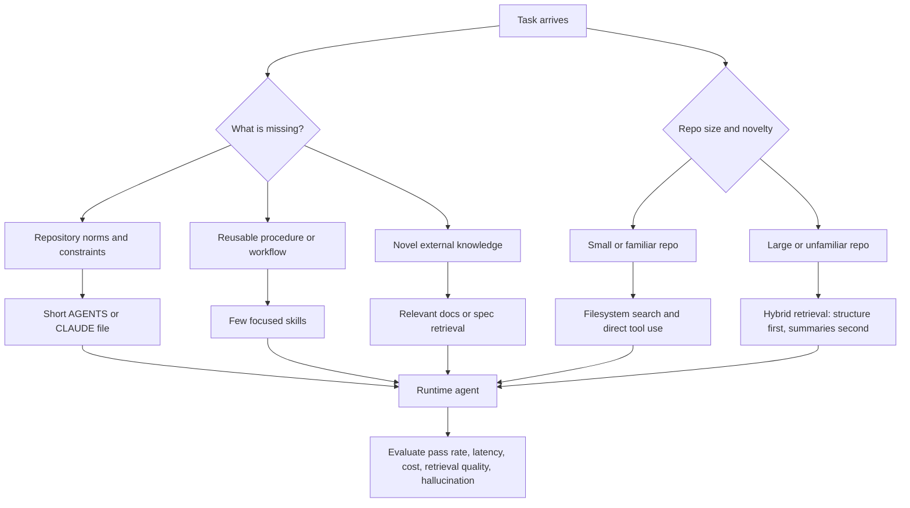
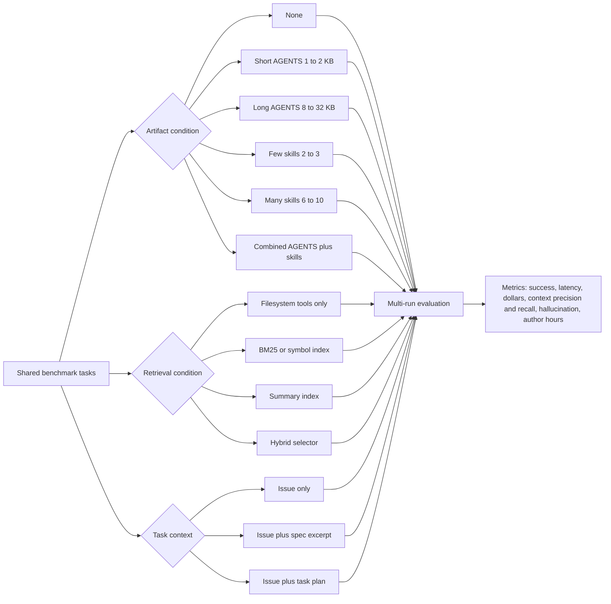

# Empirical Evidence on Agent Tooling and Codebase Augmentation for Coding Agents

> ⚠️ **Originating design exploration — superseded on the skill layer.** This file predates the skills-repo merge and [ADR 0017](../../docs/adrs/0017-no-always-load-skills.md) (no always-loaded skills). It specifies skills (`manage-task`, `documentation-gatekeeper`, `write-orchestration`) and a persona/task taxonomy the shipped framework no longer matches. It is kept for provenance and the empirical evidence it cites; **canonical truth lives in [`docs/`](../../docs/) + [`docs/adrs/`](../../docs/adrs/).**

## Executive summary

- **Curated, focused skills are the clearest win in the current literature.** The strongest direct benchmark, _SkillsBench_, evaluates 84 tasks across 11 domains and 7 model–agent configurations, and finds that curated skills raise pass rate by **16.2 percentage points on average** over a no-skills baseline. The same study reports that **2–3 focused skills/modules** work better than broader documentation-style bundles, while **4+ skills show much smaller benefit**, suggesting that skill count and scope must be actively controlled rather than maximized. _GraSP_ reinforces this pattern: when the active skill set grows, the bottleneck becomes orchestration, not raw skill availability. Confidence: **high** for skill-dependent tasks; **moderate** for direct transfer to repository-level coding because much of the skill evidence is broader than software engineering alone. citeturn24view0turn24view3turn31view5turn17view0

- **Self-generated skills are not yet reliable.** _SkillsBench_ finds that self-generated skills provide **no average benefit**, and _SkillLearnBench_ finds that continual skill-learning methods usually beat a no-skill baseline but **no method dominates across all tasks and LLMs**; stronger backbones do not reliably generate better skills, and self-feedback alone can drift recursively unless grounded by external feedback. Confidence: **moderate to high**. citeturn24view3turn26view8turn26view10turn26view11

- **Repository-wide context files such as `AGENTS.md` or `CLAUDE.md` are genuinely mixed, not uniformly good or bad.** On broad issue-resolution benchmarks, dense context files often **increase cost and lower success**: the ICML paper _Evaluating AGENTS.md_ reports that LLM-generated context files reduce average resolution rates on SWE-bench Lite and AGENTbench while increasing average cost by roughly **20% to 23%** and increasing exploration steps; developer-written files help only slightly and still increase cost. But the narrower paired study _On the Impact of AGENTS.md Files on the Efficiency of AI Coding Agents_ finds that, for **124 real pull requests** handled by a Codex-based agent, adding `AGENTS.md` lowers median wall-clock time by **28.64%** and median output tokens by **16.58%** with comparable completion behavior. The most plausible synthesis is that **minimal, task-relevant repository instructions can reduce search cost on short, constrained tasks, while longer requirement-heavy files tend to hurt long-horizon issue resolution**. Confidence: **moderate**. citeturn36view0turn36view1turn24view8turn24view9turn37view2turn37view5turn37view6

- **Direct evidence for `SKILL.md` vs `AGENTS.md` vs a combined setup is still sparse.** There is no multi-benchmark, cross-harness, randomized study that directly isolates those three conditions in repository-level coding. The closest head-to-head evidence is a single-framework engineering evaluation by entity["company","Vercel","cloud platform"] on version-matched Next.js tasks: baseline and skills-only both scored **53%**, adding explicit AGENTS instructions to trigger the skill raised performance to **79%**, and a compressed `AGENTS.md` docs index reached **100%**. That is informative, but it is one public evaluation in one framework ecosystem, not a general law. Confidence: **low to moderate**. citeturn19view2turn19view5turn19view7

- **For codebase augmentation, selectivity matters more than augmentation volume.** _RepoCoder_ shows that iterative retrieval beats both in-file completion and a simpler retrieval-augmented baseline. _SWE-ContextBench_ shows that **correctly selected summaries** improve resolution accuracy while substantially reducing runtime and token cost; incorrect or unfiltered context can hurt. _Agent-Diff_ shows a similar pattern for API docs: **relevant docs** improve pass rate by **+7.0 ± 2.3 pp** and reduce hallucination and reasoning errors, while **all docs** can hurt due to context dilution. Confidence: **moderate to high**. citeturn17view9turn17view10turn16view12turn26view5turn34view1turn34view2turn34view5

- **Classical indexing is not the only strong retrieval strategy.** A 2026 long-context paper finds that off-the-shelf coding agents using filesystem tools and direct manipulation of large corpora outperform published long-context and RAG baselines by **17.3% on average** across benchmarks up to **3 trillion tokens**. That does not prove “no retriever is always better,” but it does show that **tool-based navigation can be a serious alternative to embedding-heavy retrieval**, especially when agents can script, grep, sort, and reorganize artifacts explicitly. Confidence: **moderate** for long-context processing tasks; **lower** for direct transfer to all repository-coding tasks. citeturn16view16turn17view8

- **Developer effort, maintenance cost, and security burden are still under-measured.** Most benchmark papers report pass rate, runtime, token usage, or retrieval precision/recall, but not author-hours to create or update agent artifacts. The closest empirical evidence comes from observational studies of context files: _Agent READMEs_ examines **2,303 context files from 1,925 repositories** and finds they evolve like configuration code through frequent small additions, while a separate `Claude.md` study of **253 files from 242 repositories** finds shallow but operationally dense structures. A separate security study of real-world skills finds that skills with executable scripts are **2.12×** more likely to contain vulnerabilities than instruction-only skills, which matters for maintenance and review policy. Confidence: **moderate** on maintenance complexity, **low** on precise labor costs because controlled measurements are mostly absent. citeturn16view17turn16view18turn24view12turn39search0

## What the evidence says about each requested configuration

**Many small skills vs few large skills vs no skills.** The best direct evidence favors **a small number of focused skills over both no skills and large, monolithic skill/doc bundles**. In _SkillsBench_, curated skills help, but the benefit is not monotonic with more content: tasks with **2–3 skills** show the largest gains, while **4+ skills** add much less, implying rising context and selection overhead. _GraSP_ goes further and shows that when the skill library grows, the key factor is whether the agent can structure dependencies among skills; graph-structured orchestration improves reward and reduces steps relative to flat baselines. _SkillLearnBench_ suggests that if skills must be generated automatically, the generation loop needs external feedback; self-generated skills are too unstable to anchor a production default yet. citeturn31view5turn24view3turn17view0turn17view1turn26view8turn26view10

**`SKILL.md` vs `AGENTS.md` vs combined.** The current empirical base does **not** support a universal winner. The strongest general-purpose evidence says: repository-wide files should be **minimal and factual**, while procedural workflows should be put into **skills**. The broad AGENTS paper concludes that unnecessary requirements in context files make tasks harder, while official vendor docs from entity["company","OpenAI","ai company"] and entity["company","Anthropic","ai company"] explicitly recommend **short, accurate repository guidance** and moving procedure-heavy content into skills, using progressive disclosure when a skill becomes large. The one public direct comparison I found, from Vercel’s engineering eval, suggests that **passive version-matched docs in `AGENTS.md` can outperform skills-only** when the central problem is factual framework knowledge and the skill-triggering decision is itself fragile. That result is important but narrow. My evidence-based conclusion is: **use `AGENTS.md`/`CLAUDE.md` for concise repository norms, and use skills for reusable multi-step procedures; combine them only when the root file’s job is to route to the right skill, not to duplicate it.** Confidence remains **low to moderate** because direct multi-repo crossover studies are missing. citeturn24view8turn18view0turn18view1turn18view2turn19view1turn19view2turn19view7

**Docs-only vs skills-only vs combined.** The evidence points to a **task-typed answer**, not a single best configuration. If the missing information is **static factual knowledge** that can be indexed compactly and is needed repeatedly—framework version details, unusual APIs, repository conventions—passive docs can work very well, as the Vercel eval suggests. If the missing information is **procedural know-how**—a repeatable workflow, tool invocation pattern, or checklist—skills outperform large prose bundles, as _SkillsBench_ shows. Combined setups are under-evaluated; the limited evidence suggests they help only when the root document does **lightweight routing or policy**, not when it becomes another long bundle. citeturn24view3turn19view2turn19view5turn19view7

**Task files, specs, and Spec-Kit-like alternatives.** Direct controlled evidence on Spec Kit itself is sparse in the public literature I reviewed. The closest empirical evidence comes from **structured task augmentation** rather than branded spec tools. _CodeScout_ shows that turning underspecified problem statements into richer, codebase-grounded task statements improves resolution rates on SWE-bench Verified, and that a **separate augmentation pipeline** beats asking the runtime agent to self-augment. _SWE-Bench 5G_ shows that injecting relevant telecom specification excerpts helps only on **specification-dependent bugs**, not uniformly. _Agent-Diff_ shows the same conditionality for API documentation: relevant documentation helps most on **novel endpoints** rather than on well-known APIs already internalized by the model. So the closest evidence-based conclusion is: **task/spec files help when they encode genuinely missing external knowledge or disambiguate under-specified requirements, but they are not a universal substitute for repository context or skills.** Confidence: **moderate** for structured task augmentation in general, **low** for Spec-Kit-specific claims. citeturn24view14turn17view4turn15view10turn34view2

**Indexing vs summarizing vs hybrid retrieval.** The evidence favors **adaptive hybrids** over single-method dogma. _RepoCoder_ shows that iterative retrieval improves over both no-retrieval and naive retrieval augmentation. _SWE-ContextBench_ shows that **compact summaries** are valuable when they are correctly selected, especially for harder tasks and for reducing runtime and token cost. _Meta-RAG_ shows that repository summarization can compress codebases by about **79.8%** while reaching strong localization rates on SWE-bench Lite. But _Agent-Diff_ shows that throwing in irrelevant docs causes dilution, and the long-context coding-agent paper shows there are settings where **explicit tool-based navigation beats conventional RAG altogether**. The operational takeaway is not “always summarize” or “always index”; it is **use minimal structural retrieval first, add summaries for expensive recurring context, and avoid bulk context dumps.** citeturn17view9turn17view10turn26view5turn40view0turn40view3turn34view1turn34view2turn17view8

**Big vs small `AGENTS.md`.** There is no clean randomized paper that varies only AGENTS size while keeping content constant. What the evidence does show is a strong convergence around **minimality and progressive disclosure**. The AGENTS benchmark paper finds that unnecessary requirements make tasks harder. Official docs say a **short, accurate `AGENTS.md` is more useful than a long file full of vague rules**. The skills guidance says that when a `SKILL.md` becomes unwieldy, it should be split and linked rather than loaded monolithically. The Vercel eval adds a useful concrete datapoint: compressing a docs index from roughly **40 KB to 8 KB** preserved the gain, which suggests that **compactness and addressability matter at least as much as raw information volume**. Confidence: **low to moderate**, because the direct causal size study still does not exist. citeturn24view8turn18view0turn18view2turn19view6

## Comparison table of the most relevant studies

| Study                                                                                                      | Configuration / setup                                                                                                                                                                   | Metrics                                                                                         | Main empirical result                                                                                                                                                                                                                                                                            | Reproducibility and main limitations                                                                                                                                                            |
| ---------------------------------------------------------------------------------------------------------- | --------------------------------------------------------------------------------------------------------------------------------------------------------------------------------------- | ----------------------------------------------------------------------------------------------- | ------------------------------------------------------------------------------------------------------------------------------------------------------------------------------------------------------------------------------------------------------------------------------------------------ | ----------------------------------------------------------------------------------------------------------------------------------------------------------------------------------------------- |
| **SkillsBench** citeturn24view0turn31view3turn32view0                                                 | 84 tasks, 11 domains, 7 frontier model–agent configs across Claude Code, Codex CLI, and Gemini CLI; compares **no skills**, **curated skills**, and **self-generated skills**           | Pass rate, normalized gain, token/cost appendices                                               | Curated skills improve pass rate by **+16.2 pp** on average; **2–3 skills/modules** work best; **4+** skills show much weaker returns; self-generated skills provide **no average gain** citeturn24view3turn31view5                                                                          | Data and harness published; strong benchmark design, but only part of the task set is repository-level software engineering and authoring effort is not measured citeturn31view5turn32view0 |
| **SkillLearnBench** citeturn26view8turn26view11                                                        | 20 verified, skill-dependent tasks across 15 sub-domains; evaluates one-shot, self/teacher-feedback, and skill-creator continual learning methods                                       | Skill quality, trajectory quality, task outcome                                                 | All methods beat no-skill baselines, but **no method consistently leads** across tasks and LLMs; stronger backbones do not reliably generate better skills; external feedback helps more than self-feedback alone citeturn26view8turn26view10                                                | Code and data open-sourced; task count is still modest and the paper is about skill generation more than codebase augmentation per se citeturn26view11                                       |
| **GraSP** citeturn17view0turn27view14                                                                  | Structured skill composition on ALFWorld, ScienceWorld, WebShop, and InterCode; compares graph-structured orchestration to ReAct, Reflexion, ExpeL, and flat skill baselines            | Reward, environment steps, robustness to over-retrieval                                         | Up to **+19 reward points** over the strongest baseline and **up to 41% fewer steps**; advantage grows with task complexity and remains robust under skill over-retrieval citeturn17view0                                                                                                     | Strong evidence that orchestration matters, but environments are not all repository-coding tasks and the paper studies skills more than documentation artifacts                                 |
| **Evaluating AGENTS.md** citeturn29view0turn35view8                                                    | Cross-agent study on SWE-bench Lite plus **AGENTbench** (138 instances from 12 repos with developer context files); compares **none**, **LLM-generated context**, **developer context** | Success rate, steps, cost, reasoning tokens, trace behavior                                     | LLM-generated context files reduce average resolution rate and raise cost by roughly **20–23%**; developer-written files help only slightly and also raise cost; agents follow instructions and explore more, but that does not reliably help citeturn36view0turn36view1turn24view8         | Code available; very strong direct evidence for repository context files, but mostly Python issue-resolution tasks and only four agent/model pairings                                           |
| **On the Impact of AGENTS.md Files on the Efficiency of AI Coding Agents** citeturn24view10turn37view2 | Paired Codex-only study over **10 repositories and 124 pull requests**; same task with/without root `AGENTS.md`                                                                         | Wall-clock time, token usage                                                                    | `AGENTS.md` lowers median runtime by **28.64%** and median output tokens by **16.58%**, with comparable completion behavior citeturn37view5turn37view6turn37view7                                                                                                                           | Useful counterpoint to the broader AGENTS benchmark; however it uses one agent family, narrow PR-style tasks, and does not evaluate correctness beyond a sanity check                           |
| **Agent READMEs** and the **Claude.md manifest study** citeturn16view17turn16view18turn24view12       | Observational studies of **2,303 context files / 1,925 repos** and **253 Claude.md files / 242 repos**                                                                                  | Structure, maintenance patterns, content types                                                  | Context files evolve like configuration code through **frequent small additions**; most emphasize build/run commands, implementation details, and architecture, while security/performance requirements are rarely specified citeturn24view11turn24view12                                    | Strong evidence on maintenance and content, but these studies do **not** directly measure agent task performance                                                                                |
| **ContextBench** citeturn26view0                                                                        | 1,136 issue-resolution tasks from 66 repos across 8 languages, with human-annotated gold context; evaluates 4 frontier LLMs and 5 coding agents                                         | Context recall, precision, efficiency during issue resolution                                   | Agent scaffolding yields only **marginal gains** in retrieval; models tend to favor **recall over precision**; there is a substantial gap between context inspected and context actually used citeturn26view2turn26view3turn26view4                                                         | Excellent process benchmark; it evaluates retrieval quality more than artifact formats like AGENTS or skills                                                                                    |
| **SWE-ContextBench** citeturn26view5turn26view6turn26view7                                            | 1,100 base tasks plus 376 related tasks across 51 repos / 9 languages; evaluates experience reuse via full trajectories vs compact summaries                                            | Prediction accuracy, time efficiency, cost efficiency                                           | **Correctly selected summarized context** improves accuracy and substantially reduces runtime and token cost, particularly on harder tasks; incorrectly selected or unfiltered context can hurt citeturn16view12                                                                              | Important for summary-vs-full-context questions; less direct on root repository instruction files                                                                                               |
| **RepoCoder** citeturn17view9turn17view10turn17view11                                                 | Repository-level code completion with iterative retrieval-generation on RepoEval                                                                                                        | Completion accuracy / unit-test-backed eval                                                     | Beats in-file completion by **>10%** in all settings and outperforms a simpler vanilla retrieval-augmented baseline                                                                                                                                                                              | Peer-reviewed and reproducible; task is code completion rather than full autonomous issue resolution                                                                                            |
| **Agent-Diff** citeturn20search0turn23view0turn23view1                                                | 224 tasks over four enterprise APIs with code execution; compares **no docs**, **relevant docs**, and **all docs** across 9 LLMs                                                        | Pass rate, assertion-weighted score, cost, tokens, halluci­nation/error taxonomy, recovery rate | Relevant docs raise overall pass rate by **+7.0 ± 2.3 pp**; all docs can hurt due to dilution; docs reduce reasoning-failure prevalence by **25.9 pp** and hallucination prevalence by **21.2 pp**; effect is strongest for genuinely novel endpoints citeturn34view1turn34view2turn34view5 | Code and data available; domain is enterprise APIs rather than code repositories, but it is one of the strongest direct studies of docs relevance vs dilution                                   |
| **CodeScout** citeturn24view14turn24view15                                                             | Structured pre-exploration pipeline that augments underspecified problem statements before runtime execution on SWE-bench Verified; 3 scaffolds × 3 LLM families                        | Resolution rate, localization quality, augmentation overhead                                    | Up to **20% improvement** in resolution rate and up to **27 additional issues resolved**; separate augmentation pipeline outperforms self-augmentation; weaker runtime agents benefit most citeturn24view14turn17view4turn17view5turn17view7                                               | Strong closest evidence for task/spec-file augmentation; still Python-centric and not a branded Spec-Kit comparison                                                                             |
| **Coding Agents are Effective Long-Context Processors** citeturn16view16turn17view8                    | Off-the-shelf coding agents process corpora up to **3 trillion tokens** using filesystem tools rather than classic retrievers                                                           | Benchmark scores across long-context reasoning, RAG, and QA tasks                               | Coding agents outperform published state of the art by **17.3% on average**, suggesting tool-based navigation can rival or beat semantic retrieval pipelines in some long-context settings                                                                                                       | Important adjacent evidence; not a code-repository benchmark per se                                                                                                                             |
| **Meta-RAG on Large Codebases Using Code Summarization** citeturn40view0turn40view3turn40view4        | Summary-first retrieval for bug localization on SWE-bench Lite with GPT-4o                                                                                                              | File-level and function-level localization, compression, cost/time table                        | Codebase summarization compresses tokens by **79.8%** on average and reaches **84.67%** file-level and **53.0%** function-level localization, outperforming reported baselines in that setup citeturn40view0turn40view2turn40view3                                                          | Promising summary-based retrieval result; authors are industry researchers, and the study is a preprint focusing on localization rather than end-to-end repair                                  |
| **Single-framework engineering eval by Vercel** citeturn19view2turn19view5                             | Baseline vs skills-only vs skill+explicit AGENTS trigger vs compressed `AGENTS.md` docs index for version-matched Next.js tasks                                                         | Pass rate across build/lint/test evals                                                          | Baseline **53%**; skills-only **53%**; skills + explicit trigger **79%**; compressed `AGENTS.md` docs index **100%**; compression from ~40 KB to ~8 KB kept the gain citeturn19view2turn19view6turn19view7                                                                                  | Useful direct comparison for framework docs, but non-peer-reviewed, single team, and public write-up omits some benchmark details such as exact sample size and model configuration             |

## Best-practice recommendations with trade-offs

The evidence supports a **layered configuration strategy** rather than a single artifact for every job. Put **stable repository norms**—build/test commands, non-obvious tooling, critical constraints, and a small number of “must not violate” rules—in a **short repository-wide file**. Put **reusable procedures**—migration playbooks, release recipes, debugging workflows, API usage patterns, or multi-step checklists—in **skills**. Avoid duplicating the same procedural content in both places, because the available AGENTS evidence suggests that broader requirement bundles increase steps, thinking tokens, and cost without consistently improving success. citeturn24view8turn36view0turn18view0turn18view1turn18view2

For skill design, prefer a **small active set of focused skills** over a large library dumped into the agent’s reachable context. The best current empirical rule of thumb is **2–3 focused skills/modules** for a task when skilling is useful at all. If the library must be large, use a selection/orchestration mechanism rather than relying on flat retrieval. If skills are generated automatically, require **external evaluation or teacher feedback** before promotion; the available benchmarks do not justify trusting self-generated skills by default. citeturn31view5turn17view0turn26view10

For retrieval over large codebases, the safest empirical default is a **hybrid selector**. Start with **cheap structural navigation**—filesystem search, symbols, grep/BM25, dependency cues, or a compact docs index. Add **targeted summaries** for large or repeatedly queried regions. Inject **relevant external specs or API docs** only when the task depends on knowledge that is likely missing from model pretraining or from the local codebase. Do **not** dump all available documentation into context: multiple studies show that irrelevant documentation and overly broad context hurt either score, pass rate, or step efficiency. citeturn17view9turn26view5turn34view1turn34view2turn17view8turn40view3

The following architecture captures the strongest current synthesis:

Vendor guidance is broadly consistent with this conclusion. Official docs say a short, accurate repository file is better than a long vague one, and that procedure-heavy sections should move into skills with progressive disclosure. The most defensible interpretation is that **root files should tell the agent what the repo expects**, while **skills should tell the agent how to execute a reusable workflow**. citeturn18view0turn18view1turn18view2

Do not evaluate only by “did the final tests pass.” The stronger recent work measures **task success, latency, token cost, steps/tool calls, retrieval precision/recall, error recoverability, and hallucination categories**. Future production evals should also measure **human effort to author and update artifacts**, because that quantity is still the most important missing variable in the literature. citeturn26view0turn26view5turn34view1turn34view5turn16view17turn24view12

One trade-off is easy to miss: skills can improve procedural reliability, but they also widen the review surface when they include executable scripts. A large-scale skills security study finds that skills bundling scripts are **2.12× more likely** to contain vulnerabilities than instruction-only skills. That does not argue against skills; it argues for **treating scripted skills as code**, with the same review, permissioning, and provenance controls you would apply to internal tooling. citeturn39search0

## Gaps, open questions, and experiments that would resolve them

The most important gap is that there is still **no public benchmark that directly randomizes `AGENTS.md` vs `SKILL.md` vs combined** on the **same repo tasks, same harness, same models, and same retrieved knowledge**. Today’s conclusions come from triangulating separate literatures: skill benchmarks, AGENTS/context-file papers, retrieval benchmarks, and a handful of engineering blogs. That is enough for directional guidance, but not enough for a definitive ranking of artifact types. citeturn24view3turn24view8turn19view2

A second gap is that **developer effort and maintenance cost are almost never first-class metrics**. Observational work shows that agent context files evolve continuously and accumulate operational detail, but controlled studies do not measure author-hours to create, update, review, or deprecate them. Nor do they quantify the cost of artifact staleness, duplicated instructions, or broken scripts. That omission matters because a configuration that raises pass rate by a few points but doubles maintenance effort can still be the wrong production choice. citeturn16view17turn16view18turn24view12

A third gap is that retrieval comparisons are still fragmented. We have evidence for iterative retrieval, summary-based reuse, relevant-doc injection, and direct tool-based navigation, but not many **same-harness, same-dataset, factorial comparisons** of these alternatives in repository-level coding. That is why the safest current recommendation is “hybrid and selective,” not “always summarize” or “always index.” citeturn17view9turn26view5turn34view1turn17view8turn40view3

The best next experiment would be a **factorial benchmark** that explicitly manipulates artifact type, artifact size, retrieval method, and task context on the same task distribution:

The evaluation stack should combine **SWE-bench-class issue resolution**, **process-level retrieval benchmarks**, **context reuse benchmarks**, and **novel-spec / novel-API tasks**. Concretely, the strongest current starting panel would include AGENTbench-style repository tasks, ContextBench for retrieval metrics, SWE-ContextBench for reuse, Agent-Diff-style doc-injection tasks, and domain-specific spec-heavy tasks such as SWE-Bench 5G. Every condition should run with fixed seeds where possible, multiple trials per task, public Docker environments, and released artifacts for the exact AGENTS/skills/spec files used. citeturn35view7turn26view0turn26view5turn20search0turn15view10

The key success criteria for that experiment should be broader than current practice. I would require, at minimum: **task success**, **wall-clock latency**, **token/dollar cost**, **retrieval precision and recall**, **hallucination rate by category**, **instruction adherence**, **human authoring and update time**, **stale-context failure rate**, and **security review burden for scripted skills**. Until studies report those together, the field will keep over-optimizing for leaderboard pass rate while under-measuring the real operational cost of context engineering. citeturn26view0turn34view5turn16view17turn39search0
