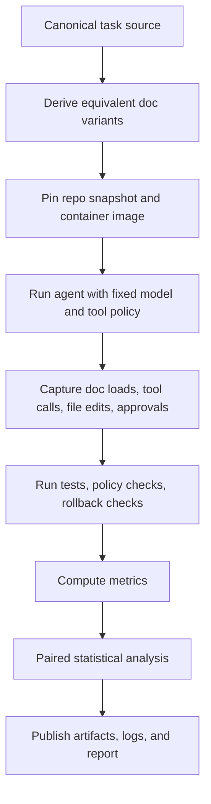
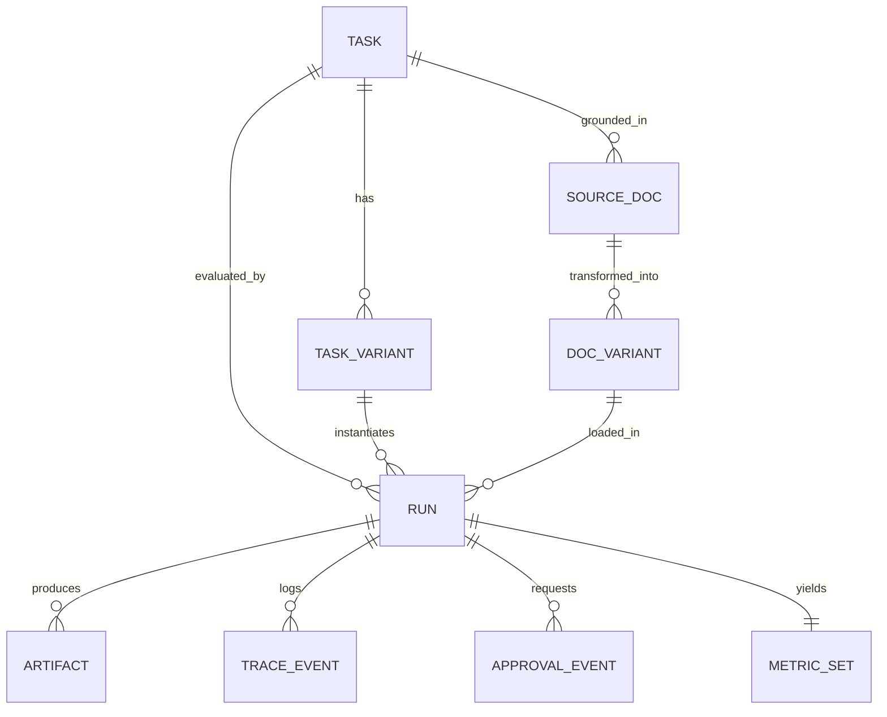
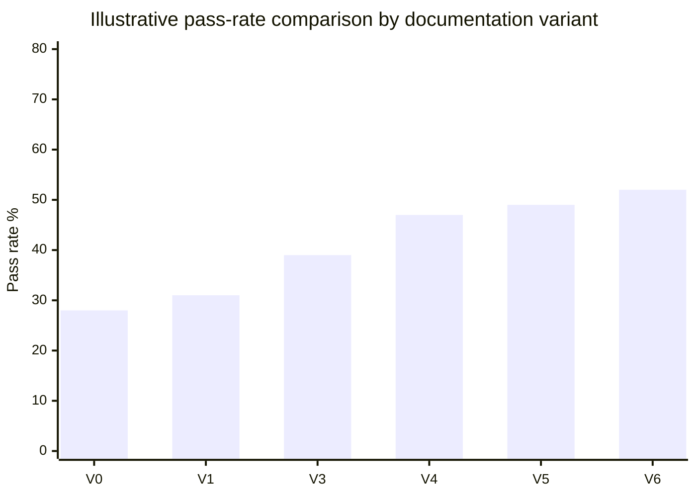

# Empirical Evidence on Documentation Frameworks for Coding Agents

## Executive summary

The empirical literature on documentation frameworks for coding agents is still young, but it is already strong enough to support some high-confidence design decisions for Swarm. The best-supported conclusion is **not** “more documentation is always better.” Instead, the evidence consistently points toward a narrower rule: **focused, well-matched, execution-relevant documentation helps; broad, generic, or stale documentation often adds cost, noise, and failure modes**. citeturn10view0turn11view2turn9view3turn9view4turn26view0

Three findings are especially load-bearing. First, curated modular skills can help substantially, but only when the skill is genuinely relevant and scoped tightly. In SkillsBench, curated skills raised average pass rate by **16.2 percentage points**, with the biggest gains from **2–3 focused skills** and a drop-off for **4+ skills**; “comprehensive” skills actually hurt performance by **2.9 points**. In contrast, the SWE-specific SWE-Skills-Bench found a much smaller average gain of **+1.2%**, with **39 of 49** skills showing **zero** pass-rate improvement and some causing regressions because the guidance mismatched the repository context. Taken together, those studies support a Swarm design centered on **small numbers of specialized skills**, not giant “all the rules” documents. citeturn10view0turn11view2turn27search0

Second, repository-level context files such as AGENTS.md are not a free win. In the most direct benchmark study so far, LLM-generated repo context files slightly **reduced** success rates on average while increasing steps, reasoning tokens, and inference cost by **more than 20%**; developer-written files helped only **marginally** on average, though they performed better than autogenerated files and were useful in lower-documentation repositories. This points toward a thin-manifest design: keep root-level documentation short, operational, and local to the repo, while pushing specialized procedures into separately loadable modules. citeturn9view3turn9view4turn25view2turn25view3turn24view3turn17view1

Third, the evidence for **explicit task contracts** is materially stronger than the evidence for generic “prompt patterns.” A 2025 empirical paper found **no statistically significant differences** in maintainability, reliability, or security defects across generic prompt-pattern labels such as zero-shot, CoT, and few-shot. By contrast, requirement-driven and plan-driven agent systems show meaningful gains on repository-level tasks: REAgent’s structured issue-oriented requirements improved resolved instances by **9.17% to 24.83%** over baselines, while LongCLI-Bench showed that injecting plans and combining them with interactive guidance dramatically outperformed fully autonomous baseline runs on long-horizon tasks. For Swarm, that means a `task.md`-style contract should emphasize **acceptance criteria, constraints, ambiguity handling, verification, and rollback**, rather than fashionable prompt ornamentation. citeturn12view0turn31view0turn30view3

There is also a clear safety lesson. Passive natural-language instructions alone are not reliably enforced. ContextCov, which compiles instruction files into executable checks, increased constraint compliance to **88.3%** from **67.0%** and **50.3%** for passive-prompt and reflection baselines, while also slightly improving functional resolution with statistically significant paired differences. This is the strongest direct evidence in the literature that documentation becomes much more valuable when paired with **deterministic verification hooks**. citeturn22view2turn22view0turn22view3

My central recommendation is therefore straightforward: **Swarm v1 should benchmark a thin manifest + 2–3 focused skills + explicit task contract + executable verification/guardrails**, rather than choosing between “AGENTS.md everywhere” and “just wing it.” A literal `task.md` benchmark does not yet exist in the literature, so this recommendation is partly an inference from adjacent requirement-driven, skills, and guardrail studies rather than a direct head-to-head result. citeturn24view3turn17view1turn11view2turn31view0turn22view2

## Evidence base and source prioritization

I assume “documentation framework” includes five related artifacts: persistent repo instructions, discoverable manifests, modular skills, structured task contracts, and executable verification or approval metadata. Because the literature does not yet benchmark a literal `task.md` standard, I treat studies on **structured requirements**, **issue-oriented specifications**, **plan injection**, and **repo context files** as the closest empirical proxies. citeturn31view0turn30view3turn25view3

The sources worth prioritizing fall into four tiers. The first tier is **controlled benchmarks with deterministic verification and public harnesses**: SkillsBench, SWE-Skills-Bench, the AGENTS.md evaluation, ContextCov, REAgent, LongCLI-Bench, ContextBench, HiL-Bench, ProjDevBench, Terminal-Bench, and SWE-Dev. These are the best sources for effect sizes, task counts, and measurement design. citeturn10view0turn27search0turn25view3turn22view2turn31view0turn16view0turn9view9turn13view0turn32view0turn14search0turn29search11

The second tier is **descriptive empirical software-engineering studies** of what developers actually write in the wild. The strongest example is Agent READMEs, which analyzed **2,303 context files from 1,925 repositories** and showed that these files behave more like living configuration artifacts than like static documentation, while also showing a strong skew toward functional instructions and a relative absence of security/performance constraints. This does not measure performance directly, but it is crucial for benchmarking realism. citeturn26view0

The third tier is **official protocol and tooling docs**, which are essential for understanding what systems actually do when they read documentation, discover prompts/resources, or log artifacts. Official guidance from entity["company","OpenAI","ai company"] explains Codex’s hierarchical AGENTS.md discovery chain, size limits, and override behavior; official guidance from entity["company","Anthropic","ai company"] explains lazy skill loading and progressive disclosure for SKILL.md; official docs from entity["company","Google","technology company"] ADK emphasize evaluating agent trajectories as well as final outputs; the official MCP specification explains prompt/resource discoverability; and the official A2A documentation—now stewarded by the entity["organization","Linux Foundation","open source nonprofit"] ecosystem—defines task histories and artifacts as first-class protocol entities. These are design sources, not outcome studies, but they are indispensable for building realistic benchmarks. citeturn24view1turn24view3turn17view1turn17view5turn17view7turn18view2turn18view1turn19view1turn19view4

The fourth tier is **adjacent prompt-engineering and safety studies**. These are weaker for Swarm-specific design, but they help interpret the boundary between “documentation structure” and “prompting technique.” The most useful are the EASE 2025 code-quality study, which found negligible effects from generic prompt-pattern labels, and the secure-code-generation benchmark, which found substantial vulnerability reduction from security-focused prompt prefixes and iterative repair prompts. citeturn12view0turn12view1

### Prior studies summary

| Study                                         | What it tested                                                               | Experimental design                                                                                             | Key metrics                                                                  | Main findings                                                                                                                                                                                                                                                                 | Significance / CI                                                                                                       | Most important limitation                                                            |
| --------------------------------------------- | ---------------------------------------------------------------------------- | --------------------------------------------------------------------------------------------------------------- | ---------------------------------------------------------------------------- | ----------------------------------------------------------------------------------------------------------------------------------------------------------------------------------------------------------------------------------------------------------------------------- | ----------------------------------------------------------------------------------------------------------------------- | ------------------------------------------------------------------------------------ |
| SkillsBench (2026)                            | Curated skills vs no skills vs self-generated skills across domains          | 84 tasks, 7 agent-model configs, 7,308 trajectories, deterministic verifiers, 5 trials per task-model-condition | Pass rate, normalized gain, bootstrap CI                                     | Curated skills: **+16.2 pp** average; self-generated: **-1.3 pp** average; 2–3 skills best (**+18.6 pp**); 4+ skills only **+5.9 pp**; comprehensive skills **-2.9 pp** citeturn10view0turn11view2                                                                        | 95% bootstrap CIs reported; 10-run validation kept conclusions unchanged citeturn10view0turn10view3                 | Cross-domain benchmark; software engineering is only one slice                       |
| SWE-Skills-Bench (2026)                       | Marginal utility of public SWE skills in fixed-commit repos                  | 49 skills, ~565 task instances, deterministic execution-based verification                                      | Pass-rate delta, token overhead                                              | Average gain only **+1.2%**; **39/49** skills show zero improvement; only 7 specialized skills help materially; token overhead can rise **451%** without accuracy gain citeturn27search0turn27search1                                                                     | Effect sizes reported; no formal significance visible in the abstract/excerpt                                           | Preprint; early results; narrow to public skills chosen by authors                   |
| Evaluating AGENTS.md (2026)                   | Repo context files: none vs LLM-generated vs developer-written               | 300 SWE-Bench Lite tasks + 138 AGENTBENCH instances; 4 agents/models; single completion per instance            | Resolution rate, steps, cost, reasoning tokens                               | LLM-generated context files reduce success slightly and raise cost **20–23%**; developer-written files give only marginal average gains; instructions are followed, but they trigger over-exploration and more reasoning citeturn9view3turn9view4turn25view2turn25view3 | No overall CI/p-values reported; no single repository showed significant impact in per-repo grouping citeturn10view8 | One-sample runs; effect sizes are small and may be harness-sensitive                 |
| Agent READMEs (2025)                          | Real-world structure and content of agent context files                      | 2,303 files from 1,925 repos across Codex, Claude Code, Copilot-style files                                     | Readability, maintenance patterns, content categories, classification F1     | Files are actively maintained, often long and shallowly structured; build/run in **62.3%**, implementation details **69.9%**, architecture **67.7%**; security and performance only **14.5%** each citeturn20search0turn26view0                                           | Automatic topic classification reaches **0.79 F1** citeturn26view0                                                   | Descriptive, not causal                                                              |
| ContextCov (2026)                             | Passive instruction files vs executable guardrails compiled from them        | 300 SWE-Bench Lite tasks on 12 repos; prompt-only vs reflection vs executable guardrails                        | Constraint compliance, clean rate, harness resolution, feedback rounds, cost | Constraint compliance: **88.3%** vs **67.0%** vs **50.3%**; resolution: **57.3%** vs **53.0%** vs **52.3%**; **3.4×** better cost-efficiency than LLM reflection citeturn22view2turn22view3                                                                               | McNemar p-values: 0.031 and 0.046 for key paired comparisons citeturn22view0                                         | Python-heavy SWE-Bench Lite only; multiplicity correction not applied                |
| REAgent (2026)                                | Structured issue requirements and iterative refinement                       | 3 issue-resolution benchmarks × 2 LLMs × 5 baselines                                                            | % Resolved, % Applied, Requirement Assessment Score                          | Structured, information-rich requirements improve resolved instances by **9.17%–24.83%** and applied patches by **22.17%–49.50%** vs baselines citeturn31view0                                                                                                             | Effect sizes reported; significance not reported in visible excerpt                                                     | Preprint; task contract proxy is issue-oriented requirements, not a literal task.md  |
| LongCLI-Bench (2026)                          | Long-horizon coding with requirements, self-correction, plan injection, HITL | 20 long tasks, 4 task categories, dual-set F2P/P2P tests, step-level scoring                                    | Pass, Pass@3, F2P/P2P scores, time, human interventions                      | Fully autonomous agents stay below **20%** pass in base setting; for Claude Opus 4.6, base **16.7%**, self-correction **55.0%**, plan **58.3%**, plan+interactive **61.7%** citeturn16view0turn30view3                                                                    | Strong descriptive effect sizes; no formal significance shown in excerpt                                                | Small benchmark; manually intensive; task creation ~40 hours each citeturn30view4 |
| HiL-Bench (2026)                              | Whether agents ask for help under ambiguity                                  | 300 tasks (150 SWE, 150 SQL), blocked vs full-information vs ask_human conditions                               | Pass@3, blocker recall, question precision, Ask-F1                           | Under full info, SWE pass@3 is high; when agents must decide when to ask, performance collapses and SWE Ask-F1 averages **37.4%**, showing a major judgment gap citeturn13view0turn13view3                                                                                | Large gap is clear; significance not reported in excerpt                                                                | Measures escalation judgment, not documentation directly                             |
| ContextBench (2026)                           | Context retrieval quality and scaffolding complexity                         | 5 agents, 4 LLMs, file/block/line-level gold contexts                                                           | Recall, precision, F1, Pass@1, cost                                          | More sophisticated retrieval scaffolds do **not** consistently outperform simple baselines; over-retrieval hurts precision and cost efficiency citeturn9view9turn9view10                                                                                                  | Descriptive, benchmarked across models                                                                                  | Measures retrieval behavior rather than authored docs                                |
| Prompt patterns and code quality (EASE 2025)  | Generic prompt-pattern labels                                                | 7,583 code files from DevGPT; SonarQube metrics; Kruskal-Wallis + Dunn                                          | Maintainability, reliability, security defects                               | No statistically significant differences; effect sizes negligible citeturn12view0                                                                                                                                                                                          | p=0.704, 0.072, 0.906; negligible rank epsilon-squared effects citeturn12view0                                       | Short-form code-generation setting, not repo-grounded agents                         |
| Secure code generation prompting (Forge 2025) | Security-focused prompt scaffolds and iterative prompting                    | Automated benchmark using static security scanners                                                              | Vulnerability occurrence, repair rate                                        | Security-focused prefix cuts vulnerabilities by up to **56%**; iterative prompting repairs **41.9%–68.7%** of vulnerable code citeturn12view1                                                                                                                              | Accepted venue, but visible abstract does not state significance                                                        | Not repo-grounded documentation; prompt-level rather than file-level                 |

## Experimental designs, metrics, and what the evidence actually says

The largest methodological divide in this area is between **descriptive studies of documents in the wild** and **causal evaluations where documentation is the intervention**. For Swarm, the causal studies matter most, but the descriptive studies explain why the causal results look the way they do. Wild agent docs are often long, shallow, incrementally appended, and dominated by operational instructions. That composition is exactly what you would expect to increase context cost and cognitive overhead if loaded monolithically. citeturn26view0

### SKILL.md versus embedded documentation

The evidence favors a **modular skills** model over dumping all reusable guidance into a root document. Official skill docs from entity["company","Anthropic","ai company"] matter here because they reveal the actual loading semantics: only skill metadata is preloaded at startup, the main `SKILL.md` is read **on demand**, and the rest of the directory is loaded selectively. The official guidance also recommends progressive disclosure, one-level-deep references, and keeping `SKILL.md` under roughly **500 lines**. That design is directly aligned with the strongest benchmark evidence: SkillsBench found that **2–3 focused skills** are optimal and that “comprehensive” documentation hurts, while SWE-Skills-Bench found that broad, generic skill injection rarely helps in real SWE tasks unless the skill is highly specific to the repository’s needs. citeturn17view1turn17view2turn11view2turn27search0

The important nuance is that skills are **not universally beneficial**. SkillsBench shows that, under good curation, skills can deliver large gains; SWE-Skills-Bench shows that in repository-grounded software engineering, many public skills are too generic, stale, or mismatched to move the needle. My synthesis is that SKILL.md-like modules are valuable when they encode **rare procedural knowledge** or **repo-specific workflow traps**, but they are much less useful as generic “best practices” bundles that the base model mostly knows already. citeturn11view2turn27search0

### Centralized manifest versus per-repo skills

There is **no direct public controlled study** comparing “thin centralized manifest + modular skills” against “everything encoded in one repo file.” This is one of the biggest evidence gaps. What we do have is a strong indirect pattern. Official Codex guidance from entity["company","OpenAI","ai company"] uses a **hierarchical instruction chain**: global defaults, repo-level files, then nested directory overrides, with one file per directory and size caps. Official MCP docs define discoverable prompts and resources, while official A2A docs define discoverable skills, task histories, and artifacts. Together, these systems separate **discovery** from **detailed execution guidance**, which is precisely what a Swarm manifest should do. citeturn24view1turn17view3turn17view4turn18view2turn18view1turn19view3turn19view4

The nearest causal proxy is the AGENTS.md evaluation. Its results imply that a **thick root document** is risky: repo context files do influence behavior, agents do follow them, but that often manifests as extra exploration, extra testing, and extra reasoning without enough success-rate gain to justify the cost. That is the empirical reason I recommend a **thin manifest** whose job is limited to discovery, routing, and governance, while procedural detail moves into on-demand skills and task contracts. This is an inference, but it is a well-grounded one. citeturn9view4turn25view2turn25view3

### Monolithic skills versus micro-skills

The evidence here is more direct. SkillsBench does **not** support “smaller is always better.” It supports **moderate modularity**: one focused skill or two to three focused skills work well; too many skills or a single exhaustive manual degrade performance. In practical terms, that means Swarm should benchmark a small, named set of relevant skills attached to each task type rather than loading a giant “persona + architecture + coding + testing + review” mega-skill by default. citeturn11view2turn10view0

I would distinguish between **focused skills** and **micro-fragments**. The papers support focused modules; they do not directly test ultra-fragmented micro-skills whose selection overhead may itself become a problem. This is why I recommend testing a bounded family of variants—one monolith, one focused bundle of 2–3 skills, and one over-fragmented 4+ condition—rather than assuming the optimum in advance. citeturn11view2turn27search0

### Explicit task contracts versus freeform prompts

This is where the literature becomes most relevant to Swarm’s `task.md` idea. The negative evidence first: generic prompt-pattern labels—zero-shot, CoT, few-shot—did **not** move maintainability, reliability, or security outcomes in a meaningful way in an EASE 2025 study. So “structured prompt” in the abstract is too weak a concept. citeturn12view0

The positive evidence is much more specific. REAgent shows that **structured, information-rich issue requirements**, assessed and iteratively refined, improve repository-level issue resolution over strong baselines. LongCLI-Bench shows that explicit plans and human-provided roadmaps help much more than just letting the agent rerun after failure. HiL-Bench shows that even strong agents are poor judges of when they must ask for clarification, which implies that a high-quality task contract should not merely tell the agent “what to do,” but should also encode what uncertainty is unacceptable and when escalation is expected. citeturn31view0turn30view3turn13view0turn13view3

For Swarm, the implication is clear: a task contract should be evaluated as a **specification object**, not a “nice prompt template.” The contract should explicitly carry acceptance criteria, open questions, known unknowns, verification commands, rollback stance, and escalation rules. That design is better supported by the evidence than generic role-prompting or style-oriented templates. citeturn31view0turn30view3turn24view3

### Safety, rollback, reproducibility, and auditability

The strongest direct safety result comes from ContextCov. It shows that instruction files become much more valuable when they are translated into executable checks that can block or flag violations during the run itself. That is powerful evidence for Swarm’s `{{cmd...}}` verification placeholder idea: documentation has more safety value when it is coupled to a reproducible oracle. citeturn22view2turn22view0

There is weaker but still useful adjacent evidence from the secure-code-generation benchmark: safety-oriented scaffolding can materially reduce security defects, which supports including explicit security and compliance sections in task contracts and manifests. The Agent READMEs study reinforces the same point from the opposite direction: projects rarely write those constraints down, which likely contributes to the under-measurement of non-functional requirements in current agent benchmarks. citeturn12view1turn26view0

Auditability is the least mature part of the literature. Official Google ADK docs explicitly distinguish **trajectory evaluation** from final-response evaluation; A2A defines **task history** and **artifacts** as separate protocol concepts; MCP defines discoverable prompts and resources. But I did not find a public benchmark that quantifies “auditability gain” from documentation structure itself. That means Swarm must probably pioneer metrics such as trace completeness, approval latency, artifact lineage, and rollback reproducibility rather than inheriting a standard one. citeturn17view5turn17view7turn17view9turn19view4turn18view2turn18view1

## Gaps, confounders, and threats to validity

The most important gap is the absence of a public benchmark that directly studies **literal task.md-style conditioning** as distinct from generic structured requirements. REAgent, LongCLI-Bench, and HiL-Bench are highly relevant, but they are still proxies. Swarm should treat claims about `task.md` as **hypotheses to test**, not as already-proven conclusions. citeturn31view0turn30view3turn13view0

A second major confounder is **vendor-specific loading behavior**. Codex uses a layered AGENTS.md chain with byte caps and per-directory precedence, while Claude-style skills use lazy loading and progressive disclosure. A benchmark that compares doc structures without controlling the underlying harness may confound “document quality” with “how the platform loads documents.” This is one reason to instrument actual doc-load events in any Swarm benchmark. citeturn24view1turn17view1

A third problem is **benchmark skew**. Many direct studies still lean heavily toward Python issue resolution or short-to-medium horizon software engineering. Recovery, rollback, incident containment, approval flows, and branch-review auditability are all underrepresented. LongCLI-Bench and ProjDevBench help, but they still do not cover enterprise-style recovery work especially well. citeturn22view1turn16view0turn32view0

A fourth issue is **document quality leakage**. In several studies, autogenerated or curated documents are themselves products of upstream repo documentation, conventions, or hand-built prompts. That makes it hard to know whether performance changes come from the “framework type” or simply from better underlying content. Swarm’s experiments should therefore derive all variants from a shared canonical source to hold information constant as much as possible. The AGENTS.md evaluation and ContextCov both illustrate how sensitive outcomes are to the quality and specificity of the instruction source. citeturn25view2turn22view2

A fifth threat is **insufficient statistical power or incomplete reporting**. Several benchmark papers provide large effect sizes but not full significance analyses; others use one sample per task; others are explicit preprints. That does not make them unusable, but it does mean Swarm should adopt stronger statistical hygiene than much of the current literature: multiple attempts, paired designs, preregistered metrics, bootstrap intervals, and multiplicity correction. How2Bench is useful here because it documents widespread reproducibility and QA weaknesses in code benchmark construction. citeturn28view0turn25view4turn22view1

## A Swarm-specific benchmarking suite

### Core hypotheses

The most defensible Swarm benchmark should test the following hypotheses.

| Hypothesis | Statement                                                                                                                                                                         | Why it is plausible                                                                                                                                                          |
| ---------- | --------------------------------------------------------------------------------------------------------------------------------------------------------------------------------- | ---------------------------------------------------------------------------------------------------------------------------------------------------------------------------- |
| H1         | A **thin manifest + 2–3 focused skills + explicit task contract** outperforms both no-doc control and monolithic documentation on task success per unit cost.                     | SkillsBench favors focused modularity; AGENTS.md studies penalize thick repo context; official skill docs favor on-demand loading. citeturn11view2turn9view3turn17view1 |
| H2         | **Executable verification and guardrails** increase compliance, rollback success, and auditability more than passive textual constraints, with little or no loss in task success. | ContextCov shows large compliance gains and slightly better functional outcomes. citeturn22view2turn22view0                                                              |
| H3         | **Explicit task contracts** help more on fix/refactor/recovery tasks than on trivial feature tasks, because ambiguity and regression risk are higher.                             | REAgent, HiL-Bench, and LongCLI-Bench all show stronger effects when ambiguity and long-horizon planning matter. citeturn31view0turn13view0turn30view3                  |
| H4         | **Ambiguity escalation rules** improve safety and reproducibility even when they slightly increase human latency.                                                                 | HiL-Bench shows strong failure from silent guessing. citeturn13view0turn13view3                                                                                          |
| H5         | A **centralized manifest** is best used for discovery and governance, not as the main procedural knowledge store.                                                                 | Supported indirectly by AGENTS cost results plus official AGENTS/MCP/A2A semantics. citeturn25view3turn24view1turn18view2turn19view4                                   |

### Controlled variables

Every experiment should hold constant: model version, harness, tool permissions, sandbox mode, repo snapshot, test suite, time budget, token budget, retry budget, random seed policy, and the canonical information source used to author the documentation variants. Without that, the benchmark will collapse into a model comparison instead of a documentation comparison. This follows both direct benchmark practice and broader benchmark-quality guidance. citeturn28view0turn11view0turn25view4

### Tasks, variants, personas, and skill-loading strategies

Use four task families because the public literature now supports them well enough: **feature**, **fix**, **refactor**, and **recovery**. Feature and end-to-end build tasks should borrow from SWE-Dev, FeatureBench-style tasks, ProjDevBench, and LongCLI-Bench. Fix tasks should be based on SWE-Bench Lite/Verified and REAgent-style issue instances. Refactor tasks should emphasize pass-to-pass preservation and architecture constraints, drawing from LongCLI-Bench’s refactor subset and custom preservation tasks. Recovery needs a new Swarm-authored suite because public benchmarks barely cover rollback and containment. citeturn29search11turn32view0turn16view0turn31view0

Define documentation variants as follows:

- **V0**: freeform task prompt only
- **V1**: monolithic root repo instructions only
- **V2**: thin manifest + one monolithic skill bundle
- **V3**: thin manifest + 2–3 focused skills
- **V4**: V3 + explicit `task.md` contract
- **V5**: V4 + verification placeholders / executable guardrails
- **V6**: V5 + ambiguity escalation / approval gates / reviewer loop

### Proposed benchmark matrix

| Task type | Recommended datasets / task source                                                              | Critical variants      | Primary persona config       | Secondary persona / review config                                     | Core skills to compare                                                            |
| --------- | ----------------------------------------------------------------------------------------------- | ---------------------- | ---------------------------- | --------------------------------------------------------------------- | --------------------------------------------------------------------------------- |
| Feature   | SWE-Dev, ProjDevBench-lite, LongCLI feature slice citeturn29search11turn32view0turn16view0 | V0, V1, V3, V4, V5     | Builder                      | Skeptic review on final diff; Lead Engineer only for decomposed tasks | write-feature, manage-task, documentation-gatekeeper, optional architecture skill |
| Fix       | SWE-Bench Lite/Verified, REAgent-style issue tasks citeturn25view3turn31view0               | V0, V1, V3, V4, V5, V6 | Builder                      | Skeptic plus ambiguity escalation on blocked tasks                    | write-fix, manage-task, empirical-proof, optionally write-bug-report              |
| Refactor  | LongCLI refactor slice + custom architecture-preservation tasks citeturn16view0              | V0, V1, V3, V4, V5     | Janitor / Builder-equivalent | Skeptic mandatory                                                     | write-refactor, architecture-boundary skill, testing-file-layout                  |
| Recovery  | New IncidentBench with seeded outages, rollback scripts, observability artifacts                | V0, V4, V5, V6         | Responder                    | Skeptic and human approver loop                                       | incident-response, empirical-proof, guardrails-governor                           |

### Metrics and measurement definitions

| Metric                               | Definition                                                                                | Why it matters                  | Source inspiration                                                                                                       |
| ------------------------------------ | ----------------------------------------------------------------------------------------- | ------------------------------- | ------------------------------------------------------------------------------------------------------------------------ |
| Task success / resolution            | Final patch or repo passes all acceptance tests and forbidden-check oracles               | Core outcome metric             | SWE-Bench, SWE-Skills-Bench, REAgent, LongCLI-Bench citeturn27search0turn31view0turn16view0                         |
| Fail-to-pass                         | Fraction of new requirements that move from failing to passing                            | Feature/fix progress            | LongCLI-Bench, SWE-Dev citeturn16view0turn29search11                                                                 |
| Pass-to-pass                         | Fraction of existing behavior preserved                                                   | Refactor/recovery safety        | LongCLI-Bench citeturn16view0                                                                                         |
| Constraint compliance                | Final clean patch rate against executable rules                                           | Safety and governance           | ContextCov citeturn22view0                                                                                            |
| Rollback success                     | Recorded rollback restores baseline and passes rollback-check tests                       | Recovery realism                | Proposed for Swarm; motivated by ContextCov-style executable enforcement and incident-oriented design citeturn22view2 |
| Ask-F1                               | Harmonic mean of blocker recall and question precision                                    | Ambiguity/escalation quality    | HiL-Bench citeturn13view0turn13view4                                                                                 |
| Trace completeness                   | Fraction of required trajectory, command, approval, and artifact events present in logs   | Auditability                    | ADK trajectory evaluation + A2A task history/artifacts citeturn17view5turn19view4                                    |
| Artifact lineage score               | Fraction of final outputs linked back to source docs, approvals, and verification results | Audit reconstruction            | A2A artifacts/history, Swarm-specific extension citeturn17view9turn19view4                                           |
| Cost per success                     | Total tokens / wall-clock / tool calls per successful task                                | Efficiency frontier             | AGENTS.md paper, ContextBench, LongCLI-Bench citeturn25view3turn9view9turn16view0                                   |
| First relevant file step             | Steps before first interaction with a file in the gold patch                              | Localization efficiency         | AGENTS.md evaluation citeturn25view4                                                                                  |
| Context relevance precision / recall | Of loaded docs, proportion actually used and proportion of gold-relevant docs retrieved   | Measure over- and under-loading | ContextBench citeturn9view9turn9view10                                                                               |
| Human approval latency               | Median time from approval request to human response                                       | Enterprise usability            | Proposed; motivated by HiL-Bench and A2A clarification/task workflows citeturn13view0turn19view4                     |
| Reproducibility score                | Success stability across reruns, seeds, and clean containers                              | Enterprise trust                | How2Bench + agent testing literature citeturn28view0turn28view1                                                      |

### Instrumentation and required infrastructure

| Component                       | Requirement                                                                                                            |
| ------------------------------- | ---------------------------------------------------------------------------------------------------------------------- |
| Containerized execution harness | Fresh container per run; repo snapshot pinning; deterministic environment setup; retained raw test outputs             |
| Doc-loading telemetry           | Log which docs are loaded, when, how many bytes/tokens, and whether they were explicitly referenced or auto-discovered |
| Agent trajectory logger         | Tool calls, commands, file reads/writes, retries, warnings, approval requests, and timestamps                          |
| Verification runner             | Executes tests, lint/type/build, policy checks, rollback checks, and rule oracles                                      |
| Guardrail layer                 | Can run passive checks and executable checks so V4 vs V5 is a real ablation                                            |
| Human review surface            | Approval/clarification UI with timestamps and preserved message history                                                |
| Artifact store                  | Immutable store for patches, logs, screenshots, traces, approval records, and final reports                            |
| Metrics pipeline                | Computes pass, F2P/P2P, Ask-F1, compliance, time, token, lineage, and reproducibility metrics                          |
| Statistical notebooks           | Mixed-effects models, bootstrap CIs, McNemar tests, multiple-comparison correction, and report generation              |
| Benchmark governance            | Adversarial task review, leakage checks, documentation-source provenance, and benchmark changelog                      |

The right statistical plan is a **paired within-task design**: each task should be run under each documentation variant with randomized order and fresh environments. Use **5 runs per task-variant-model** for stochastic frontier agents as a default, and more for the noisiest settings. Analyze binary outcomes with mixed-effects logistic regression and pairwise McNemar tests; analyze cost/time with robust or non-parametric tests; use percentile bootstrap confidence intervals for pass-rate deltas; and apply Holm-Bonferroni correction to the primary family of comparisons. This is tighter than much of the current literature and is worth the extra rigor. citeturn10view0turn22view0turn28view0

## Reproducible experiment recipes and reporting templates

### Experiment flow

The crucial methodological rule is that all documentation variants must be derived from the **same canonical source truth**. If one variant contains more information than another, you are no longer measuring structure; you are measuring information content. That distinction is the single most common way these experiments become ambiguous. citeturn28view0turn25view2

### Entity relationship model

### Suggested chart types

The most useful chart families for this benchmark are:

- **Clustered bar charts** for pass rate, compliance, and cost by variant
- **Paired dumbbell plots** for per-task deltas between V0 and V4/V5
- **Heatmaps** for task type × doc variant effect size
- **Precision/recall plots** for Ask-F1 and context relevance
- **Survival or cumulative curves** for time-to-first-correct patch
- **Stacked bars** for failure taxonomy: wrong answer, regression, policy violation, timeout, ambiguity miss, rollback failure

The rationale for these chart types comes directly from the metrics used in current benchmark work: pass/fail, F2P/P2P, Ask-F1 precision/recall, context precision/recall, and cost/steps. citeturn13view0turn9view9turn16view0turn25view3

### Example mermaid chart

### Reporting table templates

The schema below is copy-paste-ready for Swarm benchmark reports.

#### Prior studies summary schema

Use the same columns as the earlier prior-studies table in this report:

- Study
- What it tested
- Experimental design
- Key metrics
- Main findings
- Significance / CI
- Most important limitation

#### Swarm benchmark result schema

| Model | Task type | Variant | Persona config | Runs | Success % | F2P % | P2P % | Compliance % | Ask-F1 | Rollback success % | Trace completeness | Median time | Median tokens | Notes |
| ----- | --------: | ------- | -------------- | ---: | --------: | ----: | ----: | -----------: | -----: | -----------------: | -----------------: | ----------: | ------------: | ----- |
|       |           |         |                |      |           |       |       |              |        |                    |                    |             |               |       |

#### Pairwise delta schema

| Comparison |           Metric | Mean delta | 95% CI | Paired test            | p-value | Effect-size note | Interpretation |
| ---------- | ---------------: | ---------: | -----: | ---------------------- | ------: | ---------------- | -------------- |
| V4 vs V0   |          Success |            |        | McNemar / mixed model  |         |                  |                |
| V5 vs V4   |       Compliance |            |        | McNemar / mixed model  |         |                  |                |
| V3 vs V2   | Cost per success |            |        | bootstrap / rank-based |         |                  |                |

#### Failure taxonomy schema

| Task type | Variant | Wrong answer | Regression | Policy violation | Timeout | Ambiguity miss | Rollback failure | Other |
| --------- | ------- | -----------: | ---------: | ---------------: | ------: | -------------: | ---------------: | ----: |
|           |         |              |            |                  |         |                |                  |       |

## Minimum viable experiments for v1

A good v1 should be ambitious enough to settle the core architecture questions, but small enough to run before the benchmark itself becomes the project. I recommend three minimum viable experiments and one optional fourth.

### Recommended v1 experiments

| Experiment                     | Purpose                                      |                              Tasks | Variants       | Models | Suggested runs | What it can answer                                                       |
| ------------------------------ | -------------------------------------------- | ---------------------------------: | -------------- | -----: | -------------: | ------------------------------------------------------------------------ |
| Skill granularity ablation     | Monolith vs focused modular skills           |          120–180 feature/fix tasks | V1, V2, V3, V4 |      2 |         5 each | Are 2–3 focused skills actually better than one large skill file?        |
| Repo guidance vs task contract | Root instructions vs explicit task contract  | 150–250 feature/fix/refactor tasks | V0, V1, V3, V4 |      2 |         5 each | Does `task.md`-style conditioning beat a plain AGENTS-like file?         |
| Guardrails and auditability    | Passive rules vs executable checks           | 80–120 fix/refactor/recovery tasks | V4, V5, V6     |      2 |         5 each | Do verification placeholders improve compliance, rollback, and traces?   |
| Ambiguity / escalation         | Ask-or-guess behavior under incomplete tasks |  80–120 blocked fix/recovery tasks | V0, V4, V6     |      2 |         5 each | Do explicit ambiguity rules reduce silent guessing and unsafe execution? |

### Cost, time, and detectable effects

Because API prices and hardware costs move quickly, I recommend budgeting in **task-runs and engineering time**, not dollars. A practical **low-budget** track is about **3–5 engineer-weeks** and roughly **3,000–8,000 total runs/events** when all variants, attempts, and models are included. A **medium-budget** track is **6–10 engineer-weeks** with **10,000–30,000** total runs and a stronger held-out test split. A **high-budget** track adds more models, more task families, and human review studies. These are planning estimates, not empirically sourced constants.

For sample size, a sane v1 target is to be able to detect about an **8–10 percentage point** difference in task success or compliance between paired variants. In practice that usually means **roughly 200–300 task-equivalents** per primary comparison family in a paired design, or fewer if discordant outcomes are common and effects are larger. Detecting **~5 points** robustly usually needs materially more—often **400+ tasks** or additional repeated runs. The safest v1 move is therefore to optimize for detecting medium effects first and to treat smaller effects as directional until a medium-budget replication is finished.

### Why these v1 experiments are enough

If v1 can answer the following four questions, Swarm will have crossed the threshold from taste to evidence:

1. Is modular skill loading better than monolithic skill docs?
2. Does a task contract add value beyond repo-level guidance?
3. Do executable verification hooks meaningfully improve safety and auditability?
4. Do explicit ambiguity/escalation rules reduce dangerous guesswork?

The current literature strongly suggests the answer will be “yes” to all four, but not strongly enough to skip benchmarking. citeturn11view2turn27search0turn31view0turn22view2turn13view0

## Open questions, risks, and practical mitigations

The biggest open question is how to create **equivalent documentation variants** without accidentally changing information content. The mitigation is to author all variants from one canonical brief, then run a blinded audit verifying that every required fact appears across all variants, with only structural changes allowed.

A second open question is how to score **auditability** objectively. Existing official docs provide histories, artifacts, and trajectories, but they do not define a standard benchmark metric. My recommendation is to score three things separately: trace completeness, artifact lineage completeness, and reviewer reconstruction accuracy. citeturn17view5turn19view4

A third risk is optimizing too hard for benchmark pass rate and accidentally penalizing useful enterprise behaviors like asking for approval, collecting evidence, or running extra checks. The mitigation is to make these first-class metrics instead of hidden costs: measure approval latency, Ask-F1, and audit trace quality alongside raw success. HiL-Bench is the clearest evidence that task success alone hides an important failure mode. citeturn13view0turn13view3

A fourth risk is overgeneralizing from Python-centric or bug-fix-heavy public benchmarks. The mitigation is to stratify by task family, language, and repo topology, and to add a custom recovery suite early rather than waiting for a public benchmark that may not arrive soon.

A fifth risk is mistaking **stale or low-quality docs** for evidence against documentation frameworks in general. The AGENTS.md study and the SWE-skills study both show that mismatched guidance can hurt. The mitigation is to evaluate documentation quality explicitly, publish docs with the benchmark, and separate “bad doc content” from “bad doc structure” in your analysis. citeturn25view2turn27search0turn26view0

The bottom line is that the current empirical record already supports a concrete Swarm design direction: **thin manifest, focused skill modules, explicit task contracts, deterministic verification hooks, and explicit ambiguity escalation**. What is missing is not enough evidence to act; what is missing is a benchmark tailored to those choices. Swarm should build that benchmark and treat documentation structure as a measurable systems variable rather than as workflow folklore. citeturn24view3turn17view1turn11view2turn22view2turn31view0turn13view0
