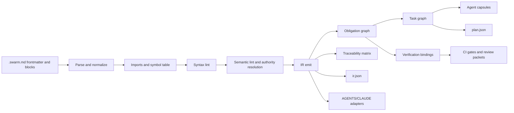
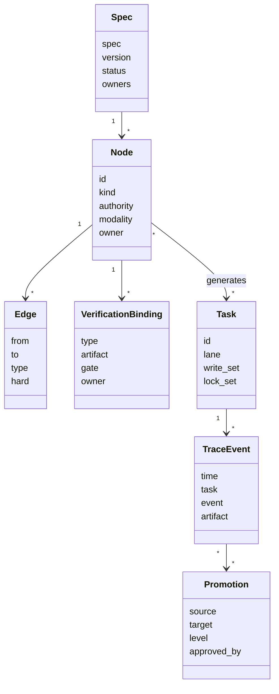
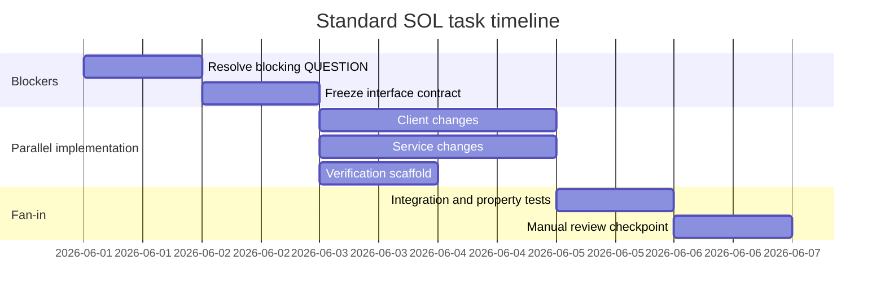

# Swarm Obligation Language and `.swarm.md`

## Executive summary

The strongest design choice is **not** to invent a purely formal language that replaces English, and **not** to remain in free-form Markdown. The best near-term path is a **hybrid**: keep Markdown as the authoring shell for readability and adoption, but introduce a **small controlled specification language** inside typed obligation blocks that compile into a deterministic intermediate representation, obligation graph, task graph, and per-agent execution capsules. That recommendation follows directly from the evidence. Controlled requirements styles such as **EARS** reduce ambiguity without requiring authors to think in temporal logic; **FRET/FRETish** shows that structured natural language can be mapped compositionally to formal semantics and checked; **Gherkin** proves the value of executable behavioral examples; **TLA+** shows why mathematically precise modeling is unmatched for high-risk invariants and concurrency, but is too heavy to be the default authoring format for everyday product specs. At the same time, empirical studies of coding-agent workflows show that ambiguity, long iterative sessions, and weak grounding are real bottlenecks in practice, with frequent user pushback and low survival of agent-produced code in real repositories. citeturn5search0turn5search1turn26view0turn0search0turn27view0turn27view1turn23view1turn23view0

The core engineering insight is this: **trustworthy parallelism requires compiled obligations, not better prose**. One developer can supervise many agents only if each agent receives a **small, unambiguous, authority-scoped slice** of the spec, plus exact verification bindings and merge-safety constraints. The evidence from context-file studies is especially important here. Markdown context files are widely adopted and increasingly standardized around `AGENTS.md`, but evidence is mixed on whether “more context” helps: one study found AGENTS files could reduce runtime and output tokens while maintaining comparable completion behavior, while another found context files could lower task success and increase cost by more than 20%. A separate controlled study found that file layout choices such as size, position, and multi-file architecture produced no detectable effect, while **within-session compliance declined as sessions grew longer**. Anthropic’s own guidance also favors **simple, composable workflows** over monolithic agent loops, and its memory documentation explicitly treats project memory as guidance rather than enforcement. The implication is clear: the normative source of truth should be a compiled spec, and agent-facing memory/context files should be **derived, minimal adapters**, not the canonical policy surface. citeturn11view0turn7search17turn24view0turn3search0turn3search1turn25view0turn33view0

The proposed answer is **Swarm Obligation Language**, abbreviated here as **SOL**, stored in `.swarm.md` files. SOL should use **typed blocks** such as `REQ`, `CONSTRAINT`, `INVARIANT`, `INTERFACE`, `QUESTION`, and `TASK-MAP`; **BCP 14 modal vocabulary** (`MUST`, `SHALL`, `SHOULD`, `MAY`) in uppercase only; **EARS-inspired trigger/state patterns** (`WHEN`, `WHILE`, `WHERE`, `IF … THEN`); and **mandatory verification bindings** for every active obligation. The compiler should emit a deterministic IR, detect syntax and semantic defects, generate a dependency/task graph with write-set and lock-set analysis, and produce a small plan for fan-out/fan-in execution. High-risk invariants should be eligible for escalation to formal backends such as property testing or TLA+ model checking. citeturn31view0turn31view1turn5search0turn26view0turn27view0turn34search0turn34search1

The recommendation set below is the highest-confidence synthesis.

| Recommendation                                                                                    | Why                                                                                    |       Evidence |  Confidence |
| ------------------------------------------------------------------------------------------------- | -------------------------------------------------------------------------------------- | -------------: | ----------: |
| Keep Markdown as the outer container, but make the inner language typed and lintable              | Preserves adoption ergonomics while enabling deterministic parsing and IR generation   | E1, E2, E3, E5 |        High |
| Use EARS-style trigger/state clauses plus BCP 14 uppercase modalities                             | Gives controlled syntax without forcing full formal-method fluency                     |     E1, E2, E5 |        High |
| Make `.swarm.md` the normative source of truth; generate `AGENTS.md`/`CLAUDE.md` adapters from it | Context/memory artifacts are useful but should remain derivative and small             |     E2, E3, E5 |        High |
| Require every active `REQ`/`CONSTRAINT`/`INVARIANT` to bind to at least one verification lane     | Verifiability is the central trust lever for multi-agent orchestration                 | E1, E2, E3, E5 |        High |
| Treat `QUESTION` and `TASK-MAP` as typed, non-business-truth blocks with lower authority          | Prevents planning metadata from silently changing requirements                         |         E2, E5 |        High |
| Enforce critical rules in hooks/CI/policy layers, not only through prompt text                    | Prompt guidance alone is not a security or compliance boundary                         |     E2, E3, E5 |        High |
| Parallelize only when write sets and lock groups are non-overlapping                              | Review bottlenecks come from uncertainty and merge collisions, not lack of agent count |     E2, E3, E5 | Medium-High |

## Rationale and evidence

The problem that SOL should solve is not “how do we write prettier prompts.” It is “how do we convert messy human intent into an artifact that behaves more like source code than prose.” That problem exists because ambiguity in requirements remains materially harmful. Recent work on requirement ambiguity for code generation reports that ambiguous prompts significantly degrade model performance and that models frequently fail to identify or resolve ambiguity autonomously. Requirements-smell research likewise emphasizes ambiguity and verifiability as severe and practically important quality problems. A 2026 Requirements Engineering study evaluating LLM-generated requirements also operationalized **unambiguity**, **verifiability**, and **singularity** as core quality attributes and found that output quality varies substantially with prompt design and input clarity, even when models appear strong overall. citeturn5search0turn5search1turn30view0

This is why the right precedent is not a single prior-art system, but a **stack of precedents**. **EARS** contributes lightweight controlled syntax patterns for event-driven, state-driven, optional, and fault-driven requirements. **FRET/FRETish** contributes the crucial compiler idea: structured natural language with explicit fields can be translated compositionally into formal semantics and checked. **Gherkin** contributes executable examples and the discipline of observable outcomes. **RFC 2119/8174** contributes a normative modality vocabulary whose meaning is stable precisely because only uppercase keywords carry the special meaning. **TLA+** contributes the model-checking and proof layer for concurrency, invariants, and liveness. **Spec Kit** contributes the modern four-phase spec workflow—specify, plan, tasks, implement—and recent Spec Kit Agents work adds the insight that repository-grounding hooks can improve quality. **DocPrompting** contributes evidence that retrieving the right documentation materially improves code generation. Claude project memory and the expanding `AGENTS.md` ecosystem contribute the operational reality that repository-bound context artifacts are now normal, but they are not yet formal enough to be compiler-grade. citeturn6search1turn26view0turn0search0turn31view0turn31view1turn27view0turn27view1turn3search17turn25view0turn29view0turn3search1turn4search0turn33view0

That stack leads to a narrow but important conclusion. **SOL should be a controlled natural language for obligation capture, not a general-purpose formal methods language, and not a free-form agent README.** In practice, Gherkin is excellent for behavioral scenarios but weak for architectural constraints, shared invariants, and authority conflict management. TLA+ is excellent for high-risk protocol logic but costly to author and review at broad organizational scale. Context files such as `AGENTS.md` and `CLAUDE.md` are a good operational distribution mechanism, but the evidence does not support using them as the sole or primary requirements format. Official and empirical evidence points instead toward **small, composable workflows**, repository grounding, and modestly scoped context. citeturn0search0turn27view1turn3search0turn25view0turn33view0turn24view0

The evidence base used in this report is classified as follows.

| Evidence class | Meaning                                                                                       |
| -------------- | --------------------------------------------------------------------------------------------- |
| E1             | Peer-reviewed papers, standards, or primary technical references with stable semantics        |
| E2             | Official vendor or project documentation maintained by creators                               |
| E3             | High-quality preprints, empirical datasets, or in-the-wild measurements not yet fully settled |
| E4             | Expert practitioner material and case studies                                                 |
| E5             | Design synthesis and engineering inference from E1–E4                                         |

The following comparison table is the decision surface SOL is designed to occupy.

| Alternative               | Strength                                                    | Weakness                                                                    | Best use                                    | Why SOL should borrow from it                            |
| ------------------------- | ----------------------------------------------------------- | --------------------------------------------------------------------------- | ------------------------------------------- | -------------------------------------------------------- |
| Gherkin                   | Behavioral examples tied to executable steps                | Poor fit for cross-cutting constraints, interfaces, architectural authority | Acceptance criteria and observable outcomes | Reuse `WHEN/THEN` discipline for verification bindings   |
| EARS                      | Lightweight controlled NL, low authoring burden             | Limited explicit formal semantics by itself                                 | Product/system requirements authoring       | Use its trigger/state/optional/fault patterns            |
| FRETish                   | Structured NL mapped to formal semantics and verification   | Heavier, temporal-logic-oriented, stronger fit for cyber-physical systems   | Safety-critical temporal requirements       | Use typed fields and compositional formalization pattern |
| RFC 2119/8174             | Stable normative modality language                          | No guidance on requirement shape or decomposition                           | Standards and normative documents           | Use uppercase modal semantics                            |
| TLA+                      | Precise models, invariants, liveness, concurrency reasoning | High training/adoption cost as default authoring language                   | High-risk invariants and protocols          | Use as optional backend for selected invariants          |
| AGENTS.md / CLAUDE memory | Operationally convenient and widely adopted                 | Not schema-first, not compiler-grade, mixed empirical effects               | Lightweight repository guidance             | Use as generated adapter, not normative source           |
| Standalone JSON/YAML DSL  | Easy to parse                                               | Bad authoring ergonomics and poor social adoption                           | Machine-generated artifacts                 | Use for IR, not for human-first authoring                |

This comparison is grounded in official Cucumber, RFC, TLA+, Anthropic, and Spec Kit documentation; EARS and FRET/FRETish literature; and empirical studies on context files and agent workflows. citeturn0search0turn31view0turn31view1turn27view0turn27view1turn26view0turn3search1turn4search0turn25view0turn33view0

The design goals and non-goals should therefore be explicit.

| Goals                                                | Non-goals                                                   |
| ---------------------------------------------------- | ----------------------------------------------------------- |
| Make requirements parseable into an obligation graph | Replace source code or all design/docs formats              |
| Make ambiguity and incompleteness lintable           | Turn every spec into a full formal proof artifact           |
| Bind obligations to verification and ownership       | Act as a general workflow engine for every business process |
| Generate merge-safe multi-agent task plans           | Store hidden prompt state as normative truth                |
| Preserve Markdown ergonomics and staged adoption     | Eliminate human review entirely                             |

## Language definition

The recommended file extension is **`.swarm.md`**. The recommended language name is **Swarm Obligation Language (SOL)**, with a normative file header such as `language: SOL/0.1`. The outer Markdown shell exists for readability, discussion, rationale, and documentation reuse. The inner typed blocks exist for compilation. This preserves compatibility with modern repository workflows while taking advantage of the fact that Markdown structure itself is cognitively and model-wise useful for readable, structured content. citeturn32view0turn33view0

The canonical syntax recommendation is a **directive block** format with a single required control sentence followed by YAML-like metadata:

```md
:::REQ auth.refresh.retry-on-401
WHEN response.status == 401 AND refresh_token.present THEN web-client SHALL retry original_request once.
title: Retry once after token refresh
owner: @web-platform
priority: P1
depends:

- INTERFACE.auth.refresh.endpoint
  verify:
- integration: web/tests/auth-refresh-401.spec.ts
- property: web/tests/auth-refresh.properties.ts#no_unbounded_retry
  files:
- web/src/http/client.ts
  locks:
- auth-client
  :::END
```

This format is recommended for five reasons. First, it is visibly distinct from surrounding prose. Second, it is easy to parse without a full Markdown AST rewrite. Third, the first line gives a **single controlled sentence** that can be linted aggressively. Fourth, the metadata is familiar to developers because it resembles YAML. Fifth, it keeps the file authorable in ordinary editors while enabling future editor grammars and language servers. The modal words should follow **BCP 14 semantics in uppercase only**, because RFC 8174 explicitly clarifies that only uppercase forms carry the special normative meaning. citeturn31view0turn31view1

The frontmatter schema should be minimal but sufficient to define provenance, authority, defaults, imports, and planner settings.

```yaml
---
spec: auth-refresh
title: Access token refresh
language: SOL/0.1
version: 0.1.0
status: draft # draft | active | deprecated
owners:
  - "@auth-platform"
reviewers:
  - "@security"
repo_roots:
  - "web/"
  - "api/"
imports:
  - "shared/security.swarm.md"
authority_order:
  - compliance
  - security
  - architecture
  - product
  - team
  - task-map
  - memory
defaults:
  risk: medium # low | medium | high | critical
  verify:
    - unit
    - integration
planner:
  max_parallel: 4
  lock_strategy: component # file | component | explicit
memory:
  promote: selective # none | selective | explicit
  adapter_targets:
    - agents
    - claude
glossary:
  original_request: "The request that triggered the 401"
  single_flight: "At most one refresh in progress per principal"
---
```

The frontmatter fields and their status should be treated as follows.

| Field             | Required | Meaning                                             |
| ----------------- | -------: | --------------------------------------------------- |
| `spec`            |      Yes | Stable spec identifier                              |
| `title`           |      Yes | Human-readable title                                |
| `language`        |      Yes | Language/version discriminator                      |
| `version`         |      Yes | Semver-like schema and content version              |
| `status`          |      Yes | Lifecycle state                                     |
| `owners`          |      Yes | Accountable maintainers                             |
| `repo_roots`      |       No | Planning and scope boundaries                       |
| `imports`         |       No | Imported `.swarm.md` dependencies                   |
| `authority_order` |       No | Override precedence if non-default                  |
| `defaults.verify` |       No | Default verification lanes                          |
| `planner.*`       |       No | Parallelism and lock behavior knobs                 |
| `memory.*`        |       No | Adapter generation and promotion strategy           |
| `glossary`        |       No | Canonical term definitions for linting and planning |

The reserved keywords for the MVP should be fixed and case-sensitive. **Uppercase** is required for control keywords and modalities.

| Reserved keywords                                                                                                                                                                        |
| ---------------------------------------------------------------------------------------------------------------------------------------------------------------------------------------- |
| `REQ`, `CONSTRAINT`, `INVARIANT`, `INTERFACE`, `QUESTION`, `TASK-MAP`, `END`                                                                                                             |
| `WHEN`, `WHILE`, `WHERE`, `IF`, `THEN`, `ALWAYS`, `NEVER`, `ASK`, `MAP`, `TO`, `ORDER`, `EXPOSES`, `INPUT`, `OUTPUT`, `ERRORS`, `BEFORE`, `UNTIL`, `WITHIN`, `IMMEDIATELY`, `EVENTUALLY` |
| `MUST`, `MUST NOT`, `SHALL`, `SHALL NOT`, `SHOULD`, `SHOULD NOT`, `MAY`                                                                                                                  |

The **minimal viable grammar** should be intentionally small. An implementation can extend the expression grammar later, but the top-level sentence forms should be stable from day one.

```ebnf
document        = frontmatter, { markdown | block } ;

block           = block_open, nl, control_line, nl, { field_line | list_field }, block_close, nl ;
block_open      = ":::", block_type, ws, block_id ;
block_close     = ":::END" ;
block_type      = "REQ" | "CONSTRAINT" | "INVARIANT" | "INTERFACE" | "QUESTION" | "TASK-MAP" ;
block_id        = ident, { ("." | "-"), ident } ;

control_line    = req_line | constraint_line | invariant_line | interface_line | question_line | taskmap_line ;

req_line        = [ where_clause, ws ],
                  [ while_clause, ws ],
                  [ trigger_clause, ws ],
                  subject, ws, modal, ws, predicate,
                  [ ws, timing_clause ],
                  "." ;

where_clause    = "WHERE", ws, expr ;
while_clause    = "WHILE", ws, expr ;
trigger_clause  = ("WHEN" | "IF"), ws, expr, ws, "THEN" ;

constraint_line = subject, ws, constraint_modal, ws, predicate, "." ;
constraint_modal= "MUST" | "MUST NOT" | "SHALL" | "SHALL NOT" ;

invariant_line  = ("ALWAYS" | "NEVER"), ws, predicate, "." ;

interface_line  = subject, ws, "EXPOSES", ws, operation,
                  [ ws, "INPUT", ws, schema_ref ],
                  [ ws, "OUTPUT", ws, schema_ref ],
                  [ ws, "ERRORS", ws, error_list ],
                  "." ;

question_line   = "ASK", ws, question_text, "?" ;

taskmap_line    = "MAP", ws, ref_list, ws, "TO", ws, target_list,
                  [ ws, "ORDER", ws, order_clause ], "." ;

modal           = "MUST" | "SHALL" | "SHOULD" | "MAY" ;

timing_clause   = "IMMEDIATELY"
                | "EVENTUALLY"
                | "WITHIN", ws, duration
                | "BEFORE", ws, expr
                | "UNTIL", ws, expr ;

field_line      = key, ":", ws, scalar ;
list_field      = key, ":", nl, indent, "-", ws, scalar, { nl, indent, "-", ws, scalar } ;

expr            = token, { ws, ("AND" | "OR"), ws, token } ;
token           = ident | string | number | comparison | "(", expr, ")" ;
```

The intended semantics of the block types are implementation-facing, not merely cosmetic.

| Block type   | Meaning                                                     | Required metadata                          |
| ------------ | ----------------------------------------------------------- | ------------------------------------------ |
| `REQ`        | A stakeholder-visible obligation the system should satisfy  | `owner`, `verify`                          |
| `CONSTRAINT` | A limit or prohibition that shapes implementations          | `owner`; `verify` unless explicitly exempt |
| `INVARIANT`  | A property that must hold across states or executions       | `owner`, `verify`                          |
| `INTERFACE`  | A contract between components or systems                    | `owner`, `version` recommended, `verify`   |
| `QUESTION`   | A typed unresolved ambiguity or decision needing resolution | `owner`, `blocking`                        |
| `TASK-MAP`   | Planning and decomposition hints only; never business truth | `owner` recommended                        |

The metadata vocabulary should stay small at first. The common fields recommended for MVP are `title`, `owner`, `priority`, `risk`, `tags`, `depends`, `blocks`, `verify`, `files`, `locks`, `affects`, `example`, and `rationale`. This is enough to generate planning, review, and traceability without turning the authoring experience into XML in disguise. That tradeoff matches the broader RE literature: developers accept structure when it reduces ambiguity and preserves readability; they reject it when it becomes an alien formal notation for routine work. citeturn26view0turn28search0

## Compiler, IR, and linting

The compiler should be explicit about its phases. The goal is not “turn prose into code directly.” The goal is “turn authored obligations into a graph of **typed, reviewable commitments** that tooling can then project into code, tests, reviews, memory adapters, and dashboards.”



This architecture is recommended because agent performance depends heavily on the quality of the surrounding interface and grounding, not only on model choice. SWE-agent work emphasizes the importance of the agent-computer interface, Anthropic advocates simple composable workflows with explicit checkpoints, and real-world studies show that long sessions and weakly grounded interaction frequently produce developer correction and trust costs. The compiler should therefore produce **small work packets** rather than dumping the entire spec into a single prompt. citeturn8search1turn3search0turn23view0turn23view1turn24view0

The recommended IR should be JSON-native even if authors use Markdown, because JSON is the natural planning and tooling substrate.

```json
{
  "meta": {
    "spec": "auth-refresh",
    "title": "Access token refresh",
    "language": "SOL/0.1",
    "version": "0.1.0",
    "status": "draft",
    "owners": ["@auth-platform"],
    "imports": ["shared/security.swarm.md"]
  },
  "nodes": [
    {
      "id": "REQ.auth.refresh.retry-on-401",
      "kind": "REQ",
      "authority": "product",
      "modality": "SHALL",
      "clauses": {
        "trigger": "response.status == 401 AND refresh_token.present",
        "subject": "web-client",
        "predicate": "retry original_request once"
      },
      "owner": "@web-platform",
      "priority": "P1",
      "risk": "medium",
      "depends": ["INTERFACE.auth.refresh.endpoint"],
      "files": ["web/src/http/client.ts"],
      "locks": ["auth-client"],
      "verify": [
        {
          "type": "integration",
          "artifact": "web/tests/auth-refresh-401.spec.ts",
          "gate": "required"
        },
        {
          "type": "property",
          "artifact": "web/tests/auth-refresh.properties.ts#no_unbounded_retry",
          "gate": "required"
        }
      ],
      "source": {
        "file": "auth-refresh.swarm.md",
        "line_start": 18,
        "line_end": 29
      }
    }
  ],
  "edges": [
    {
      "from": "REQ.auth.refresh.retry-on-401",
      "to": "INTERFACE.auth.refresh.endpoint",
      "type": "depends_on",
      "hard": true
    }
  ],
  "diagnostics": [],
  "provenance": {
    "hash": "sha256:…",
    "compiled_at": "2026-05-31T12:00:00Z"
  }
}
```

The entity relationships should be explicit enough to support traceability and promotion.



The IR schema should be fixed enough to support downstream tools.

| IR field       | Meaning                                                                                 |
| -------------- | --------------------------------------------------------------------------------------- |
| `meta`         | File-level provenance, ownership, versioning, imports                                   |
| `nodes`        | Obligations, interfaces, questions, and planning hints                                  |
| `edges`        | Typed relationships: `depends_on`, `blocks`, `conflicts_with`, `verified_by`, `affects` |
| `diagnostics`  | Compiler findings attached to source spans                                              |
| `provenance`   | Hashes, compiler version, compile timestamp                                             |
| `tasks`        | Optional post-planning materialized tasks                                               |
| `traceability` | Optional links to code, tests, PRs, ADRs, incidents                                     |

The lint layer should be strict. If SOL is to behave like a compiler target, then incomplete syntax must fail clearly and early. The following rules are the recommended MVP baseline.

| Code     | Level   | Meaning                                                          | Example trigger                                     |
| -------- | ------- | ---------------------------------------------------------------- | --------------------------------------------------- |
| `SOL001` | Error   | Invalid or missing frontmatter                                   | `language` absent                                   |
| `SOL002` | Error   | Unknown block type                                               | `:::RULE`                                           |
| `SOL003` | Error   | Invalid block ID                                                 | spaces in ID                                        |
| `SOL004` | Error   | Missing `:::END`                                                 | unterminated block                                  |
| `SOL005` | Error   | First non-empty line is not a control sentence                   | metadata before sentence                            |
| `SOL006` | Error   | Unknown metadata field                                           | `urgency:`                                          |
| `SOL007` | Error   | Duplicate field with scalar semantics                            | two `owner:` lines                                  |
| `SOL101` | Error   | `WHEN` or `IF` without `THEN`                                    | `WHEN X web-client SHALL...`                        |
| `SOL102` | Error   | `THEN` without modal obligation                                  | `WHEN X THEN web-client retries`                    |
| `SOL103` | Error   | `REQ` lacks a modal keyword                                      | no `MUST`/`SHALL`/`SHOULD`/`MAY`                    |
| `SOL104` | Error   | `INVARIANT` does not begin with `ALWAYS` or `NEVER`              | malformed invariant                                 |
| `SOL105` | Error   | `QUESTION` does not end in `?`                                   | statement instead of question                       |
| `SOL201` | Error   | Duplicate logical node ID                                        | repeated `REQ.auth.x`                               |
| `SOL202` | Error   | Unresolved dependency reference                                  | `depends: INTERFACE.foo` missing                    |
| `SOL203` | Error   | Hard dependency cycle                                            | `A -> B -> A`                                       |
| `SOL204` | Error   | Active `REQ`/`INVARIANT`/`CONSTRAINT` lacks verification binding | no `verify:`                                        |
| `SOL205` | Error   | Blocking `QUESTION` unresolved                                   | `blocking: true` without answer                     |
| `SOL206` | Error   | Authority conflict                                               | lower-authority block attempts to weaken higher one |
| `SOL207` | Error   | Contradictory obligations in same scope                          | `MUST` and `MUST NOT` on same subject/predicate     |
| `SOL208` | Error   | Planner marks conflicting tasks parallelizable                   | overlapping locks/write sets                        |
| `SOL301` | Warning | Ambiguous adjective or adverb                                    | “fast”, “cleanly”, “user-friendly”                  |
| `SOL302` | Warning | Unverifiable wording                                             | “optimize”, “gracefully”                            |
| `SOL303` | Warning | Low singularity: multiple obligations in one sentence            | two modals in one line                              |
| `SOL304` | Warning | Missing `owner` or `priority`                                    | governance gap                                      |
| `SOL305` | Warning | Scope too broad for planning                                     | no `files`, `locks`, or `affects`                   |
| `SOL306` | Warning | Imported file creates policy overlap                             | duplicate constraint imported                       |
| `SOL307` | Warning | Overlong block body                                              | too much rationale inside block                     |

Those warnings are not arbitrary. They reflect the empirical importance of **unambiguity**, **verifiability**, and **singularity** in requirements engineering, plus the operational reality that agents do worse when the task packet is broad, repetitive, or context-heavy. citeturn30view0turn5search0turn24view0

Authority resolution should be more explicit than today’s agent-readme conventions. The emerging `AGENTS.md` ecosystem often uses simple locality rules such as “deeper file wins” plus explicit user overrides, which is useful operationally but too weak for normative requirements governance. The recommended SOL hierarchy is:

| Authority rank  | Meaning                                                |
| --------------- | ------------------------------------------------------ |
| Enforced policy | CI hooks, repo settings, org policy, legal constraints |
| Compliance      | Regulatory and audit obligations                       |
| Security        | Security/privacy/data handling obligations             |
| Architecture    | Structural and interface decisions                     |
| Product         | Functional and experience requirements                 |
| Team            | Component-local engineering constraints                |
| Task-map        | Planner hints only                                     |
| Memory          | Derived hints and ephemeral lessons                    |

The resolution rules should be: higher authority beats lower authority; equal authority with the same ID uses the newer version; broader scope can be narrowed by equal-or-higher authority but not weakened by lower authority; `TASK-MAP` can reorder work but never weaken requirements; derived memory can never override `.swarm.md`. This layered approach is necessary because official memory/context mechanisms are guidance layers, not enforcement boundaries, and security guidance for LLM systems continues to emphasize the need for external policy enforcement rather than trusting the prompt surface alone. citeturn3search1turn4search0turn21view2turn20view0

Promotion and memory integration should therefore be conservative. The rule should be simple: **`.swarm.md` is normative; memory is derivative**. Promotion should move recurring, validated execution knowledge into the cheapest durable layer that preserves correctness:

| Observation type                    | Target                                    |
| ----------------------------------- | ----------------------------------------- |
| Stable build/test commands          | Generated `AGENTS.md`/`CLAUDE.md` adapter |
| Repeated debugging recipe           | Skill or internal runbook                 |
| Durable business rule or constraint | `.swarm.md` update                        |
| Architectural rationale             | ADR linked from `.swarm.md`               |
| Ephemeral session hint              | Agent-local memory only                   |

This is the right split because vendor memory systems are bounded and operational rather than normative, while studies of context artifacts suggest that deeper configuration is still mostly used as static documentation, not executable workflow automation. citeturn3search1turn33view0

## Verification and planning

The verification model is where SOL becomes trustworthy enough for multi-agent execution. The recommended principle is simple: **no active obligation without at least one explicit verification lane**. That lane can be automated or human, but it must be named, scoped, and attributable. Gherkin’s emphasis on observable outcomes supports executable example tests; FRET shows how structured requirements can be formally mapped and checked; TLA+ shows the value of invariants and liveness properties for concurrency; and property-based testing ecosystems such as QuickCheck and Hypothesis show how invariant-like properties can be tested across large generated input spaces and reduced to minimal counterexamples. citeturn0search0turn26view0turn27view1turn34search0turn34search1turn34search16

The recommended verification binding taxonomy is:

| Verification type | Typical use                                                  |
| ----------------- | ------------------------------------------------------------ |
| `unit`            | Local deterministic behavior                                 |
| `integration`     | Cross-component behavior with real boundaries                |
| `e2e`             | User-visible multi-step flows                                |
| `contract`        | Interface/schema/API compatibility                           |
| `property`        | Invariants and edge-case generation                          |
| `model`           | High-risk concurrency/safety/liveness via TLA+ or equivalent |
| `static`          | Lint, type, schema, policy, taint, SAST                      |
| `perf`            | Latency/throughput/resource ceilings                         |
| `security`        | Abuse cases, authz/authn, injection, secret handling         |
| `monitor`         | Runtime SLO/alert instrumentation                            |
| `manual`          | Human-only judgment with checklist and owner                 |

A `verify:` binding should compile to a normalized object:

```json
{
  "type": "property",
  "artifact": "web/tests/auth-refresh.properties.ts#no_unbounded_retry",
  "owner": "@web-platform",
  "gate": "required",
  "review_if_fails": true
}
```

The generation of the task/dependency graph should be deterministic. The recommended compiler rules are:

| Rule                                                          | Behavior                                                                 |
| ------------------------------------------------------------- | ------------------------------------------------------------------------ |
| `INTERFACE` before consumers                                  | New or changed interfaces create contract tasks that gate consumer tasks |
| Blocking `QUESTION` first                                     | Unresolved blockers prevent downstream planning                          |
| `REQ` creates implementation tasks per affected component     | Use `files`, `affects`, or inferred ownership                            |
| `INVARIANT` creates verification and guard tasks              | Prefer property/model/static verification                                |
| `CONSTRAINT` creates enforcement tasks                        | Policy checks, guard code, or test gates                                 |
| `TASK-MAP` can group or reorder but not weaken                | It is a planning overlay only                                            |
| Explicit `depends` create hard edges                          | Mandatory order                                                          |
| Shared write sets or shared locks create conflict edges       | Default no parallelism                                                   |
| Verification tasks fan in after implementation tasks          | Merge only after required bindings pass                                  |
| Missing scope metadata defaults to conservative serialization | Safety over speculative parallelism                                      |

The planning output should include lane assignment, write sets, lock sets, and merge eligibility. A minimal `plan.json` should look like this:

```json
{
  "plan_id": "auth-refresh@0.1.0",
  "max_parallel": 3,
  "tasks": [
    {
      "id": "T1",
      "kind": "contract",
      "derived_from": ["INTERFACE.auth.refresh.endpoint"],
      "lane": "shared",
      "writes": ["openapi/auth-refresh.yaml"],
      "locks": ["auth-api"],
      "depends": [],
      "merge_safe": false
    },
    {
      "id": "T2",
      "kind": "implementation",
      "derived_from": ["REQ.auth.refresh.retry-on-401"],
      "lane": "agent-a",
      "writes": ["web/src/http/client.ts"],
      "locks": ["auth-client"],
      "depends": ["T1"],
      "merge_safe": true
    },
    {
      "id": "T3",
      "kind": "verification",
      "derived_from": ["INVARIANT.auth.refresh.no-unbounded-retry"],
      "lane": "agent-b",
      "writes": ["web/tests/auth-refresh.properties.ts"],
      "locks": ["auth-test"],
      "depends": ["T2"],
      "merge_safe": true
    }
  ]
}
```

Parallelization must be conservative, because the central operational problem is **review entropy**, not nominal agent count. Real-world datasets of coding-agent usage show frequent user pushback and explicit correction, low survival of agent-authored code into commits, and persistent effort/trust costs. In that world, “run five agents” only works if the plan compiler prevents them from stepping on the same files, abstractions, or architectural constraints. citeturn23view1turn23view0

The merge-safety rules should therefore be explicit:

| Condition                                       | Planner result                   |
| ----------------------------------------------- | -------------------------------- |
| Same file in `writes`                           | No parallelism                   |
| Same lock group in `locks`                      | No parallelism                   |
| Shared public API/interface node                | Serialize behind contract freeze |
| Shared migration or schema change               | Serialize                        |
| Test-only tasks with distinct paths             | Parallel allowed                 |
| Append-only docs/runbooks with no policy effect | Parallel allowed                 |
| Unscoped tasks                                  | Conservative serialization       |

The planner should also support tiered task templates because not all obligations deserve the same execution shape.

| Template   | Intended size                                              | Plan shape                                                  | Typical use                                |
| ---------- | ---------------------------------------------------------- | ----------------------------------------------------------- | ------------------------------------------ |
| `micro`    | 1 component, 1 lock, 1–3 files                             | single lane + auto-verify                                   | local bugfix or helper behavior            |
| `standard` | 2–3 components, 2–4 locks                                  | contract freeze, fan-out, fan-in                            | feature work across API + client           |
| `deep`     | multi-component, migration, policy or concurrency concerns | blocker questions, formal verification lane, staged fan-out | payments, auth, retry logic, infra changes |

A typical timeline for `standard` work should look like this.



## Worked examples

The examples below are not toy prose; they are intended to show the **authored source**, the **compiled interpretation**, and the **task plan shape**.

### Auth refresh example

```md
---
spec: auth-refresh
title: Access token refresh
language: SOL/0.1
version: 0.1.0
status: draft
owners:
  - "@auth-platform"
repo_roots:
  - "web/"
  - "api/"
defaults:
  verify:
    - unit
    - integration
planner:
  max_parallel: 3
  lock_strategy: component
---

:::INTERFACE auth.refresh.endpoint
auth-service EXPOSES POST /auth/refresh INPUT RefreshRequest OUTPUT RefreshResponse ERRORS 400,401,429,500.
owner: @auth-platform
version: v1
verify:

- contract: openapi/auth-refresh.yaml
  :::END

:::REQ auth.refresh.retry-on-401
WHEN response.status == 401 AND refresh_token.present THEN web-client SHALL retry original_request once.
title: Retry once after refresh
owner: @web-platform
priority: P1
depends:

- INTERFACE.auth.refresh.endpoint
  verify:
- integration: web/tests/auth-refresh-401.spec.ts
  files:
- web/src/http/client.ts
  locks:
- auth-client
  :::END

:::INVARIANT auth.refresh.no-unbounded-retry
ALWAYS retry_count(original_request) <= 1.
owner: @web-platform
verify:

- property: web/tests/auth-refresh.properties.ts#no_unbounded_retry
  :::END

:::QUESTION auth.refresh.cross-tab
ASK Should successful refresh be broadcast across browser tabs?
blocking: false
owner: @product-auth
:::END
```

Rendered compile summary:

| ID                                          | Kind        | Meaning                                     | Blocking |
| ------------------------------------------- | ----------- | ------------------------------------------- | -------: |
| `INTERFACE.auth.refresh.endpoint`           | `INTERFACE` | Refresh contract must exist and be testable |       No |
| `REQ.auth.refresh.retry-on-401`             | `REQ`       | Retry once after qualifying 401             |       No |
| `INVARIANT.auth.refresh.no-unbounded-retry` | `INVARIANT` | No infinite retry loop                      |       No |
| `QUESTION.auth.refresh.cross-tab`           | `QUESTION`  | Cross-tab broadcast decision remains open   |       No |

Generated `ir.json` excerpt:

```json
{
  "meta": {
    "spec": "auth-refresh",
    "language": "SOL/0.1",
    "version": "0.1.0"
  },
  "nodes": [
    {
      "id": "INTERFACE.auth.refresh.endpoint",
      "kind": "INTERFACE",
      "owner": "@auth-platform",
      "contract": {
        "operation": "POST /auth/refresh",
        "input": "RefreshRequest",
        "output": "RefreshResponse",
        "errors": [400, 401, 429, 500]
      }
    },
    {
      "id": "REQ.auth.refresh.retry-on-401",
      "kind": "REQ",
      "modality": "SHALL",
      "clauses": {
        "trigger": "response.status == 401 AND refresh_token.present",
        "subject": "web-client",
        "predicate": "retry original_request once"
      },
      "depends": ["INTERFACE.auth.refresh.endpoint"],
      "files": ["web/src/http/client.ts"],
      "locks": ["auth-client"],
      "verify": [
        {
          "type": "integration",
          "artifact": "web/tests/auth-refresh-401.spec.ts"
        }
      ]
    },
    {
      "id": "INVARIANT.auth.refresh.no-unbounded-retry",
      "kind": "INVARIANT",
      "clauses": {
        "predicate": "retry_count(original_request) <= 1"
      },
      "verify": [
        {
          "type": "property",
          "artifact": "web/tests/auth-refresh.properties.ts#no_unbounded_retry"
        }
      ]
    }
  ],
  "edges": [
    {
      "from": "REQ.auth.refresh.retry-on-401",
      "to": "INTERFACE.auth.refresh.endpoint",
      "type": "depends_on",
      "hard": true
    }
  ]
}
```

Generated plan:

| Task                   | Lane    | Derived from                                | Writes                                 | Depends   | Exit criteria                                  |
| ---------------------- | ------- | ------------------------------------------- | -------------------------------------- | --------- | ---------------------------------------------- |
| `T1-contract-refresh`  | shared  | `INTERFACE.auth.refresh.endpoint`           | `openapi/auth-refresh.yaml`            | —         | contract exists and passes contract validation |
| `T2-client-retry-once` | agent-a | `REQ.auth.refresh.retry-on-401`             | `web/src/http/client.ts`               | `T1`      | retry-once behavior implemented                |
| `T3-property-no-loop`  | agent-b | `INVARIANT.auth.refresh.no-unbounded-retry` | `web/tests/auth-refresh.properties.ts` | `T2`      | property test fails on >1 retry                |
| `T4-integration-401`   | agent-c | `REQ.auth.refresh.retry-on-401`             | `web/tests/auth-refresh-401.spec.ts`   | `T2`      | qualifying 401 scenario passes                 |
| `T5-review-and-merge`  | human   | all above                                   | PR + trace links                       | `T3`,`T4` | required review complete                       |

### Checkout example

```md
---
spec: checkout
title: Checkout submit flow
language: SOL/0.1
version: 0.1.0
status: active
owners:
  - "@orders-platform"
planner:
  max_parallel: 4
---

:::INTERFACE checkout.place-order
checkout-api EXPOSES POST /checkout INPUT CheckoutRequest OUTPUT OrderConfirmation ERRORS 400,409,500.
owner: @orders-platform
verify:

- contract: openapi/checkout.yaml
  :::END

:::CONSTRAINT checkout.submit.idempotency
checkout-api MUST reject duplicate submit requests without creating duplicate orders.
owner: @orders-platform
verify:

- integration: api/tests/checkout-idempotency.spec.ts
  locks:
- checkout-api
  :::END

:::REQ checkout.reserve-before-capture
WHEN submit_checkout.valid THEN order-service SHALL reserve_inventory BEFORE payment-service captures_funds.
owner: @orders-platform
depends:

- INTERFACE.checkout.place-order
  verify:
- integration: api/tests/checkout-reserve-before-capture.spec.ts
  affects:
- order-service
- payment-service
  locks:
- orders-domain
- payment-adapter
  :::END

:::INVARIANT checkout.total-equals-lines-plus-tax
ALWAYS order_total == sum(line_items) + tax - discounts.
owner: @orders-platform
verify:

- property: api/tests/checkout-total.properties.ts#total_consistency
  :::END

:::TASK-MAP checkout.submit.flow
MAP REQ.checkout.reserve-before-capture, CONSTRAINT.checkout.submit.idempotency TO web.checkout, api.orders, api.payments ORDER interface>services>web>verification.
owner: @tech-lead-checkout
:::END
```

Rendered compile summary:

| ID                                               | Kind         | Meaning                                     |
| ------------------------------------------------ | ------------ | ------------------------------------------- |
| `INTERFACE.checkout.place-order`                 | `INTERFACE`  | Checkout submission contract                |
| `CONSTRAINT.checkout.submit.idempotency`         | `CONSTRAINT` | Duplicate submits must not duplicate orders |
| `REQ.checkout.reserve-before-capture`            | `REQ`        | Reserve inventory before capture            |
| `INVARIANT.checkout.total-equals-lines-plus-tax` | `INVARIANT`  | Total consistency                           |
| `TASK-MAP.checkout.submit.flow`                  | `TASK-MAP`   | Plan grouping and order override            |

Generated `ir.json` excerpt:

```json
{
  "meta": { "spec": "checkout", "version": "0.1.0" },
  "nodes": [
    { "id": "INTERFACE.checkout.place-order", "kind": "INTERFACE" },
    {
      "id": "CONSTRAINT.checkout.submit.idempotency",
      "kind": "CONSTRAINT",
      "modality": "MUST",
      "locks": ["checkout-api"]
    },
    {
      "id": "REQ.checkout.reserve-before-capture",
      "kind": "REQ",
      "modality": "SHALL",
      "clauses": {
        "trigger": "submit_checkout.valid",
        "subject": "order-service",
        "predicate": "reserve_inventory BEFORE payment-service captures_funds"
      },
      "affects": ["order-service", "payment-service"],
      "locks": ["orders-domain", "payment-adapter"]
    },
    {
      "id": "INVARIANT.checkout.total-equals-lines-plus-tax",
      "kind": "INVARIANT"
    },
    {
      "id": "TASK-MAP.checkout.submit.flow",
      "kind": "TASK-MAP",
      "mapping": {
        "refs": [
          "REQ.checkout.reserve-before-capture",
          "CONSTRAINT.checkout.submit.idempotency"
        ],
        "targets": ["web.checkout", "api.orders", "api.payments"],
        "order": ["interface", "services", "web", "verification"]
      }
    }
  ]
}
```

Generated plan:

| Task                           | Lane    | Writes                                   | Depends        | Merge-safe |
| ------------------------------ | ------- | ---------------------------------------- | -------------- | ---------: |
| `T1-contract-checkout`         | shared  | `openapi/checkout.yaml`                  | —              |         No |
| `T2-orders-reservation`        | agent-a | `api/orders/*`                           | `T1`           |        Yes |
| `T3-payments-capture-ordering` | agent-b | `api/payments/*`                         | `T1`           |        Yes |
| `T4-web-submit-idempotency`    | agent-c | `web/checkout/*`                         | `T1`           |        Yes |
| `T5-total-property-tests`      | agent-d | `api/tests/checkout-total.properties.ts` | `T2`,`T3`      |        Yes |
| `T6-integration-gates`         | agent-d | `api/tests/checkout-*.spec.ts`           | `T2`,`T3`,`T4` |        Yes |
| `T7-merge`                     | human   | PRs + trace links                        | `T5`,`T6`      |          — |

### Payment 5xx example

```md
---
spec: payment-5xx
title: Handling provider 5xx responses
language: SOL/0.1
version: 0.1.0
status: active
owners:
  - "@payments-platform"
---

:::INTERFACE payment.capture
payment-provider EXPOSES POST /capture INPUT CaptureRequest OUTPUT CaptureResult ERRORS 409,422,500,502,503,504.
owner: @payments-platform
verify:

- contract: openapi/payment-capture.yaml
  :::END

:::CONSTRAINT payment.no-double-charge
payment-service MUST NOT reissue capture without an idempotency_key.
owner: @payments-platform
verify:

- integration: api/tests/payment-idempotency-key.spec.ts
  locks:
- payment-adapter
  :::END

:::REQ payment.unknown-state-recorded
WHEN provider.status IN [500,502,503,504] THEN payment-service SHALL persist attempt_state as unknown.
owner: @payments-platform
depends:

- INTERFACE.payment.capture
  verify:
- integration: api/tests/payment-unknown-state.spec.ts
  files:
- api/payments/capture.ts
- api/payments/repository.ts
  locks:
- payments-domain
  :::END

:::REQ payment.user-visible-degraded-message
WHEN provider.status IN [500,502,503,504] THEN checkout-ui SHALL show a degraded_status_message and SHALL NOT claim success.
owner: @checkout-ui
verify:

- e2e: web/e2e/payment-5xx-message.spec.ts
  locks:
- checkout-ui
  :::END

:::QUESTION payment.reconciliation-sla
ASK What is the maximum acceptable time before unknown payment states must be reconciled?
blocking: true
owner: @payments-product
:::END
```

Rendered compile summary:

| ID                                          | Kind         | Meaning                                  | Blocking |
| ------------------------------------------- | ------------ | ---------------------------------------- | -------: |
| `INTERFACE.payment.capture`                 | `INTERFACE`  | Provider capture contract                |       No |
| `CONSTRAINT.payment.no-double-charge`       | `CONSTRAINT` | Never repeat capture without idempotency |       No |
| `REQ.payment.unknown-state-recorded`        | `REQ`        | Persist unknown state on 5xx             |       No |
| `REQ.payment.user-visible-degraded-message` | `REQ`        | Do not falsely claim success             |       No |
| `QUESTION.payment.reconciliation-sla`       | `QUESTION`   | Reconciliation deadline unresolved       |      Yes |

Generated `ir.json` excerpt:

```json
{
  "meta": { "spec": "payment-5xx", "status": "active" },
  "nodes": [
    {
      "id": "QUESTION.payment.reconciliation-sla",
      "kind": "QUESTION",
      "blocking": true
    },
    {
      "id": "CONSTRAINT.payment.no-double-charge",
      "kind": "CONSTRAINT",
      "modality": "MUST NOT"
    },
    { "id": "REQ.payment.unknown-state-recorded", "kind": "REQ" },
    { "id": "REQ.payment.user-visible-degraded-message", "kind": "REQ" }
  ],
  "diagnostics": [
    {
      "code": "SOL205",
      "level": "error",
      "node": "QUESTION.payment.reconciliation-sla",
      "message": "Blocking question unresolved; downstream reconciliation tasks cannot be planned"
    }
  ]
}
```

Generated plan:

| Task                            | Lane    | Result before question is resolved |
| ------------------------------- | ------- | ---------------------------------- |
| `T1-resolve-reconciliation-sla` | human   | Required blocker                   |
| `T2-provider-contract-check`    | shared  | Can proceed                        |
| `T3-persist-unknown-state`      | agent-a | Can proceed after `T2`             |
| `T4-ui-degraded-message`        | agent-b | Can proceed independently          |
| `T5-reconciliation-worker`      | blocked | Cannot proceed until `T1` resolves |
| `T6-verification`               | agent-c | Partial until `T5` unblocked       |

This is exactly the sort of behavior a compiler should enforce. Ambiguity should not quietly leak into implementation; it should either become a typed blocker or an explicitly accepted risk.

## Adoption and tooling

A staged adoption model is necessary because the ecosystem evidence is clear: **context files are the dominant low-friction entry point**, while richer mechanisms such as skills and subagents remain shallowly adopted and are still used mostly as structured documentation. At the same time, there is clear bottom-up convergence around `AGENTS.md` as a cross-tool context artifact. That makes `.swarm.md` viable only if it can **coexist** with today’s tooling and generate adapters into the lowest-friction surfaces teams already use. citeturn33view0

The recommended adoption ladder is:

| Layer    | What changes                                                 | Compiler requirement                          |
| -------- | ------------------------------------------------------------ | --------------------------------------------- |
| `Layer0` | Markdown-only Swarm                                          | none                                          |
| `Layer1` | Add frontmatter and typed IDs inside existing Markdown       | advisory parser only                          |
| `Layer2` | Native `.swarm.md` obligation blocks                         | parser + syntax lint + IR                     |
| `Layer3` | Verification bindings, plan generation, CI traceability      | semantic lint + planner + trace               |
| `Layer4` | Multi-agent orchestration, memory promotion, formal backends | full graph compiler + adapters + eval harness |

The tooling roadmap should be deliberately modular.

| Tool                | Purpose                                                          |
| ------------------- | ---------------------------------------------------------------- |
| `swarm-lint`        | Parse, syntax lint, semantic lint, authority checks              |
| `swarm-ir`          | Emit canonical `ir.json`                                         |
| `swarm-plan`        | Emit `plan.json` and agent task capsules                         |
| `swarm-trace`       | Collect execution traces and artifact links                      |
| `swarm-adapt`       | Generate `AGENTS.md`, `CLAUDE.md`, skill fragments, or summaries |
| `swarm-eval`        | Run fixture suites and produce readiness dashboards              |
| `swarm-lsp`         | Editor diagnostics, completion, and hover help                   |
| `tree-sitter-swarm` | Grammar for editors and static tooling                           |

The CI and evaluation harness should use fixture directories from day one.

| Fixture class            | What it tests                                                       |
| ------------------------ | ------------------------------------------------------------------- |
| `fixtures/syntax/`       | grammar acceptance/rejection                                        |
| `fixtures/semantic/`     | dependency resolution, authority conflicts, contradiction detection |
| `fixtures/planner/`      | task derivation, lock behavior, parallelism correctness             |
| `fixtures/verification/` | binding mandatoryness, gate semantics                               |
| `fixtures/migration/`    | Markdown-to-SOL conversion expectations                             |
| `fixtures/security/`     | prompt-injection, import trust boundaries, secret redaction         |
| `fixtures/examples/`     | canonical golden examples like auth-refresh, checkout, payment-5xx  |

The evaluation rubric should be primarily deterministic, with human review reserved for the truly subjective parts. That matters because LLM-as-a-judge systems demonstrably exhibit biases, including position bias and other systematic distortions; however, human-validated LLM judging can still be useful as a secondary measurement layer when paired with deterministic checks and calibration. citeturn22search0turn22search2turn30view0

| Dimension                                 | Weight | Gate type                              |
| ----------------------------------------- | -----: | -------------------------------------- |
| Parse exactness                           |    25% | Deterministic                          |
| Lint precision/recall on labeled fixtures |    20% | Deterministic + human-labeled gold set |
| IR fidelity                               |    15% | Deterministic                          |
| Plan correctness and merge safety         |    20% | Deterministic + dry-run repo checks    |
| Trace completeness                        |    10% | Deterministic                          |
| Review packet usefulness                  |    10% | Human rubric, blinded                  |

Migration from Markdown-only Swarm should be incremental and reversible.

| Migration step | Action                                                                        |
| -------------- | ----------------------------------------------------------------------------- |
| Start          | Keep existing `.md` docs; add frontmatter and stable `spec` IDs               |
| Tag            | Convert explicit acceptance criteria into `REQ` and `CONSTRAINT` blocks first |
| Separate       | Turn open ambiguities into `QUESTION` blocks instead of prose comments        |
| Bind           | Add `verify:` bindings for all active obligations                             |
| Scope          | Add `files`, `locks`, or `affects` for planner readiness                      |
| Compile        | Generate `ir.json`, then `plan.json`, then adapter files                      |
| Replace        | Make `.swarm.md` normative only after coverage parity is reached              |

A practical migration rule is worth stating plainly: **do not rewrite all Markdown at once**. Context-file research shows that teams already prefer the lowest-friction path. The right move is to convert only the parts that need machine accountability—obligations, interfaces, constraints, blockers, and decomposition hints—while leaving rationale and discussion in ordinary Markdown. citeturn33view0

## Metrics, risks, and readiness

The ultimate measure of SOL is not elegance. It is whether it reduces the two real bottlenecks identified by current evidence: **review load** and **trust decay**. Real-world coding-agent studies report high levels of pushback against agent outputs, substantial explicit developer correction, and low survival of agent-produced code into commits. That is exactly the environment in which a compiler-like spec artifact is justified. citeturn23view1turn23view0

The recommended trust and reviewer-load metrics are:

| Metric                           | Definition                                                                     | Why it matters                    |
| -------------------------------- | ------------------------------------------------------------------------------ | --------------------------------- |
| Obligation coverage              | active obligations with at least one verification binding / active obligations | measures verifiability discipline |
| Trace coverage                   | active obligations linked to code/tests/reviews / active obligations           | measures auditability             |
| Reviewer minutes per merged task | median human review time                                                       | direct supervision bottleneck     |
| Pushback rate                    | agent turns requiring interruption/correction / total agent turns              | proxy for trust                   |
| Survival rate                    | committed agent-authored lines / produced agent-authored lines                 | proxy for useful output           |
| Merge collision rate             | parallel tasks that required manual conflict resolution / parallel tasks       | proxy for planner safety          |
| Escape rate                      | post-merge incidents linked to violated obligations / merged tasks             | measures real correctness         |
| Question churn                   | reopened or late-resolved `QUESTION` blocks / total questions                  | measures spec quality             |
| Plan determinism                 | identical `plan.json` across repeated compiles / compiles                      | compiler stability                |

The security and privacy posture should be strict. The main threat is not only secret leakage; it is **instruction/data confusion**. Untrusted imported content, issue text, logs, and external documents must never be allowed to silently create normative obligations. They should enter the IR as **evidence** or **quoted inputs**, not as executable policy. External policy enforcement should sit in CI, hooks, or repo policy, not only in prompt text. The broader AI risk-management and LLM security guidance supports exactly that sort of layered approach, and prompt-injection remains a central risk pattern in LLM systems. citeturn21view2turn20view0

The recommended security/privacy controls are:

| Control                       | Recommendation                                                        |
| ----------------------------- | --------------------------------------------------------------------- |
| Trusted imports               | Only committed, allowlisted `.swarm.md` imports can create nodes      |
| Untrusted evidence separation | External issue text/logs/docs enter a non-normative evidence channel  |
| Secret redaction              | `swarm-trace` must scrub secrets/token-like values before persistence |
| Provenance hashing            | All compiled artifacts include source hash and compiler version       |
| Policy hooks                  | Critical `CONSTRAINT`s mirrored into CI/policy checks where possible  |
| Memory isolation              | Agent-local memory cannot override spec; promotion requires approval  |
| Review sign-off               | Security/compliance blocks require authority-specific approval        |
| Retention control             | Traces and adapters should support TTL and minimization settings      |

Language readiness should be measured against explicit thresholds. These thresholds are recommendations from this report, not published industry defaults.

| Readiness criterion                                  |                    Recommended threshold | Evidence |  Confidence |
| ---------------------------------------------------- | ---------------------------------------: | -------: | ----------: |
| Valid fixture parse success                          |                                   99.5%+ |       E5 |        High |
| Invalid fixture rejection                            |        100% for curated syntax negatives |       E5 |        High |
| Lint precision on labeled set                        |                                    0.90+ |       E5 | Medium-High |
| Lint recall on labeled set                           |                                    0.85+ |       E5 |      Medium |
| Active obligation coverage                           |                                     95%+ |       E5 |        High |
| Plan determinism                                     |   95%+ identical outputs on fixed inputs |       E5 |        High |
| Parallel merge collision rate                        |                                      <5% |       E5 |      Medium |
| Reviewer minutes per merged task                     |    30%+ reduction from Markdown baseline |   E3, E5 |      Medium |
| Pushback rate                                        | sustained reduction versus team baseline |   E3, E5 |      Medium |
| High-severity security bypasses in red-team fixtures |                                        0 |   E2, E5 |        High |

The phased implementation plan should also be explicit.

| Wave           | Deliverables                                                                                       |
| -------------- | -------------------------------------------------------------------------------------------------- |
| `Wave seed`    | grammar spec, frontmatter schema, parser, syntax linter, golden examples                           |
| `Wave core`    | semantic linter, IR emitter, obligation graph, traceability matrix                                 |
| `Wave planner` | task graph generation, write-set/lock-set analysis, `plan.json`, CI integration                    |
| `Wave trust`   | adapter generation for `AGENTS.md`/`CLAUDE.md`, promotion workflow, review packets, dashboards     |
| `Wave formal`  | optional backends for property-model generation, TLA+/formal bindings for selected invariants      |
| `Wave scale`   | language server, migration assistant, repository-wide metrics, red-team fixtures, org policy hooks |

The most important risk is overreach. If SOL tries to become a universal language for all software truth, it will collapse under its own weight. If it stays too soft, it will remain English prose with expensive branding. The durable center is narrower and stronger: **SOL should be the language of obligations, interfaces, invariants, blockers, and planning boundaries**. Everything else can remain ordinary Markdown or deeper formal methods depending on risk. That is the “compiler” worth building.

Open questions remain. The expression sublanguage should stay intentionally small at first, because over-ambitious embedded logic will slow adoption. The exact escalation path from `INVARIANT` to TLA+ or other formal backends must be validated in real repositories, not only designed on paper. The best conflict-detection heuristics for shared architectural surfaces will need empirical tuning. And the strongest recent evidence on agent-context files and developer-agent interaction is still young, with several key papers in preprint form, so implementation should preserve observability and be ready to revise thresholds as the evidence base matures. citeturn24view0turn25view0turn33view0turn23view0turn23view1
