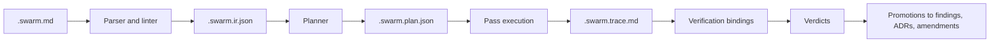
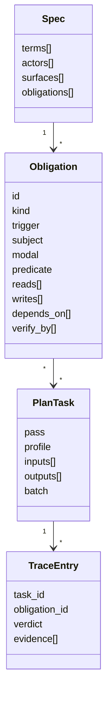
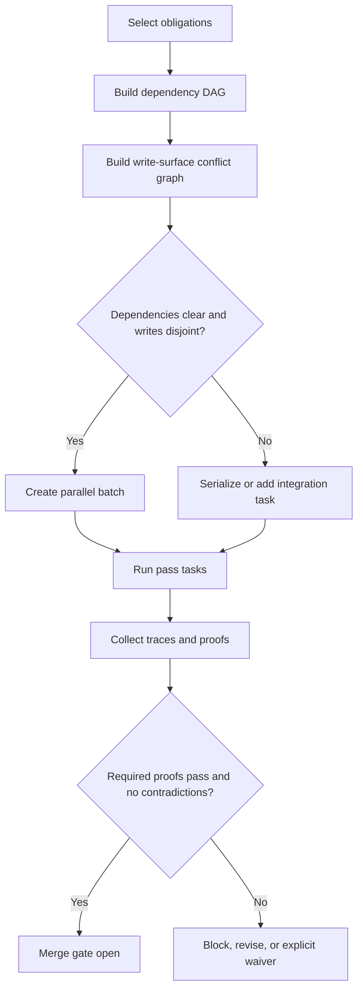

# Swarm and SOL as a Compiler for Specifications

## Executive summary

The most coherent way to consolidate everything you have been circling around is this: **Swarm should be treated as a specification compiler stack, and SOL should be its source language**. In that stack, the source file is a controlled natural-language specification; the compiler emits a typed intermediate representation of obligations, dependencies, write surfaces, proof bindings, and provenance; planning produces executable work packets; “skills” become named compiler passes over IR; execution emits traces; verification produces verdicts; and memory promotion turns evidence-backed findings into durable project knowledge. That framing is materially stronger than “a set of prompts” because it gives you syntax, semantics, type-like checks, build artifacts, verification hooks, precedence rules, and schedulable parallel work. It is also the cleanest answer to the original problem: you cannot safely run many agents in parallel until their outputs are constrained enough that review is no longer the dominant bottleneck. citeturn35view0turn7search0turn25view1turn32view0

The empirical basis for this shift is strong. Natural-language requirements remain dominant in practice, but they are prone to ambiguity, vagueness, and incompleteness; practitioners consistently rank **ambiguity** and **unverifiability** among the most severe requirement-quality problems, and recent code-generation research shows that ambiguous requirements reliably degrade LLM performance while LLMs often fail to identify or resolve the ambiguity on their own. Controlled natural languages exist precisely because they occupy a middle ground between unrestricted English and fully formal notations: they remain readable to stakeholders while becoming structured enough for automation. EARS reported qualitative and quantitative improvements over conventional requirement prose; Rimay showed that a systematically designed CNL could express about 88% of previously unseen industrial requirements; NASA’s FRET/FRETish demonstrates that a structured natural language can be assigned precise temporal semantics and translated into formal logic. citeturn20view0turn9search12turn35view0turn7search0turn15view2turn23view0

The model-facing evidence points in exactly the same direction. Official OpenAI and Anthropic guidance emphasizes clear and explicit instructions, sectioned prompts, markdown/XML delimiters, explicit output formats, and examples. Empirical prompting research shows that **format alone** can materially change results: one study found GPT-3.5 varied by up to 40% on a code-translation task depending on whether the same content was formatted as plain text, Markdown, JSON, or YAML. At the same time, instruction-density studies show that even frontier models degrade sharply as the number of simultaneous constraints rises; in IFScale, the best models reached only 68% accuracy at 500 instructions, with increasing primacy effects and omission failures. That means Swarm should not rely on ever-larger `agents.md` files or sprawling stacks of persona text. The language itself needs to carry more of the control load. citeturn26view0turn16view3turn10view3turn25view1turn32view0turn32view2

The resulting design principle is therefore simple: **put semantics into SOL, put execution policy into a thin kernel, put behavior specialization into pass contracts and profiles, and keep free-form conditioning minimal**. In concrete terms, `agents.md` should become a compact execution kernel, not a dumping ground for behavioral desiderata; a “skeptic persona” should become a parameterized review pass, not a free-floating prompt blob; task templates should be compiled work packets with declared inputs, outputs, preserves, rejects, write surfaces, and proofs; and memory promotion should require provenance and evidence. Tools can accelerate this workflow, but they do not eliminate human judgment; even ASD Simplified Technical English explicitly warns that checkers are aids, not substitutes for responsible authorship and review. citeturn10view5turn24view1turn18view0turn34view0

A concise global definition follows from that:

| Layer            | What it is                                                                                                       |
| ---------------- | ---------------------------------------------------------------------------------------------------------------- |
| **SOL**          | The source language for normative specifications                                                                 |
| **Swarm kernel** | Global execution rules, authority order, artifact conventions, trace requirements                                |
| **IR**           | Typed obligation graph with proof bindings, ownership, read/write surfaces, provenance                           |
| **Passes**       | Compiler/analysis/execution stages such as linting, decomposition, implementation, adversarial review, promotion |
| **Plan**         | A schedulable task graph for agents                                                                              |
| **Trace**        | The build log of the specification compiler                                                                      |
| **Verification** | Bound proofs and verdicts attached to obligations                                                                |
| **Memory**       | Promoted findings, ADRs, and amendments with provenance                                                          |

## Empirical foundations

The evidence points to a **controlled natural language**, not unrestricted prose and not a purely formal DSL, as the right center of gravity. Restricted languages reduce ambiguity without forcing every stakeholder to think in logic. Thomas Kuhn’s CNL survey distinguishes increasingly precise classes of language and shows why unrestricted natural language remains inherently imprecise and frequently ambiguous, while more restricted forms become reliably or deterministically interpretable. Rimay shows that a CNL can be derived systematically from real requirement corpora, with vocabulary, grammar, and semantic restrictions plus mandatory information content. FRET/FRETish shows the next step for critical cases: structured English with formal temporal semantics and proof-backed translation. In other words, the right target for SOL is not “English, but stricter”; it is “compiler-friendly structured English with optional formal backends.” citeturn20view1turn20view0turn15view2turn23view0

The most useful controlled patterns for SOL are the ones that already recur in successful requirement and executable-specification systems. EARS centers on a main clause such as “The `<system>` shall `<response>`,” prefixed by structured trigger conditions; Gherkin centers on “Given / When / Then” examples and insists that outcomes be observable; FRETish isolates scope, condition, component, timing, and response; RFC 2119 and RFC 8174 give normative force to uppercase modal verbs. These are not identical systems, but together they suggest a strong SOL core: **condition + actor + modal + action + observable proof path**. citeturn11view4turn22view0turn23view0turn1search0turn1search1

The prose side of SOL should also be constrained, because “the model can understand anything” is not a reason to write anything. Government and usability guidance converges on the same basic pattern: short sentences, active voice, present tense, common words, one topic per paragraph, objective language, and minimal negative phrasing. OPM explicitly recommends `must` rather than `shall` in ordinary prose, warns against undefined technical terms and long strings of nouns, and suggests sentences averaging roughly 15–20 words. Nielsen Norman Group’s usability studies found that concise, scannable, objective writing substantially improved usability, while promotional language and “marketese” actively harmed comprehension and trust. citeturn10view4turn31view0turn15view6

That leads to a practical distinction SOL should formalize:

| Concern                | Recommended SOL rule                                                                                                            | Why                                                                                                                                                                                 |
| ---------------------- | ------------------------------------------------------------------------------------------------------------------------------- | ----------------------------------------------------------------------------------------------------------------------------------------------------------------------------------- |
| **Normative force**    | Use uppercase `MUST`, `MUST NOT`, `SHOULD`, `MAY` only in binding SOL clauses. Use lowercase plain prose outside those clauses. | BCP 14 gives special meaning only to uppercase normative words; plain-language guidance prefers `must` over `shall` in ordinary prose. citeturn1search0turn1search1turn31view0 |
| **Clause shape**       | Prefer `WHEN/IF/WHILE <condition>, <actor> MUST <action> <object>.`                                                             | EARS-style patterns reduce ambiguity and complexity; active voice makes responsibility explicit. citeturn9search12turn10view4                                                   |
| **Examples**           | Use `GIVEN / WHEN / THEN` only for examples, scenarios, and tests, not as the primary requirement form.                         | Gherkin is excellent for executable examples, but large suites become repetitive and maintenance-heavy. citeturn22view0turn28view0                                              |
| **Verification**       | Every obligation should carry `VERIFY BY ...` and the proof should target an observable outcome.                                | Gherkin’s `Then` is meant to assert observable outcomes; INCOSE/ISO-derived guidance prioritizes verifiability and measurability. citeturn22view0turn15view3turn11view4        |
| **Atomicity**          | One obligation ID, one modal clause, one main action.                                                                           | Requirement quality guidance emphasizes singularity, completeness, and verifiability. citeturn11view4                                                                            |
| **Vocabulary**         | Maintain a glossary; prefer one word for one meaning; forbid synonym drift in normative clauses.                                | STE explicitly uses controlled vocabulary with one word / one meaning / one part of speech whenever possible. citeturn15view4turn15view5                                        |
| **Prompt scaffolding** | Put instructions first, separate context with markdown/XML, and show output examples when format matters.                       | Official prompt guidance from OpenAI and Anthropic recommends exactly this. citeturn26view0turn10view3turn16view1turn16view3                                                  |
| **Density control**    | Prefer structural fields over repeated prose. Do not restate the same rule in multiple natural-language paragraphs.             | Prompt format is model-sensitive, and instruction density degrades adherence. citeturn25view1turn32view0                                                                        |

The avoidance list should be first-class in SOL linting, because requirement-smell research gives you a concrete starting vocabulary. Femmer et al. identify subjective language, ambiguous adjectives and adverbs, loopholes, open-ended non-verifiable terms, superlatives, comparatives, negative statements, and vague pronouns as recurring smell families; later practitioner research again singles out ambiguity and unverifiability as the most severe challenges. Tjong’s work adds another important warning: words such as `all`, `any`, `and`, `or`, `and/or`, `but`, `unless`, `if`, `only`, `also`, `it`, `they`, and plural nouns are often ambiguity triggers in specifications. citeturn29view3turn29view0turn29view5turn35view0turn30view0

A practical SOL hygiene list should therefore treat the following as lint failures or warnings in **binding clauses**:

| Category                     | Examples to reject or warn on                                                         | Suggested treatment                                                                                 |
| ---------------------------- | ------------------------------------------------------------------------------------- | --------------------------------------------------------------------------------------------------- |
| **Subjective / promotional** | `flamboyant`, `user-friendly`, `easy to use`, `innovative`, `world-class`, `seamless` | Reject in normative clauses; allow in non-normative commentary only. citeturn29view3turn15view6 |
| **Ambiguous qualifiers**     | `significant`, `minimal`, `almost always`                                             | Require numeric or operational replacement. citeturn29view1turn29view0                          |
| **Loopholes**                | `as far as possible`, `if practical`, `where feasible`                                | Reject unless tied to an explicit waiver or decision record. citeturn29view1                     |
| **Non-verifiable terms**     | `sufficient`, `adequate`, `robust`, `fast`                                            | Require measurable thresholds. citeturn29view5turn35view0                                       |
| **Relative claims**          | `better`, `more efficient`, `highest`                                                 | Require baseline, metric, and comparator. citeturn29view4turn29view5                            |
| **Vague references**         | `it`, `they`, `this`, `that` without a unique antecedent                              | Replace with the named actor or artifact. citeturn29view2turn30view0                            |
| **Bundled obligations**      | coordinated main actions using `and` / `and/or`                                       | Split into separate obligation IDs. citeturn11view4turn30view0                                  |
| **Ambiguous exceptions**     | `unless`                                                                              | Prefer a positive `IF`/`WHEN` formulation or require explicit review. citeturn30view0            |

A final comparison is useful, because it clarifies what SOL should borrow and what it should not imitate wholesale:

| System      | Best use                                                        | What to borrow                                                               | Why not make it the whole solution                                                                                                                                       |
| ----------- | --------------------------------------------------------------- | ---------------------------------------------------------------------------- | ------------------------------------------------------------------------------------------------------------------------------------------------------------------------ |
| **Gherkin** | Acceptance examples and executable scenario tests               | `Given / When / Then`, observable outcomes, compact scenario discipline      | Gherkin specs become repetitive and maintenance-heavy at scale; they are better as proof artifacts than as the main requirement language. citeturn22view0turn28view0 |
| **EARS**    | Human-readable requirement clauses                              | Triggered clause patterns and requirement typing                             | EARS is better than free text but still relatively coarse-grained and not inherently formal. citeturn9search12turn11view4turn15view0                                |
| **FRETish** | Timing-sensitive, safety-critical requirements                  | Explicit scope/condition/timing/response fields and formal translation hooks | Stronger semantics come with more structure and domain cost; overkill for all project prose. citeturn15view2turn23view0                                              |
| **TLA+**    | Critical invariants, liveness, distributed protocols            | Formal backend for concurrency/safety properties                             | Excellent for proofs, not for everyday authoring of all product and implementation obligations. citeturn21search0turn21search11turn21search6                        |
| **SOL**     | Project-wide specification language for multi-agent compilation | Borrow selectively from all of the above                                     | The whole point is to unify readable source text, typed IR, orchestration, proofs, and promotion in one stack.                                                           |

## SOL language and artifacts

The strongest SOL design is a **two-lane document**: a compiler-visible normative lane and a human commentary lane. The compiler should parse only explicit SOL blocks and ignore ordinary markdown prose except as documentation. That keeps the document readable to humans while ensuring that anything Swarm must execute, schedule, or verify is written in a constrained, analyzable form. This also aligns with the broader lesson from CNL research: keep the language precise where automation matters, and leave free prose non-authoritative. citeturn20view1turn20view0

A recommended **minimal SOL core** is below. It is intentionally small. The goal is not to encode every idea in v1; the goal is to make every _binding obligation_ compilable.

```ebnf
Document        ::= { Statement }

Statement       ::= Header | TermDef | ActorDef | SurfaceDef | Obligation | Comment

Header          ::= "SPEC" Identifier
                 |  "VERSION" SemVer

TermDef         ::= "TERM" Identifier "=" QuotedText
ActorDef        ::= "ACTOR" Identifier
SurfaceDef      ::= "SURFACE" Identifier "=" SurfaceExpr

Obligation      ::= Kind Identifier ":" Newline
                    Indent
                      [ Trigger Newline ]
                      Subject Modal Predicate Newline
                      { Field Newline }
                    Dedent

Kind            ::= "REQ" | "INV" | "POLICY" | "TASK" | "FINDING" | "ADR"

Trigger         ::= ("WHEN" | "IF" | "WHILE") Expr
Subject         ::= Identifier
Modal           ::= "MUST" | "MUST_NOT" | "SHOULD" | "MAY"
Predicate       ::= VerbPhrase

Field           ::= "READS" RefList
                 |  "WRITES" RefList
                 |  "DEPENDS_ON" RefList
                 |  "VERIFY_BY" ProofSpec
                 |  "OWNER" Ref
                 |  "PRIORITY" Integer
                 |  "RATIONALE" QuotedText
                 |  "EXAMPLE" QuotedText
```

A recommended **layered extension model** is:

| Layer             | Adds                                                                                          |
| ----------------- | --------------------------------------------------------------------------------------------- |
| **Core**          | `REQ`, `INV`, `POLICY`, modal clauses, trigger, owner, reads/writes, proof binding            |
| **Planning**      | task selectors, pass/profile selection, batch constraints, agent counts                       |
| **Evidence**      | proof artifacts, verdicts, waivers, stale markers                                             |
| **Memory**        | findings, ADRs, amendments, promotion metadata                                                |
| **Formal bridge** | backend adapters such as Gherkin scenarios, TLA+ invariants, or FRETish-style timing backends |

A short example shows the intended surface shape:

```text
SPEC Checkout
VERSION 0.1.0

ACTOR CheckoutAPI
SURFACE checkout.code = src/checkout/**
SURFACE checkout.tests = tests/checkout/**

REQ CO-001:
  WHEN payment.status == "authorized"
  CheckoutAPI MUST create order
  WRITES checkout.code::create_order
  VERIFY_BY test:pytest:tests/checkout/test_order.py::test_authorized_payment_creates_order
  OWNER team:checkout

INV CO-002:
  WHILE order.state == "submitted"
  CheckoutAPI MUST_NOT mutate order_total
  READS checkout.code::order_total
  VERIFY_BY model:tla/checkout.tla::OrderTotalInvariant
  OWNER team:checkout
```

The recommended file types are:

| Artifact               | Purpose                                                         |
| ---------------------- | --------------------------------------------------------------- |
| **`.swarm.md`**        | Source specification and task declarations                      |
| **`.swarm.ir.json`**   | Typed intermediate representation extracted from source         |
| **`.swarm.plan.json`** | Schedulable plan of pass invocations, batches, and dependencies |
| **`.swarm.trace.md`**  | Human-readable execution trace and verification summary         |

Two companion artifacts are worth adding immediately even if they were not in the original list: **`.swarm.finding.md`** for promoted findings and **`.swarm.adr.md`** for architectural decisions. Without those, memory promotion ends up leaking back into ordinary prose.

The IR should be centered on an **obligation record**. That record is the semantic heart of the compiler.

```json
{
  "id": "CO-001",
  "kind": "REQ",
  "source": {
    "file": "checkout.swarm.md",
    "line_start": 9,
    "line_end": 15,
    "content_hash": "sha256:..."
  },
  "subject": "CheckoutAPI",
  "trigger": {
    "type": "WHEN",
    "expr": "payment.status == \"authorized\""
  },
  "modal": "MUST",
  "predicate": {
    "verb": "create",
    "object": "order"
  },
  "reads": [],
  "writes": ["checkout.code::create_order"],
  "depends_on": [],
  "owner": "team:checkout",
  "verify_by": [
    {
      "type": "test",
      "mode": "automated",
      "ref": "pytest:tests/checkout/test_order.py::test_authorized_payment_creates_order"
    }
  ],
  "status": "specified",
  "provenance": []
}
```

This IR shape deliberately mirrors what requirement-quality and formal-spec literature say matters most: the obligation itself, its conditions, its responsible actor, its singularity, and its verifiability. It also mirrors what agentic systems need but ordinary requirement prose usually does not record: read/write surfaces, dependency edges, and provenance. citeturn15view3turn24view1turn18view0

Three mermaid views make the artifact flow explicit:





A minimal but useful error taxonomy should also be part of v1:

| Code         | Meaning                                                                        | Severity         |
| ------------ | ------------------------------------------------------------------------------ | ---------------- |
| **SOL-S001** | Trigger present but no modal consequence clause follows                        | Error            |
| **SOL-S002** | Unknown keyword or malformed block                                             | Error            |
| **SOL-S003** | More than one modal clause in a single obligation                              | Error            |
| **SOL-S004** | Duplicate obligation ID                                                        | Error            |
| **SOL-L101** | Subjective/promotional term in binding clause                                  | Error            |
| **SOL-L102** | Ambiguous qualifier or loophole phrase                                         | Error            |
| **SOL-L103** | Vague pronoun with non-unique antecedent                                       | Warning or Error |
| **SOL-L104** | Bundled obligation using conjunction across main actions                       | Error            |
| **SOL-L105** | Passive voice or negative wording in binding clause                            | Warning          |
| **SOL-M201** | Unresolved actor, term, or surface reference                                   | Error            |
| **SOL-M202** | Contradictory obligations on same normalized subject/action/object/trigger key | Error            |
| **SOL-M203** | Missing `VERIFY_BY` binding                                                    | Error            |
| **SOL-M204** | Declared write surface missing                                                 | Error            |
| **SOL-M205** | Dependency cycle                                                               | Error            |
| **SOL-O301** | Parallelization blocked by overlapping write surfaces                          | Warning          |
| **SOL-V401** | Proof reference missing or not executable                                      | Error            |
| **SOL-V402** | Proof exists but is stale relative to source hash or changed files             | Error            |
| **SOL-V403** | Example/proof is non-observable                                                | Warning          |

The answer to your original intuition about syntax is therefore: **yes, the language needs hard syntax errors**, and the canonical example you gave is exactly correct. `WHEN X` without a consequence must fail compilation. The same applies to missing modal verbs, duplicate IDs, unverifiable subjective claims, and unresolved surfaces. If those remain “just English,” review scale will collapse long before orchestration scale appears.

## Passes and task templates

In the compiler framing, **skills are not free-floating prompt add-ons; they are passes with contracts**. That resolves the “skeptic persona + adversarial-review skill” issue cleanly. The skepticism is not the skill itself and not a permanent attribute of the agent. It is a **profile parameter** to a pass. The pass is `adversarial-review`; the profile is `skeptic`; the pass contract specifies exactly what it consumes, what it may emit, what it must preserve, and what it must never mutate. That makes the behavior schedulable, testable, and substitutable. It also avoids the biggest failure mode of ad hoc conditioning: ever-larger instruction stacks that models only follow partially and inconsistently. citeturn32view0turn18view0turn34view0

This is the sharp line Swarm should draw:

| Concern                                                                                           | Best home                    |
| ------------------------------------------------------------------------------------------------- | ---------------------------- |
| Authority order, chain of command, trace schema, artifact naming, default refusal/waiver behavior | **Swarm kernel**             |
| Transformation logic over obligations                                                             | **Pass contract**            |
| Style of critique or search strategy within a pass                                                | **Profile**                  |
| Domain glossary, approved vocabulary, repo-specific proof adapters                                | **Overlay / project stdlib** |
| Project intent, obligations, dependencies, proofs, owners                                         | **SOL source**               |

That means `agents.md` should become a **thin kernel file**. It should define the execution model, not carry pages of semantic advice. The broader research on instruction hierarchy and high instruction density cuts against heavy monolithic conditioning: modern agents already receive instructions from multiple roles and tools with different authority levels, and conflict resolution becomes harder as those layers proliferate. Swarm should therefore make authority explicit and narrow, rather than hiding it in prose. citeturn18view0turn34view0

A generic pass contract can be expressed like this:

```yaml
pass: adversarial-review
version: 0.1
consumes:
  - obligation[]
  - code_diff?
  - proof_results?
produces:
  - finding[]
  - proof_request[]
  - review_trace
preserves:
  - obligation.id
  - source_span
  - existing proof references
rejects:
  - unsupported claims
  - edits outside declared write surfaces
  - findings without evidence
profile:
  name: skeptic
  knobs:
    demand_counterexample: true
    prefer_spec_conflicts: true
    default_false_positive_bias: low
trace:
  required_fields:
    - attacked_obligation
    - evidence
    - claim
    - verdict
    - confidence
```

The five core passes you named can be specified like this:

| Pass                                            | Consumes                         | Produces                                                | Preserves                          | Rejects                                                | Required trace                                    |
| ----------------------------------------------- | -------------------------------- | ------------------------------------------------------- | ---------------------------------- | ------------------------------------------------------ | ------------------------------------------------- |
| **`lint-spec`**                                 | `.swarm.md` or IR                | diagnostics, normalized IR                              | source IDs and spans               | silent rewrites                                        | rule code, span, normalized suggestion            |
| **`decompose-spec`**                            | high-level obligations           | child obligations, dependency edges, candidate surfaces | parent-child provenance            | decomposition without proof bindings                   | parent ID, children, rationale                    |
| **`implement-obligation`**                      | selected obligations + codebase  | code diff, proof runs, implementation trace             | obligation IDs, write boundaries   | edits outside `WRITES`, unverifiable completion claims | obligation ID, files changed, proofs run, verdict |
| **`adversarial-review`** with profile `skeptic` | obligations + code diff + proofs | findings, contradiction reports, proof requests         | source IDs, existing evidence refs | unsupported accusations, code edits                    | attacked obligation, evidence, verdict            |
| **`promote-findings`**                          | traces + accepted findings       | promoted finding / ADR / amendment proposal             | provenance chain                   | unbacked promotion                                     | source trace refs, promotion decision             |

This is also where the “skills can reference other skills” question becomes tractable: **passes may depend on passes, but only through declared artifacts and an acyclic dependency graph**. For example, `promote-findings` may require `adversarial-review` traces; `implement-obligation` may require `lint-spec` to pass first; `decompose-spec` may run before planning. What you do **not** want is invisible prompt inheritance or circular behavioral dependence.

Task templates should become **compiled work packets**, not generic prompts. A task file should specify the selected obligations, the pass, the profile, the authorized write surfaces, the required proofs, and the expected trace schema. A minimal implementation template and review template could look like this:

```yaml
task: implement-checkout-create-order
pass: implement-obligation
select:
  - CO-001
profile: default
reads:
  - checkout.code
  - checkout.tests
writes:
  - checkout.code::create_order
  - checkout.tests::test_authorized_payment_creates_order
must_produce:
  - code_diff
  - proof_results
  - trace
gate:
  required_verdicts:
    - proof: PASS
```

```yaml
task: skeptical-review-checkout-create-order
pass: adversarial-review
profile: skeptic
select:
  - CO-001
reads:
  - checkout.code
  - checkout.tests
  - traces/implement-checkout-create-order.swarm.trace.md
writes:
  - reviews/findings/**
must_produce:
  - finding[]
  - trace
gate:
  block_on:
    - contradiction
    - missing proof
```

Every task template should emit two required tables in its `.swarm.trace.md`:

| Obligation | Pass | Read surfaces | Write surfaces | Output artifact | Verdict |
| ---------- | ---- | ------------- | -------------- | --------------- | ------- |

| Obligation | Proof type | Reference | Automated | Result | Reviewer or tool |
| ---------- | ---------- | --------- | --------- | ------ | ---------------- |

That last point matters more than it sounds. If task traces are unstructured, you will recreate the same review bottleneck you were trying to escape—just later in the pipeline.

## Orchestration and verification

The orchestration model should be built on **two graphs** and **one gate**. The first graph is a dependency DAG derived from `DEPENDS_ON` edges. The second is a write-surface conflict graph derived from `WRITES` declarations. The gate is the merge/integration gate, which opens only when required proofs for the selected obligations have reached acceptable verdicts and no stale or contradictory evidence remains. This is the simplest structure that supports real multi-agent parallelism without pretending that English task descriptions alone are enough to coordinate safe concurrent work. citeturn18view0turn34view0

The scheduling rule is straightforward: **tasks may run in parallel only if they are dependency-independent and write-disjoint**. Read-only passes such as linting or review can run broadly; write-producing passes should be confined to declared surfaces. Shared “global” files such as lockfiles, shared schemas, CI definitions, or project manifests should default either to serialized treatment or to a dedicated integration pass, because they function as hidden high-conflict surfaces even when the visible feature work looks separate.



The verification model should be **obligation-bound**, not task-bound. Each `REQ`, `INV`, or `POLICY` should carry one or more proof bindings. That makes “done” a property of the obligation, not of whoever last touched it. It also provides a direct path from SOL to formal backends where they are worth the cost. EARS and INCOSE already center verifiability; Gherkin offers structured scenario tests; TLA+ provides safety/liveness checks through TLC and proof-oriented support through TLAPS; FRET/FRETish provides structured temporal requirements with formal translation support. Swarm should treat all of them as proof adapter types, not as competing authoring systems. citeturn15view3turn22view0turn21search0turn21search11turn15view2turn23view0

A useful proof taxonomy is:

| Proof type                        | Example binding                                   | Best use                                     |
| --------------------------------- | ------------------------------------------------- | -------------------------------------------- |
| **Lint / syntax**                 | `VERIFY_BY lint:sol`                              | language well-formedness and smell detection |
| **Build / type / static**         | `VERIFY_BY static:mypy:...`                       | compile-time sanity                          |
| **Unit / integration / e2e test** | `VERIFY_BY test:pytest:...`                       | executable behavior                          |
| **Scenario example**              | `VERIFY_BY scenario:gherkin:features/...`         | acceptance/readability bridge                |
| **Property / model / theorem**    | `VERIFY_BY model:tla/...::InvariantName`          | concurrency, invariants, liveness            |
| **Human review**                  | `VERIFY_BY review:security`                       | judgment-heavy cases                         |
| **Runtime evidence**              | `VERIFY_BY runtime:metric:checkout.order_created` | production conformance or canary evidence    |

The verdict taxonomy should also be fixed and machine-readable:

| Verdict          | Meaning                                                                   |
| ---------------- | ------------------------------------------------------------------------- |
| **PASS**         | bound proof succeeded                                                     |
| **FAIL**         | bound proof ran and failed                                                |
| **BLOCKED**      | proof could not run because prerequisites were missing                    |
| **UNVERIFIED**   | no acceptable proof bound or executed                                     |
| **WAIVED**       | explicitly accepted exception with authority and reason                   |
| **STALE**        | prior evidence no longer matches current source hash or changed surfaces  |
| **CONTRADICTED** | evidence disagrees across proofs or between obligation and implementation |

Memory should be treated as a **promotion system**, not as a chat transcript. The durable units are findings, ADRs, and amendments. A suggested promotion protocol is: a pass emits a candidate finding; the system fingerprints it against the obligation IDs, evidence refs, and changed surfaces; if it survives reruns and review, it is promoted to `.swarm.finding.md`; if a decision is made from it, it becomes a `.swarm.adr.md`; if the finding means the source spec is wrong or incomplete, the promotion output is a **spec amendment proposal** back into `.swarm.md`. This prevents two common failure modes at once: unbounded memory accumulation and silent drift between what was learned and what the source specification actually states.

Every promoted item should have mandatory provenance fields:

| Field                  | Purpose                              |
| ---------------------- | ------------------------------------ |
| `origin_obligations[]` | what source obligations it came from |
| `origin_traces[]`      | what execution traces support it     |
| `repo_revision`        | code context                         |
| `pass` and `profile`   | which transformation produced it     |
| `reviewer_or_tool`     | who or what endorsed it              |
| `timestamp`            | ordering                             |
| `content_hash`         | staleness and deduplication          |
| `evidence[]`           | concrete proof refs                  |

## Tooling, risks, and roadmap

The tooling strategy that best matches the research and your own instincts is **unitary install, selective activation**. In other words: install the whole Swarm kernel plus stdlib, but let the planner activate only the passes needed for a given repository and task. That avoids the brittle combinatorics of user-composed prompt kits while still keeping runtime lean. It also fits the instruction-density evidence: do not make users assemble behavior from many partial fragments at authoring time if the compiler can activate the minimum necessary fragments at execution time. citeturn32view0turn18view0

A clean installation model is:

| Layer       | Role                                                                                                                   |
| ----------- | ---------------------------------------------------------------------------------------------------------------------- |
| **Kernel**  | parser, authority model, artifact schema, trace schema, core lints                                                     |
| **Stdlib**  | shipped passes such as `lint-spec`, `decompose-spec`, `implement-obligation`, `adversarial-review`, `promote-findings` |
| **Overlay** | repo- or org-specific glossaries, proof adapters, policy packs, surface maps                                           |

A corresponding CLI can stay small:

```text
swarm init
swarm lint spec.swarm.md
swarm build-ir spec.swarm.md -o spec.swarm.ir.json
swarm plan spec.swarm.ir.json -o spec.swarm.plan.json
swarm run spec.swarm.plan.json
swarm verify traces/**/*.swarm.trace.md
swarm promote traces/**/*.swarm.trace.md
swarm doctor
```

The linter/validator stack should be built in a strict order.

| Stage                    | Recommended algorithm                                                                                         | Why                                                                                                                                                            |
| ------------------------ | ------------------------------------------------------------------------------------------------------------- | -------------------------------------------------------------------------------------------------------------------------------------------------------------- |
| **Parse**                | PEG or tree-sitter-style grammar for SOL blocks inside Markdown                                               | deterministic syntax checking                                                                                                                                  |
| **Normalize**            | Convert each clause to `{trigger, subject, modal, predicate}` tuples                                          | enables conflict checks and planning                                                                                                                           |
| **Smell detect**         | dictionary + POS tagging + template rules                                                                     | requirement-smell detection works well for several smell families; RETA and smell analyzers show this is practical. citeturn24view0turn29view3turn29view0 |
| **Conformance check**    | template-specific validators, eventually projectional editing support                                         | EARS-CTRL shows “well-formed by construction” is a powerful end state. citeturn24view1                                                                      |
| **Conflict detect**      | canonical key plus polarity analysis for `MUST` vs `MUST_NOT`; pairwise normalization for duplicate semantics | catches semantic contradiction                                                                                                                                 |
| **Dependency analysis**  | topo sort + cycle detection over obligation DAG                                                               | planning                                                                                                                                                       |
| **Parallelism analysis** | overlap test on write surfaces + graph batching                                                               | safe scheduling                                                                                                                                                |
| **Proof gap analysis**   | set difference: obligations minus acceptable proof bindings/verdicts                                          | prevents “done but unverified”                                                                                                                                 |
| **Staleness analysis**   | content-hash join between source obligations, changed files, and stored proofs                                | keeps evidence valid                                                                                                                                           |
| **Promotion analysis**   | fingerprint findings by obligation + evidence + revision                                                      | keeps memory tight                                                                                                                                             |

The major risks and mitigations are clearer if stated bluntly:

| Failure mode                   | Why it happens                                                        | Mitigation                                                                                         |
| ------------------------------ | --------------------------------------------------------------------- | -------------------------------------------------------------------------------------------------- |
| **Adoption resistance**        | the language feels too formal too early                               | keep commentary lane free-form; keep core syntax small; ship good examples                         |
| **Over-conditioning**          | too much behavior hidden in kernel prose or `agents.md`               | move semantics into SOL and pass contracts; enforce instruction density limits                     |
| **Circular pass dependencies** | passes start depending on hidden outputs from each other              | require declared artifacts and acyclic pass graphs                                                 |
| **Human review bottleneck**    | traces and findings are too verbose or unstructured                   | require fixed trace tables and obligation-bound verdicts                                           |
| **False-positive linting**     | smell detection is approximate, especially for pronouns and negatives | keep precise smell families as errors, weaker ones as warnings; continually eval against gold sets |
| **Missing formal backends**    | critical obligations lack strong proofs                               | start with test/static adapters, then add TLA+/FRET adapters for high-value surfaces               |
| **Parallel merge conflicts**   | write surfaces are underdeclared or too coarse                        | require explicit `WRITES`; reserve integration surfaces; block undeclared writes                   |
| **Memory rot**                 | findings accumulate without provenance or staleness checks            | promote only evidence-backed items; hash everything; support expiration and supersession           |

The evaluation plan should measure whether Swarm is actually creating trust, not whether it generates impressive-looking artifacts. A good initial scorecard is:

| Metric                           | What it tells you                                                       |
| -------------------------------- | ----------------------------------------------------------------------- |
| **Trust per agent**              | fraction of outputs accepted without substantive rewrite                |
| **Reviewer time per obligation** | whether compiler constraints are reducing review load                   |
| **Unverified surface area**      | share of obligations that remain `UNVERIFIED`, `BLOCKED`, or `STALE`    |
| **Linter precision / recall**    | whether hygiene rules are useful rather than noisy                      |
| **Parallel throughput**          | obligations completed per day or per planning cycle under safe batching |
| **Write-surface violation rate** | whether agents stay inside declared boundaries                          |
| **Promotion precision**          | fraction of promoted findings later accepted into ADRs or amendments    |
| **Contradiction rate**           | how often passes disagree with each other or with proofs                |
| **Spec-to-code drift rate**      | how often code changes invalidate source obligations or proofs          |

The empirical evaluation sequence should be pragmatic. Compare three conditions on the same repository tasks: ordinary free-form prompts, SOL without pass contracts, and SOL with full IR/planning/verification. Use ambiguity-heavy tasks modeled on Orchid-like requirement ambiguity cases to test whether SOL actually reduces code-generation divergence, and use instruction-density stress tests inspired by IFScale to confirm that the compiler stack really is reducing model overload rather than just relocating it. Where training or auto-tuning is introduced, prefer **programmatically gradable** evaluators whenever possible; IH-Challenge is a strong recent example of why objectively graded tasks are safer for improving constraint adherence than subjective reward setups that encourage shortcut learning. citeturn7search0turn32view0turn34view0

The minimal complete system is smaller than it sounds. If I were sequencing implementation from scratch, the checklist would be:

| Priority | Component                                                     | Why it comes now                                 |
| -------- | ------------------------------------------------------------- | ------------------------------------------------ |
| **P0**   | SOL core grammar and parser                                   | nothing else is stable without a source language |
| **P0**   | Linter with syntax + smell families + verification-gap checks | immediate leverage and author feedback           |
| **P0**   | IR schema and emitter                                         | makes passes and planners possible               |
| **P0**   | Five core passes                                              | enough to prove the model end to end             |
| **P0**   | Plan builder with dependency and write-surface analysis       | unlocks safe parallelism                         |
| **P0**   | Trace schema and verdict taxonomy                             | makes outputs reviewable and auditable           |
| **P0**   | CLI with `init/lint/build-ir/plan/run/verify/promote`         | makes the system usable                          |
| **P1**   | Proof adapters for pytest/build/static analysis               | fast automation wins                             |
| **P1**   | Findings/ADR/amendment promotion                              | durable memory                                   |
| **P1**   | Staleness hashing and provenance enforcement                  | trust and reproducibility                        |
| **P1**   | Glossary / controlled-vocabulary overlay                      | prose quality and disambiguation                 |
| **P2**   | Formal backends such as TLA+ and FRET adapters                | high-value critical surfaces                     |
| **P2**   | IDE grammar support and projectional editing                  | authoring speed and correctness by construction  |
| **P2**   | Auto-repair suggestions and spec optimization tooling         | productivity after the core semantics are stable |

The first automation passes to build are therefore not the glamorous ones. They are `lint-spec`, IR generation, proof binding, and planning. Once those exist, `decompose-spec` becomes much safer, `implement-obligation` becomes bounded, and `adversarial-review` becomes auditable. That is the right bootstrap path because it aligns with the literature and with the central engineering truth underneath your whole project: **trustworthy parallel agent output is a compiler problem before it is an orchestration problem**.
