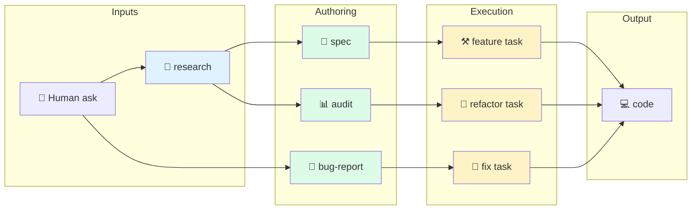

# 01 · What is Swarm?

> **TL;DR.** Swarm is a documentation framework for coding agents. It exists because agents fail predictably without grounded context — they drift, they make irreversible decisions on unverified assumptions, and they leave no trail for the next session. Swarm's response is a deterministic conditioning pipeline: a source document determines a task type, which determines a persona, which determines the skills and verification gates that get attached to a worktree-local task file. The agent reads one file, adopts a named mindset, executes the task, and pastes empirical proof.

---

## 🎯 The problem

Coding agents are powerful but brittle. The brittleness is not random; it shows up in patterns:

| Failure mode                   | What it looks like                                                                                                       |
| ------------------------------ | ------------------------------------------------------------------------------------------------------------------------ |
| 🌪️ **Drift**                   | The agent solves _a_ problem, just not _the_ problem. The conversation wanders away from the ask.                        |
| 🧱 **Architecture conflict**   | The agent introduces a pattern the codebase has explicit rules against — usually because nobody told it about the rules. |
| 🪞 **Hallucinated completion** | "Done." The tests weren't run. The build wasn't checked. The agent believes it shipped.                                  |
| 🕳️ **No resumable trail**      | The session ends mid-stride. The next session starts from scratch and re-discovers the same things.                      |
| 🔁 **Repeated mistakes**       | The same class of bug appears across sessions because nothing captured the lesson.                                       |
| 👥 **Coordination failure**    | Two agents working on related changes produce inconsistent results because they couldn't see each other's context.       |

These failures share a root cause: the agent operates without enough **grounded conditioning**. It has the model, it has the tools, it has a prompt — but it doesn't have the _frame_ the human in the room would have brought.

---

## 💡 Swarm's response

Swarm provides the frame.

The framework asks every project to write down a small set of things — short documents, by convention — that capture what an agent would otherwise have to invent or guess:

- **Source documents** ground the work: a spec describes what to build, an audit describes what's there, a bug report describes what's broken, research describes what's been learned externally.
- **Task files** condition the agent: the task is the unit of work; the file links the source doc, names the persona, attaches the skills, and lists the verification gates.
- **Personas** condition the mindset: each task type has exactly one default persona, with a written profile, hard rules, and forbidden actions.
- **Skills** carry domain knowledge: progressively disclosed, loaded on demand, written in the format adopted by Claude Code, OpenAI Codex, and others.
- **The flow graph** ties it all together: pick a source doc, the rest follows deterministically.

The agent's first action in any session is to read its task file. The task file already names the persona. The persona's profile defines the constraints. The skills load themselves based on relevance. The verification gates are bound to repo-specific commands. Empirical proof is a hard gate at the end. There is no improvisation in the conditioning — the agent reads its file and proceeds.

---

## 🔭 The mechanism in one diagram

Each arrow is a **conditioning step**. The downstream task already knows its persona, its skills, and its verification gates because the upstream document determined them.

For the full edge list, see [the flow graph reference](../reference/flow-graph.md).

---

## 🧰 What Swarm gives you (concretely)

When you adopt Swarm, your repo gets:

1. An `AGENTS.md` at the root — the entry point every agent CLI looks for.
2. An `.agents/` directory containing:
   - `tasks/` (gitignored) — where worktree-local task files live
   - `templates/` — task and document templates with placeholders
   - `skills/` — the framework's cross-cutting skills, plus your project-specific ones
   - `specs/`, `audits/`, `research/`, `bugs/` — the four source-doc types
3. A standing convention: when an agent starts, it reads its task file, adopts the named persona, and proceeds.

You can install all of this manually — it is just files. The Swarm CLI automates the install and the conditioning, but the framework does not require it.

See [`guides/quickstart.md`](../guides/quickstart.md) for the 10-minute path to a working install.

---

## 🪜 Framework vs CLI

This distinction matters and is easy to confuse.

| Layer               | What it is                                                                                            | Where it lives          |
| ------------------- | ----------------------------------------------------------------------------------------------------- | ----------------------- |
| **Swarm framework** | The vocabulary, the templates, the personas, the skills, the routing rules, the placeholder contract  | This repo               |
| **Swarm CLI**       | One implementation of the framework: scaffolds task files, manages worktrees, runs verification gates | Separate repo           |
| **Agent CLI**       | The tool that actually runs the model: Claude Code, Codex, Cursor, Aider, etc.                        | The agent vendor's repo |

The framework is the contract. The Swarm CLI honours the contract. Other tools can honour the contract too — see [`reference/template-placeholders.md`](../reference/template-placeholders.md) for what "honouring the contract" means.

---

## 🌍 Positioning

Swarm sits in a small, well-defined space among 2025–2026 frameworks:

| Framework                                                   | Centre of gravity                                        | Persona ceremony                    | Tool portability               |
| ----------------------------------------------------------- | -------------------------------------------------------- | ----------------------------------- | ------------------------------ |
| [Spec Kit](https://github.com/github/spec-kit)              | Spec command                                             | None                                | High (30+ agents)              |
| [BMAD-METHOD](https://github.com/bmad-code-org/BMAD-METHOD) | Story file → role-played handoffs                        | High (21+ named characters)         | Medium (multi-IDE)             |
| [Superpowers](https://github.com/obra/superpowers)          | Skill-driven tasks                                       | None (skills are the discipline)    | Medium (Anthropic-format-only) |
| Cognition / Devin                                           | Single-threaded agent session                            | None                                | Devin-only                     |
| Anthropic Research                                          | Orchestrator + worker subagents                          | None                                | Anthropic-only                 |
| **Swarm**                                                   | **Task-as-source-of-truth + deterministic conditioning** | **Mid (13 mindsets, 1:1 to tasks)** | **Tool-agnostic by design**    |

Swarm leads with the **task** and arranges everything else around it. Most other frameworks lead with the spec or the persona. The task-first stance is closer to how Cognition's Devin operates internally and matches the "talk to your lead agent" framing IndyDevDan recommends for 2026.

For a deeper comparison, see [`12-prior-art.md`](12-prior-art.md).

---

## 🚦 What Swarm is not

Swarm is **not**:

- An agent runtime
- A model
- A CLI (the framework can be used by any CLI)
- A test runner, package manager, or language toolchain
- A roleplay system with named characters
- A solution to long-context coherence
- A tool for back-filling specs from finished code

See [`NON-GOALS.md`](../NON-GOALS.md) for the complete list.

---

## ✅ The "is this for you?" check

Swarm fits when:

- ✅ You have multiple agents (or one agent across many sessions) doing real engineering work.
- ✅ You've been bitten by drift, hallucinated completion, or context pollution.
- ✅ You want determinism: same input → same persona, every time.
- ✅ Your stack is heterogeneous; you don't want a framework that bakes in `pnpm` or `cargo`.
- ✅ You like Diátaxis / Spec Kit / Superpowers but want something more rigorous on the documentation side.

Swarm doesn't fit when:

- ❌ You want a runtime with a TUI.
- ❌ You want roleplay personas like "Mary the Analyst."
- ❌ Your project has zero structure and you want the framework to invent it for you (Swarm assumes you already write things down).

---

## See also

- [`02-conditioning-pipeline.md`](02-conditioning-pipeline.md) — the mechanism in detail
- [`../guides/quickstart.md`](../guides/quickstart.md) — the 10-minute install
- [`../guides/adopting-swarm.md`](../guides/adopting-swarm.md) — the full adoption guide
- [`12-prior-art.md`](12-prior-art.md) — the field landscape
