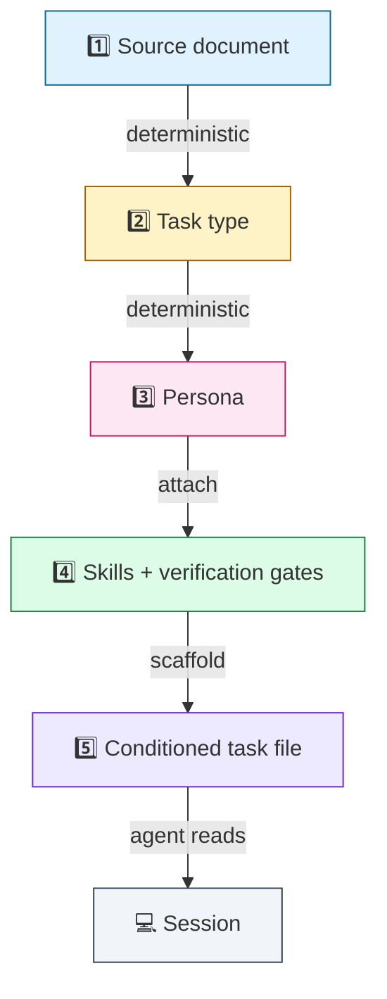
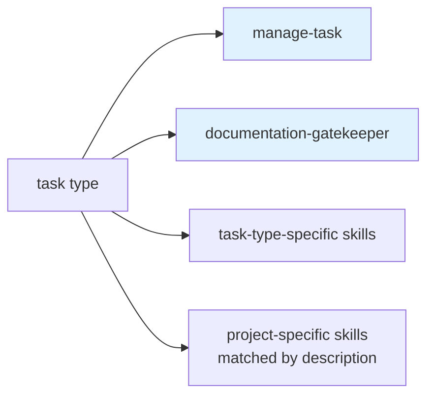
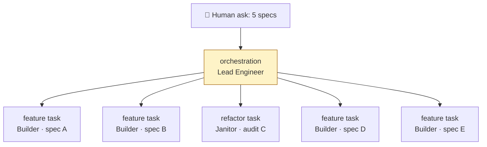

# 02 · The conditioning pipeline

> **TL;DR.** A source document determines the task type, which determines the persona, which determines the skills and verification gates. The output is a fully *conditioned* task file the agent reads as its first action. The routing is deterministic — same input, same conditioning, every time. The agent does not choose; the framework chooses for them.

---

## 🪜 The five stages



Each arrow is a routing rule defined in the framework. The launcher (the Swarm CLI or any compliant tool) executes them. The agent does not need to understand them — it just reads its task file.

---

## Stage 1: Source document

A **source document** grounds a task. The four core types:

| Doc type        | Epistemic stance                | Spawns task type        |
| --------------- | ------------------------------- | ----------------------- |
| `spec.md`       | Forward-looking, prescriptive   | `feature`               |
| `audit.md`      | Present-looking, observational  | `refactor`              |
| `bug-report.md` | Past-looking, evidential        | `fix`                   |
| `research.md`   | Outward-looking, citational     | `spec-writing`          |

A few important corollaries:

- **A source document may be missing.** When a human says "investigate X" with no upstream artefact, the framework fires an *authoring* task (`research-writing`, `audit-writing`, `spec-writing`, or `bug-report-writing`) that *produces* the missing source doc. Authoring tasks are themselves routed deterministically — see [`05-document-types.md`](05-document-types.md) and [the flow graph](../reference/flow-graph.md).
- **Multiple source documents is a routing signal.** Five spec files in one ask routes to `orchestration` (the Lead Engineer decomposes and delegates). A spec plus prior Skeptic notes routes to `kickback` (the Builder revises).
- **Specialised variants** (migration plans, benchmark reports, ADRs, constitution) are documented in [`05-document-types.md`](05-document-types.md). They route to specialised task types (`migration`, `performance`, etc.) but follow the same shape.

---

## Stage 2: Task type

A **task type** is the unit of work. The 18 types fall into three families:

```mermaid
flowchart LR
    subgraph 💻 Implementation
        F1[feature] & F2[fix] & F3[refactor] & F4[rewrite]
        F5[migration] & F6[performance] & F7[testing]
        F8[integration] & F9[upgrade] & F10[kickback]
    end
    subgraph ✍️ Authoring
        A1[spec-writing] & A2[audit-writing]
        A3[research-writing] & A4[bug-report-writing]
    end
    subgraph 🔁 Process
        P1[review] & P2[deepen-audit]
        P3[orchestration] & P4[documentation]
    end
```

Each task type has:

- A **lead persona** (always exactly one, by [Principle 4](../PRINCIPLES.md#4--personas-are-1-to-1-with-task-types))
- A set of **attached skills**
- A list of **verification gate slots** that fire at specific phases
- A **template** that pre-conditions the task file

Full catalogue: [`tasks/`](../tasks/). Single-page reference: [`reference/flow-graph.md`](../reference/flow-graph.md).

---

## Stage 3: Persona

A **persona** is a mindset, not a role. It carries:

- A **role statement** (one paragraph)
- A **mindset** (the frame the agent must adopt)
- **Hard constraints** (numbered, no hedging)
- **Forbidden actions** (the negative space)
- **Decision heuristics** (tiebreakers when rules don't directly apply)
- **Empirical proofs** the persona must produce
- A **self-review checklist**
- **Anti-patterns** (concrete failure modes the persona resists)
- **Handoff partners** (who hands off to whom)

The full catalogue is at [`personas/`](../personas/). Each persona lives in its own file.

The 1-to-1 mapping with task types is the value: the agent never picks a persona. The framework picks. Picking is deterministic. See [ADR 0002](../adrs/0002-personas-1-to-1-with-task-types.md).

---

## Stage 4: Skills + verification gates

**Skills** are progressively-disclosed knowledge modules. Two are always loaded (`manage-task` and `documentation-gatekeeper`) and the task type determines the rest.



**Verification gates** are *named slots* the framework defines. The project binds the slots to literal commands (e.g., `{{cmdValidate}}` → `pnpm run check` in a TS shop, → `cargo check` in a Rust shop). The framework cares only about the slots.

| Slot               | Fires for                                                          |
| ------------------ | ------------------------------------------------------------------ |
| `{{cmdInstall}}`   | Pre-implementation, every code-producing task                      |
| `{{cmdValidate}}`  | Periodic + post-implementation, every code-producing task          |
| `{{cmdTest}}`      | Post-implementation, every code-producing task                     |
| `{{cmdValidateDeps}}` | After every batch on `refactor`/`migration`                     |
| `{{cmdBenchmark}}` | Baseline + target on `performance`                                 |
| `{{cmdTypecheck}}` | Static analysis on `refactor`/`feature` (where applicable)         |

Full list: [`reference/template-placeholders.md`](../reference/template-placeholders.md).

---

## Stage 5: The conditioned task file

The output of the pipeline is a **fully conditioned task file**. By the time the agent sees it:

- The persona is named (in a `> **PERSONA:**` blockquote)
- The skills are listed (in `## Required skills` and `## Domain skills`)
- The source doc is linked (in `## Linked docs`)
- The verification gate slots are populated with the project's commands
- The constraints are filled in (from the task type's template plus the persona's forbidden actions)
- The Self-review checklist is pre-written, with empty answer slots and `[Paste output]` placeholders

The agent's first action is to **read this file**. It does not need to be told which persona to adopt — the file tells it. It does not need to be told which skills to load — the file lists them. It does not need to be told what "done" looks like — the Self-review answers that question.

Templates for every task type live at [`tasks/`](../tasks/). The base template (the shared skeleton) is at [`reference/task-base.md`](../reference/task-base.md).

---

## 🔁 The override semantics

The default routing is deterministic, but it is not unconditional. There are three legitimate ways the routing changes:

1. **Project-level override.** The project's `swarm.config` (a CLI artefact, not a framework artefact) can override the default persona for any task type. Example: a team that prefers minimality over adversarial focus might override `fix` from The Skeptic to a dedicated Fixer persona.
2. **Task-launch override.** When a human launches a task, they can name a different task type than the default for the source doc — e.g., treating an `audit.md` as a `deepen-audit` task instead of `refactor`. This is for cases where the human knows something the document doesn't say.
3. **Project-level overlay personas.** A project can introduce new personas that the framework doesn't know about — e.g., a Type Surgeon for a TypeScript shop, or a SecurityReviewer for a regulated codebase. Overlays add to the catalogue at the project level; the framework remains 13.

The override is **explicit**. The framework prefers loud reclassification over silent re-routing.

---

## ♻️ Recursion

The pipeline runs recursively. A task can spawn sub-tasks; each sub-task is itself a `(source doc, task type, persona)` triple, conditioned in exactly the same way.

The most common recursion is the **Lead Engineer pattern**:



Each child task gets its own worktree, branch, conditioned task file, and agent CLI session. The Lead Engineer's task file tracks all children — slug, branch, status, last review verdict.

The recursion limit is set per project. Default: **2**. See [`08-recursion-and-delegation.md`](08-recursion-and-delegation.md) and [ADR 0014](../adrs/0014-recursion-renamed-delegation.md).

---

## 🪞 Worked example

Suppose a human writes:

> "We need to add support for OAuth2 PKCE flow to the auth module. Here's a research file: `.agents/research/oauth2-pkce.md`."

The pipeline runs:

1. **Source doc:** `research/oauth2-pkce.md`. Type: research.
2. **Task type:** `spec-writing` (research routes to spec-writing — see [the flow graph](../reference/flow-graph.md)).
3. **Persona:** The Architect.
4. **Skills attached:** `manage-task`, `documentation-gatekeeper`, `write-spec`, `distillation-discipline`, plus any project-specific architecture skill matched by description.
5. **Verification gates:** post-implementation `git status` (must be clean on source — spec sessions are read-only on code).
6. **Conditioned task file scaffolded** at `.agents/tasks/spec-oauth2-pkce.md` with all of the above pre-filled.

The agent reads the file, adopts The Architect, surveys existing auth patterns, drafts the spec at `.agents/specs/oauth2-pkce.md`, fills in `## Self-review` with pasted `git status` output proving zero source files were modified, and closes the task.

Now the spec exists. A second pipeline run starts:

1. **Source doc:** `specs/oauth2-pkce.md`. Type: spec.
2. **Task type:** `feature`.
3. **Persona:** The Builder.
4. **Skills attached:** `manage-task`, `documentation-gatekeeper`, `write-feature`, `empirical-proof`, plus project-specific.
5. **Verification gates:** `{{cmdInstall}}` pre-implementation, `{{cmdValidate}}` after each batch, `{{cmdValidate}}` and `{{cmdTest}}` post-implementation.
6. **Conditioned task file scaffolded** at `.agents/tasks/feat-oauth2-pkce.md`.

Same machinery, different inputs, different conditioning. The agent doesn't need to think about any of this — it reads its file and proceeds.

---

## 🎯 Why determinism

You might expect a framework to be flexible. Swarm chooses determinism instead. The trade is intentional:

| Flexible routing                                                | Deterministic routing                              |
| --------------------------------------------------------------- | -------------------------------------------------- |
| Agent picks persona at launch                                   | Persona is fixed by task type                      |
| Source doc could spawn multiple task types                      | Source doc spawns exactly one default task type    |
| Many-to-many compatibility                                      | 1-to-1 mapping                                     |
| Gives more options at launch                                    | Removes a class of decision-fatigue failure       |
| Picking is ambiguous when source docs are ambiguous             | Ambiguous source docs trigger explicit reclassification |
| Hard to reason about behaviour across sessions                  | Same input → same conditioning, every time         |

The framework treats determinism as a feature. The agent is best when it doesn't have to decide what kind of work it's doing; the human and the doc together encode that, and the framework propagates it.

---

## See also

- [`05-document-types.md`](05-document-types.md) — what each source doc looks like
- [`06-task-types.md`](06-task-types.md) — the full task catalogue with rationale
- [`07-flow-graph.md`](07-flow-graph.md) — the conceptual graph
- [`../reference/flow-graph.md`](../reference/flow-graph.md) — the operational tables
- [`../reference/template-placeholders.md`](../reference/template-placeholders.md) — the placeholder contract
- [ADR 0002](../adrs/0002-personas-1-to-1-with-task-types.md) — why 1-to-1
