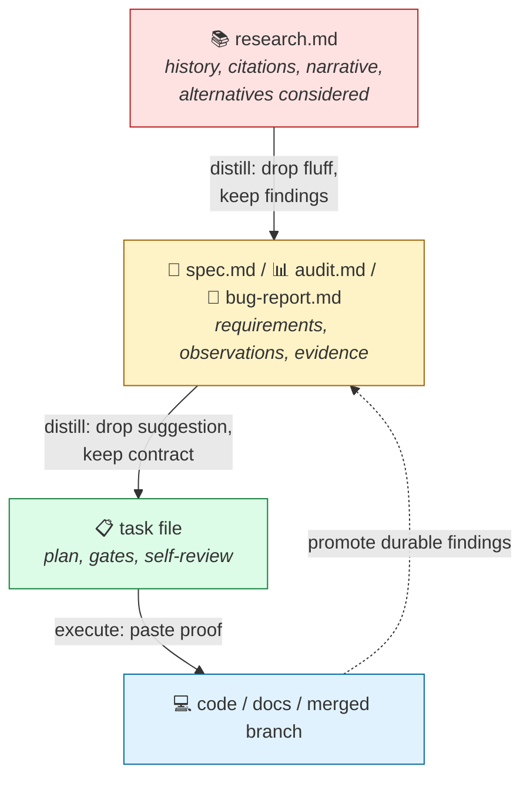
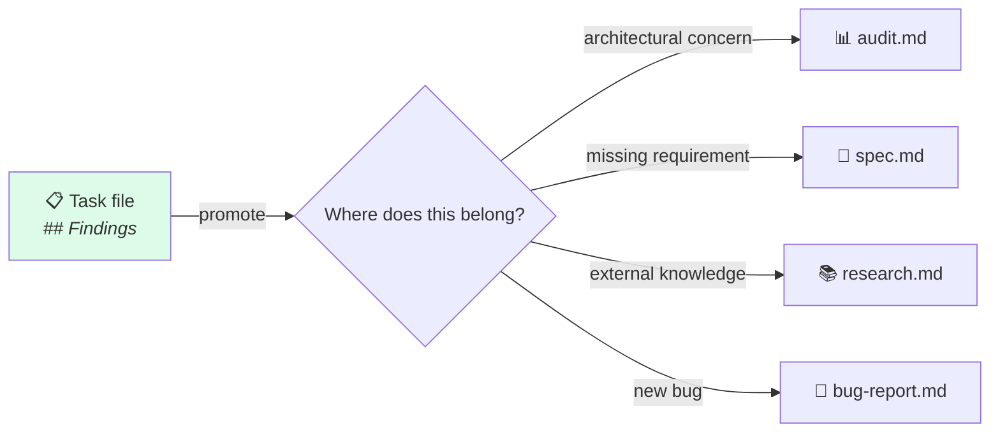

# 03 · Distillation

> **TL;DR.** Information in Swarm flows along a **verbosity gradient**: high-verbosity research → medium-verbosity spec/audit/bug-report → low-verbosity task → terminal output (code, docs). Each transition drops something; the framework requires the dropping to be **accountable** — the agent explicitly states what it dropped and why the next stage doesn't need it. Reverse flow is forbidden. Discoveries during a task are *promoted* upstream before the task closes.

---

## 🪜 The verbosity gradient



The gradient maps cleanly to [Diátaxis](https://diataxis.fr):

| Stage                      | Verbosity | Diátaxis quadrant |
| -------------------------- | --------- | ----------------- |
| `research.md`              | Highest   | Explanation       |
| `spec.md` / `audit.md` / `bug-report.md` | Medium    | Reference         |
| `task file`                | Lowest    | How-to            |

Each step down the gradient permits dropping certain content and **forbids** dropping others. The accountability principle requires the agent to record what was dropped.

---

## 📝 The Distillation Loss Statement

When transforming a high-verbosity document into a low-verbosity one, the agent appends a **Distillation Loss Statement** to the new document:

```markdown
## Distillation Loss Statement

**Dropped from upstream:**
- [What was dropped, in concrete terms]
- [More dropped content]

**Why the next stage does not need this:**
- [Justification — usually "decision is finalised", "context is captured elsewhere", or "downstream stage operates from contract, not history"]
```

The statement makes the loss visible. A reviewer can read the upstream and the distilled output side by side and verify nothing load-bearing went missing.

### Worked example

**Source content (high-verbosity research file):**

> "After reviewing the Stripe documentation and testing the `/v1/charges` vs `/v1/payment_intents` endpoints via `curl`, it's clear we have to migrate to Payment Intents. Charges are legacy and don't support SCA (Strong Customer Authentication) well in Europe. The Payment Intents API requires a two-step process: create the intent on the server to get a `client_secret`, then confirm it on the frontend using Stripe.js."

**Distilled content (medium-verbosity spec):**

```markdown
## Payment processing architecture

- **Provider:** Stripe Payment Intents API
- **Flow:**
  1. Server creates `PaymentIntent` → returns `client_secret`
  2. Client uses `Stripe.js` `confirmCardPayment` with `client_secret`

## Distillation Loss Statement

**Dropped from upstream:**
- European SCA historical justification
- Comparisons to legacy `/v1/charges` endpoint

**Why the next stage does not need this:**
- The flow enforces SCA by design; the historical motivation does not change the contract
- The legacy comparison is closed — `/v1/charges` is not on the table
```

**Distilled content (low-verbosity task file for the backend agent):**

```markdown
## Objective
Implement server-side `PaymentIntent` creation.

## Constraints
- Endpoint must return `client_secret`
- DO NOT implement client-side confirmation (separate task)
```

Notice how the historical justification vanishes by the task stage, but the load-bearing architectural constraint (`Must return client_secret`) is preserved perfectly.

This is **accountable distillation**: the agent didn't lose context silently; it dropped what wasn't needed and said so.

---

## 🛡️ The four tests

Before considering a distillation complete, the agent runs four tests. The framework codifies them in the [`distillation-discipline`](../skills/distillation-discipline.md) skill.

| Test            | Question                                                              | If failed…                          |
| --------------- | --------------------------------------------------------------------- | ----------------------------------- |
| 🎯 **Requirements** | Does every requirement in the upstream survive in some form?       | Restore the missing requirement.    |
| 🧬 **Behavior**     | Does every behavioural constraint (API shape, error semantics, etc.) survive? | Restore it; flag in Loss Statement. |
| 🔍 **Edge case**    | Does every edge case mentioned upstream get a treatment downstream? | Restore the edge case or document why it's out of scope. |
| 🧪 **Empirical**    | Does every measurement, benchmark, or repro step survive in actionable form? | Restore the measurement.            |

A distillation that passes all four is *accountable*. A distillation that fails one is incomplete — the agent halts and revises before continuing.

---

## 🔒 What's lossless and what isn't

Not all content is droppable. The loss budget per transition:

| Transition                             | Loss budget | What can be dropped                                 | What cannot be dropped                              |
| -------------------------------------- | ----------- | --------------------------------------------------- | --------------------------------------------------- |
| `research → spec/audit/bug-report`     | 🟡 High     | Narratives, conversational fluff, alternatives explored | Findings, citations to primary sources, decisions  |
| `spec → task`                          | 🟢 Zero     | (almost nothing — this is a *lossless* execution boundary) | Architectural constraints, data shapes, acceptance criteria |
| `audit → task`                         | 🟡 Medium   | Suggestive language, lower-priority findings        | File:line references, "Needed" entries, severity   |
| `bug-report → task`                    | 🟢 Zero     | (almost nothing) | Reproduction steps, root cause, regression-test specification |
| `task → code/docs`                     | 🟢 Zero     | (the task file is already minimal) | Decisions, findings — these *promote* upstream     |

The **`spec → task` transition is the critical one.** When the Lead Engineer parses a specification into sub-tasks, it is *forbidden* from dropping any architectural constraints or data shapes. This is the moment most prone to silent loss; the framework treats it accordingly.

---

## ⬇️ Why downhill only

Reverse flow — back-filling specs from finished code, narrating decisions retroactively into research files — is forbidden. Two reasons:

1. **Specs are forward-looking.** A spec describes intent, not history. Narrating finished code into a spec conflates *what was built* with *what should be built*. The right artefact for "what was built" is documentation (a how-to, a reference, an explanation) — not a spec.
2. **The chain stays acyclic.** When research feeds spec, spec feeds task, task produces code, the trail is reconstructable. When task can also rewrite spec, the trail loops, and "what we decided" becomes ambiguous.

The exception that proves the rule: **promotion**. If a task discovers something durable (a hidden architectural concern, a missing requirement, a related bug), the agent halts the task, *promotes* the finding to the appropriate upstream doc as an explicit edit, and then resumes. The promotion is visible in the upstream doc's history; it is not a silent rewrite.

See [ADR 0003](../adrs/0003-distillation-is-unidirectional.md) for the full reasoning and the alternatives considered.

---

## 🔄 The promotion protocol

Task files are gitignored. Anything captured only in a task file is lost when the worktree is deleted. The promotion protocol prevents loss:



Steps:

1. **During execution**, the agent records significant discoveries in the task file's `## Findings` section.
2. **Before closing**, the `manage-task` skill checks for unresolved findings.
3. **For each durable finding**, the agent edits the appropriate upstream document (audit, spec, research, or bug-report) to capture it.
4. **The task is marked `done`** only after promotion is complete.

This is not bureaucracy — it is the only way to keep durable knowledge from leaking out of the system.

---

## 🧪 Worked example: a feature task that triggered an audit promotion

A Builder is implementing a new export feature. Mid-task, they notice that the existing `formatCSV` helper has a buffer-overflow risk on inputs above 10 MB.

**What the Builder does *not* do:**
- ❌ Silently fix the bug (scope creep)
- ❌ Note it in the task file and move on (the task file is gitignored)
- ❌ Open a separate PR for it (the worktree is for this task)

**What the Builder *does* do:**
1. Records the finding in the task file's `## Findings` section with file:line and the failure conditions.
2. Promotes the finding to `.agents/audits/active.md` with the same detail (or appends to an existing relevant audit).
3. Continues the original feature task.
4. The audit, now updated, will be the source for a *separate* `refactor` task that fixes the buffer-overflow risk.

This is the promotion protocol working as intended: durable knowledge survives outside the gitignored task file, and the architectural concern is now scheduled for legitimate work rather than silently bundled into a feature commit.

---

## 🧯 Distillation done wrong: a counter-example

A research file documents three competing approaches (A, B, C) to a problem, with citations and tradeoffs. The Architect drafts a spec that says:

> "Use approach A."

…and stops. No Distillation Loss Statement. No mention that B and C were considered. No record of *why* A won.

**What's wrong:**
- A future contributor revisiting the spec sees only "use approach A" and asks "why not B?" — and there's no answer.
- A reviewer can't tell whether B and C were dropped because they were inferior, or because the Architect forgot they existed.
- The decision is now context-free.

**The fix:**

```markdown
## Approach: A

[the spec contents]

## Distillation Loss Statement

**Dropped from upstream:**
- Detailed implementation tradeoffs of approaches B and C
- Original library benchmarks comparing all three

**Why the next stage does not need this:**
- The decision (A) is final; the Builder needs the contract, not the comparison
- The decision rationale is captured in `## Design decisions` below for future reference
- The original research file (`.agents/research/<slug>.md`) is preserved for archeology

## Design decisions

- **Why A over B:** A is library-supported; B requires a custom implementation we don't have capacity to maintain.
- **Why A over C:** C requires a runtime change incompatible with our deployment target.
```

Now the spec carries the contract, the Loss Statement records what was dropped, and the design decisions encode the *why* in case anyone revisits.

---

## 📜 Lifecycle of each doc type

Each source doc has a lifecycle that reinforces distillation:

| Doc type        | Created in                  | Active state              | Terminal state                        |
| --------------- | --------------------------- | ------------------------- | ------------------------------------- |
| `research.md`   | `.agents/research/draft/`   | Being authored            | Moves to `.agents/research/done/` once recommendation is made |
| `spec.md`       | `.agents/specs/`            | Living until shipped      | Moves to `.agents/specs/shipped/` once feature ships  |
| `audit.md`      | `.agents/audits/`           | Active until issues addressed | Moves to `.agents/audits/resolved/` when all "Needed" entries close |
| `bug-report.md` | `.agents/bugs/`             | Active until fix shipped  | Moves to `.agents/bugs/closed/` once regression test is in place |

The lifecycle conventions are recommended, not enforced. Different teams may organise differently; the framework cares about the *direction* (downhill) and the *accountability* (Loss Statements + promotion), not the literal directory structure.

---

## 📚 The `distillation-discipline` skill

The skill that enforces the discipline is at [`skills/distillation-discipline.md`](../skills/distillation-discipline.md). It is auto-attached to:

- `spec-writing` (transitions research → spec)
- `research-writing` (creates the source for downstream distillation)
- `documentation` (transitions code → user-facing docs, where the same pattern applies)

Other tasks can attach it explicitly when appropriate — e.g., when an audit summarises a long-running investigation.

---

## 🪞 The honesty test

The framework's distillation discipline is, fundamentally, an **honesty discipline**. It asks the agent to be honest about what it dropped and why. Without this discipline, distillation is just abridgement — pieces missing without anyone noticing.

The Distillation Loss Statement is the audit trail of the decision. The promotion protocol is the audit trail of new knowledge. Together they make sure the chain — research → spec → task → code → audit — preserves load-bearing intent end-to-end.

---

## See also

- [`05-document-types.md`](05-document-types.md) — the four core doc types
- [`07-flow-graph.md`](07-flow-graph.md) — the legal flows the discipline enforces
- [`../skills/distillation-discipline.md`](../skills/distillation-discipline.md) — the skill that codifies the rules
- [`../skills/documentation-gatekeeper.md`](../skills/documentation-gatekeeper.md) — the always-loaded skill that enforces forbidden flows
- [ADR 0003](../adrs/0003-distillation-is-unidirectional.md) — the unidirectional decision
