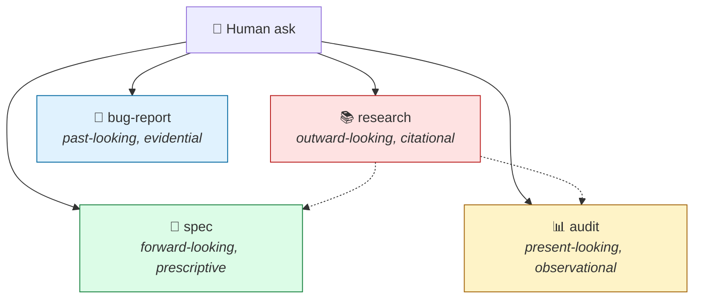
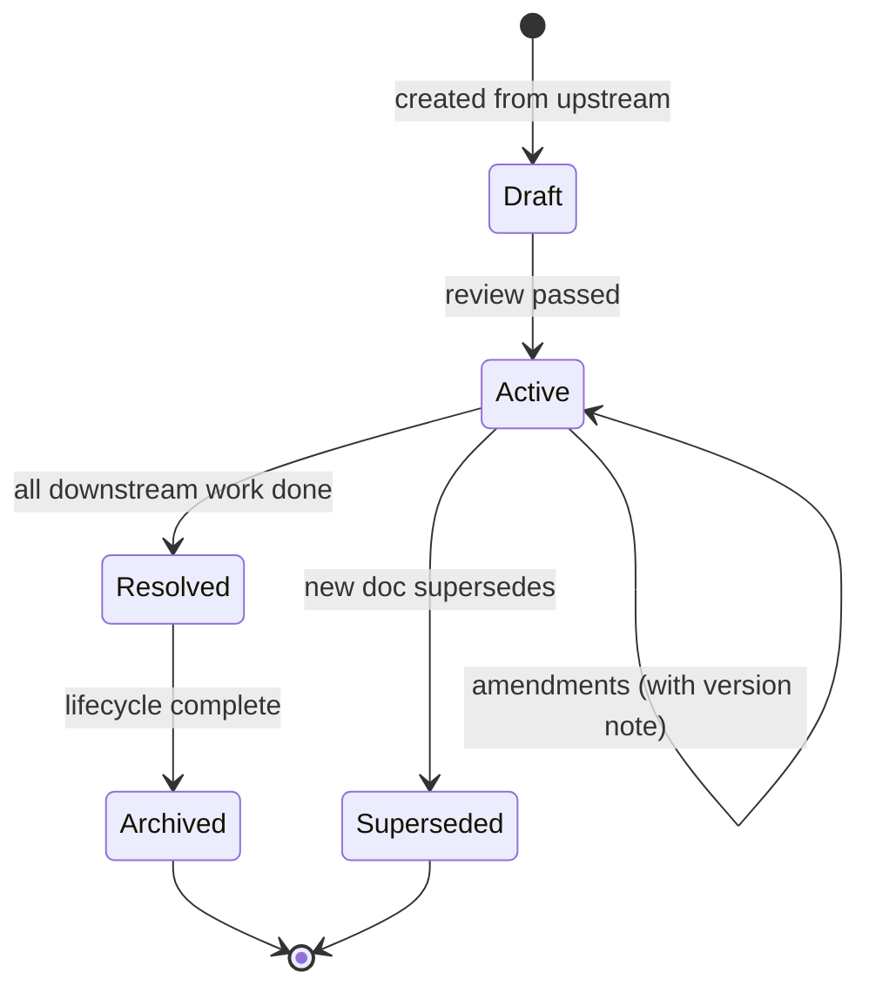

# 05 · Document types

> **TL;DR.** Four core source documents with four distinct **epistemic stances**: spec is forward-looking and prescriptive, audit is present-looking and observational, bug-report is past-looking and evidential, research is outward-looking and citational. They share a base skeleton but cannot collapse into one another — each has its own ways of being wrong, its own lifecycle, and its own routing target. Plus a small set of optional **extended** doc types (ADR, constitution, migration plan, benchmark report) that build on the same vocabulary.

---

## 🧭 The four core types



Each doc has its own dedicated page in [`documents/`](../documents/). This page is the conceptual frame.

---

## 🪞 Why four (and not one with a kind discriminator)

A reasonable first instinct is to unify: "let's just have one `Document` type with a `kind: spec | audit | research | bug-report` discriminator." This was considered and rejected. The reasoning:

| Argument for unifying                                | Argument against (the chosen position)                                                |
| ---------------------------------------------------- | ------------------------------------------------------------------------------------- |
| Less template overhead                               | The four types have **distinct ways of being wrong**. A spec can be unverifiable; an audit can be vague; a bug-report can mistake symptom for cause; research can over-claim. Each `write-<type>` skill is built to prevent the *specific* failure mode of its type. Collapsing them either fattens a single discipline beyond usefulness or thins it past the point where it catches the failure modes. |
| Easier to teach                                      | The four types have **distinct lifecycles**. A spec lives until shipped; an audit lives until issues close; a bug-report lives until regression test exists; research is terminal. A single template can't capture all four. |
| Single skeleton                                      | The four types have **distinct routing targets**. A spec routes to `feature`; an audit routes to `refactor`; a bug-report routes to `fix`; research routes to `spec-writing`. The discriminator would be load-bearing routing logic — not just metadata. |
| Less code in the framework                           | The framework is documentation, not code. The "code in the framework" cost is zero. |

The conclusion: keep the four types distinct. Share a **base skeleton** (Context, Linked docs, Decisions, Open questions) but specialise each type's structure (a spec has Acceptance criteria; an audit has Findings; a bug-report has Reliable reproduction; research has Sources).

See [ADR 0001](../adrs/0001-four-doc-types.md) for the full reasoning.

---

## 🎯 The epistemic stance test

To distinguish the four cleanly, ask: *what is this document making claims about?*

| Doc type        | Makes claims about                  | Tense       | Author's discipline                          |
| --------------- | ----------------------------------- | ----------- | -------------------------------------------- |
| **spec**        | What *should be true* of the system | Future      | Verifiability (every requirement is testable) |
| **audit**       | What *is true* of the system today  | Present     | Specificity (every finding cites file:line)  |
| **bug-report**  | What *was true* during a failure    | Past        | Reproducibility (the bug fires on demand)    |
| **research**    | What *is true* about the world outside the system | Indeterminate | Citation (every claim sources a primary)     |

If you can't tell which doc you're writing, this question disambiguates. A document can have *elements* of multiple stances (a spec might cite research; an audit might recommend approaches), but the *primary* stance determines the type.

---

## 🧬 The shared skeleton

All four types share a base shape — defined in [`reference/document-base.md`](../reference/document-base.md):

```markdown
# <Title>

## Context
Why this doc exists. The triggering ask. The audience.

## Linked docs
- Upstream sources: <links>
- Related documents: <links>

## <Type-specific main content>
(Different per doc type — see below)

## Decisions
Significant choices made while writing this doc, with rationale.

## Open questions
- [ ] **[CRITICAL]** Questions that block downstream work
- [ ] **[MINOR]** Questions worth recording but not blocking

## Distillation Loss Statement
(For docs distilled from upstream — see [03-distillation.md](03-distillation.md))
```

The type-specific content varies:

| Type            | Adds                                                                |
| --------------- | ------------------------------------------------------------------- |
| **spec**        | Goal · Scope · Acceptance criteria · Constraints · Design decisions |
| **audit**       | Goal · Scope · Findings (with file:line + Needed) · Risks · Suggested approaches |
| **bug-report**  | Reported behavior · Reliable reproduction · Hypothesis tracker · Root cause · Regression test plan |
| **research**    | Research question · Sources · Findings · Comparison · Recommendation |

Full templates: [`documents/`](../documents/).

---

## 📜 The four core types in detail

### 📜 spec.md — *forward-looking, prescriptive*

**Purpose:** Capture deterministic technical requirements for new behaviour. Maps to Diátaxis "Reference" — neutral, descriptive, source of truth.

**Where it lives:** `.agents/specs/`.

**Authoring persona:** [The Architect](../personas/the-architect.md) (always — see [ADR 0002](../adrs/0002-personas-1-to-1-with-task-types.md)).

**Spawns task type:** `feature`.

**Required sections (beyond base):** Goal · Scope · User-visible behaviour · Acceptance criteria · Design decisions · Constraints · Open questions · Tradeoffs and risks.

**Lifecycle:** Active until the feature ships, then moved to `.agents/specs/shipped/`. Living specs (those describing on-going behaviour) stay in the active directory.

**Failure mode the `write-spec` skill prevents:** Unverifiable requirements ("the system should be fast"), implementation specification (forbidding the Builder from making implementation choices), and missing acceptance criteria.

→ Full doc: [`documents/spec.md`](../documents/spec.md).

---

### 📊 audit.md — *present-looking, observational*

**Purpose:** Honestly describe the current state of a codebase area against a defined goal. Make the area *legible* so downstream work can be planned.

**Where it lives:** `.agents/audits/`.

**Authoring persona:** [The Auditor](../personas/the-auditor.md).

**Spawns task type:** `refactor` (default), or `deepen-audit` (when an audit triggers further investigation), or `performance` (when the audit identifies perf issues).

**Required sections (beyond base):** Goal · Scope · Code paths inspected · Findings (numbered, with file:line, severity, and "Needed") · Risks · Suggested approaches.

**Lifecycle:** Active until every "Needed" entry has been addressed (via refactor tasks). Then archived to `.agents/audits/resolved/`.

**Failure mode the `write-audit` skill prevents:** Findings without file:line citations; vague observations promoted to findings; missing "Needed" entries; flat lists not prioritised by impact.

→ Full doc: [`documents/audit.md`](../documents/audit.md).

---

### 🐛 bug-report.md — *past-looking, evidential*

**Purpose:** Isolated reproduction and root cause analysis of a system failure. The deliverable is a report a fixer can act on without re-discovering the cause.

**Where it lives:** `.agents/bugs/`.

**Authoring persona:** [The Bug Hunter](../personas/the-bug-hunter.md).

**Spawns task type:** `fix`.

**Required sections (beyond base):** Reported behavior · Reproduction attempts · Reliable reproduction (steps + expected vs actual + conditions) · Hypothesis tracker · Root cause (file:line + state + input + caller) · Regression test plan.

**Lifecycle:** Active until the fix ships *and* a regression test exists. Then archived to `.agents/bugs/closed/`.

**Failure mode the `write-bug-report` skill prevents:** Reporting symptom as root cause; speculating about cause without reproducing; conflating "I think this is the problem" with "I have proven this is the problem".

**Why bug-report is a meta-task** (it produces a doc, it doesn't fix the bug): the fix and the diagnosis are different work, with different mindsets and different empirical proofs. Splitting them lets each session be done well. See [ADR 0007](../adrs/0007-bug-report-as-meta-task.md).

→ Full doc: [`documents/bug-report.md`](../documents/bug-report.md).

---

### 📚 research.md — *outward-looking, citational*

**Purpose:** Gather external knowledge to inform a downstream decision. Maps to Diátaxis "Explanation" — understanding-oriented.

**Where it lives:** `.agents/research/`.

**Authoring persona:** [The Researcher](../personas/the-researcher.md) (technical) or [The Surveyor](../personas/the-surveyor.md) (UX/market).

**Spawns task type:** `spec-writing` (research is upstream input; the next step is translating into requirements).

**Required sections (beyond base):** Research question · Sources (numbered, primary preferred) · Findings (every claim cites a source) · Comparison (where multiple options exist) · Recommendation (actionable enough to spec from).

**Lifecycle:** Terminal. Research files don't get "updated" — they get superseded by new research files when the world changes.

**Failure mode the `write-research` skill prevents:** Opinion presented as finding; sources listed but not actually consulted; recommendations that say "it depends" without saying *on what*; vague attribution ("according to common practice").

**The "research is optional" rule:** If the agent's training data covers the topic adequately, research is not required. The framework forbids invented research files for trivia. The `write-research` skill includes a self-check: "Could a competent agent answer this from training data alone? If yes, the research file is unjustified."

→ Full doc: [`documents/research.md`](../documents/research.md).

---

## 🛠️ Extended doc types

These are optional but increasingly common. Projects adopt them when the value justifies the structure. They are *not* required for framework conformance.

| Doc type             | Purpose                                                                  | Where                | Authoring persona       |
| -------------------- | ------------------------------------------------------------------------ | -------------------- | ----------------------- |
| **ADR**              | Architecture Decision Record (Y-Statement: Context · Decision · Consequences). Captures architecturally-significant decisions immutably. | `.agents/adrs/`      | The Architect           |
| **constitution.md**  | The project's non-negotiable baselines: tech-stack constraints, code-quality standards, security mandates. | `.agents/constitution.md` | Human / The Architect |
| **migration plan**   | Logistics manifest for a large-scale mechanical change.                   | `.agents/migrations/` | The Architect (with input from The Migrator) |
| **benchmark report** | Baseline numbers, methodology, target metrics for a performance task.    | `.agents/benchmarks/` | The Performance Surgeon |
| **cleanup list**     | Items to remove, each with a safety proof.                               | `.agents/cleanups/`  | The Auditor             |
| **test plan**        | Coverage gaps and tests to add (when scope justifies a separate doc).    | `.agents/test-plans/` | The Test Author         |
| **audit brief**      | The scope and goal for an upcoming audit.                                | `.agents/audit-briefs/` | Human / The Architect |
| **research question** | The framing for an upcoming research task.                               | `.agents/research-questions/` | Human                |
| **review scope**     | Code reference + review focus, when too heavy to embed in the task file. | `.agents/review-scopes/` | Human / The Lead Engineer |

These extended types are conceptually **specialisations** of the core types:

- **ADR ≈ a small decision-only spec.**
- **constitution.md ≈ a project-wide spec.**
- **migration plan ≈ a spec for a mechanical change.**
- **benchmark report ≈ an audit specialised to performance.**
- **cleanup list ≈ an audit specialised to deletion.**
- **test plan ≈ a spec for tests.**
- **audit brief ≈ a tiny up-front spec for an audit task.**
- **research question ≈ a tiny up-front spec for a research task.**

A project that uses all of these has a richer doc taxonomy without inventing new epistemic stances. A project that uses none of them — putting migration scope into a regular spec, or test scope into a regular task file — is also conformant.

→ Full extended catalogue: [`documents/extended.md`](../documents/extended.md).

---

## 🛡️ The author/reviewer matrix

| Persona               | Primary author of                          | Secondary reviewer of                      |
| --------------------- | ------------------------------------------ | ------------------------------------------ |
| The Architect         | spec, ADR, constitution                    | research                                   |
| The Researcher        | research (technical)                       | ADR                                        |
| The Surveyor          | research (UX/market)                       | spec                                       |
| The Bug Hunter        | bug-report                                 | audit                                      |
| The Auditor           | audit, cleanup list                        | bug-report, constitution                   |
| The Lead Engineer     | migration plan (logistics), task tracker   | spec                                       |
| The Performance Surgeon | benchmark report                         | spec                                       |
| The Test Author       | test plan                                  | spec                                       |
| The Skeptic           | (reviews everything; authors nothing durable) | all code-producing branches               |
| The Builder, Janitor, Migrator, Documentarian | (don't author durable docs; produce code or terminal docs) | — |

The matrix is also documented in [`reference/compatibility-matrix.md`](../reference/compatibility-matrix.md).

---

## 🔁 Document lifecycle (general pattern)



Different doc types live longer or shorter on this cycle:

- **Specs** stay Active until the feature ships, then move to a `shipped/` sub-directory (the spec describes the contract of the now-living feature).
- **Audits** stay Active until every "Needed" closes, then archive to `resolved/`.
- **Bug reports** stay Active until the fix ships and a regression test exists, then archive to `closed/`.
- **Research** is born terminal — it becomes "superseded" when newer research replaces it.

---

## 🚫 Forbidden compositions

A few things the framework refuses:

- **A spec that contains current-state observations.** That's an audit. Split.
- **An audit that prescribes new behaviour.** That's a spec. Split.
- **A bug-report that fixes the bug.** Bug-report is a meta-task; the fix is a separate task driven by the report. Split.
- **A research file that doubles as a spec.** The transition is *spec-writing* — a separate task, not a single document.
- **One doc with multiple `## Recommendation` sections covering different concerns.** Split.

These are codified in [`skills/documentation-gatekeeper.md`](../skills/documentation-gatekeeper.md), the always-loaded skill that enforces the boundaries.

---

## See also

- [`documents/`](../documents/) — the per-type pages with templates
- [`03-distillation.md`](03-distillation.md) — how docs distil into one another
- [`07-flow-graph.md`](07-flow-graph.md) — the routing map
- [`../skills/documentation-gatekeeper.md`](../skills/documentation-gatekeeper.md) — the enforcement skill
- [ADR 0001](../adrs/0001-four-doc-types.md) — why four
- [ADR 0007](../adrs/0007-bug-report-as-meta-task.md) — why bug-report is a meta-task
