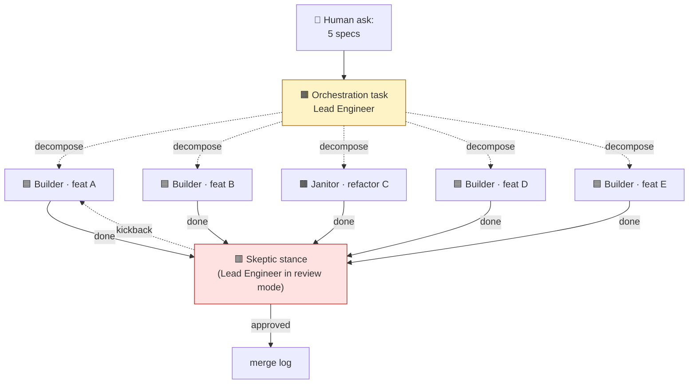
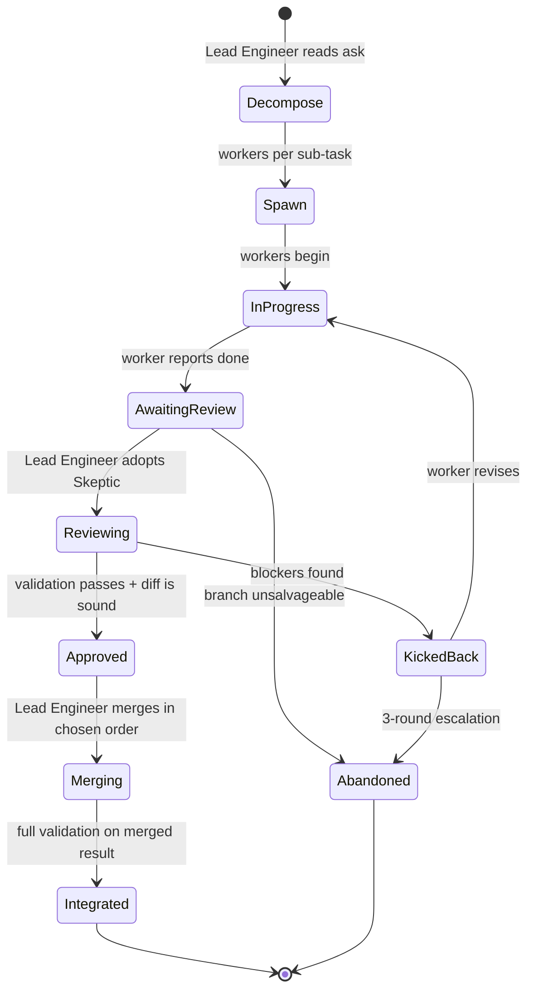

# 08 · Recursion and delegation

> **TL;DR.** A task can spawn sub-tasks. The conditioning pipeline runs recursively — each child is itself a `(source doc, task type, persona)` triple. The most common recursion is the **Lead Engineer pattern**: a Lead Engineer decomposes a complex ask into independent sub-tasks, delegates each to a worker (in its own worktree), reviews each branch as the Skeptic, and merges. Recursion depth is bounded; default limit is **2**.

> **A note on naming.** User-facing prose uses **delegation** or **sub-orchestration** for the Lead Engineer pattern. _Recursion_ is reserved for technical descriptions of the conditioning pipeline. (See [ADR 0014](../adrs/0014-recursion-renamed-delegation.md).) Internally these are the same thing; the user-facing word change avoids the marketing-flavoured "Swarm-in-Swarm" framing.

---

## 🪜 The Lead Engineer pattern



### How it works

1. **The Lead Engineer reads the orchestration task file.** The source docs are listed (often a directory of related specs); the task type is `orchestration`; the persona is The Lead Engineer.

2. **The Lead Engineer decomposes the ask.** The decomposition is into independent sub-tasks — each one a `(source doc, task type, persona)` triple. The decomposition is recorded in the task file's `## Worker tracker` section.

3. **For each sub-task, the Lead Engineer:**
   - Creates a fresh worktree (`git worktree add .worktrees/<slug>`)
   - Creates a fresh branch (e.g., `feature/<slug>`)
   - Scaffolds a conditioned task file (e.g., `task-feature.md` with the spec linked, the Builder persona named, the skills attached, the verification gates bound)
   - Spawns an agent CLI session in that worktree

4. **As workers complete, the Lead Engineer adopts the Skeptic.** Each worker's branch is reviewed _empirically_ — the Lead Engineer runs `{{cmdValidate}}` and `{{cmdTest}}` themselves, in their own worktree, with the worker's branch checked out. They do _not_ trust the worker's pasted output. Findings are recorded in the orchestration task file's review log.

5. **Approved → merged. Rejected → kickback.** The Lead Engineer merges approved branches in an order that minimises avoidable conflicts (recorded in the `## Merge log` section). For rejected branches, the Lead Engineer authors a _kickback_ — a short doc citing the specific files and lines that must change — and the worker (or a fresh agent in the same persona) revises.

6. **Final merged-branch validation.** Once all branches are merged, the Lead Engineer runs `{{cmdValidate}}` and `{{cmdTest}}` on the merged result and pastes the output into Self-review. Per-worker validation is necessary but not sufficient — latent integration issues only surface in the merged whole.

---

## 🛠️ The orchestration task file

The Lead Engineer's task file is the canonical record of the entire orchestration. It includes (beyond the base sections):

- **`## Worker tracker`** — a table of every spawned worker with slug, source doc, task type, persona, branch, status, and last review verdict.
- **`## Kickback queue`** — workers whose branches were rejected, with reasons and specific file:line citations.
- **`## Merge log`** — the order of merges, conflicts encountered, and resolutions.

Status values for workers:

| Status            | Meaning                                                         |
| ----------------- | --------------------------------------------------------------- |
| `not-started`     | Sub-task scaffolded, agent not yet spawned                      |
| `in-progress`     | Agent is working                                                |
| `awaiting-review` | Agent reports done; Skeptic-stance review pending               |
| `kicked-back`     | Branch rejected; worker revising                                |
| `merged`          | Branch approved and merged into the orchestration branch        |
| `abandoned`       | Branch unsalvageable; recorded in `## Decisions` with rationale |

Full template: [`tasks/orchestration.md`](../tasks/orchestration.md).

---

## 🚦 Recursion depth and the limit

Recursion depth is the number of orchestration layers. Default: **2**.

```
Depth 0: feature task (Builder, single agent)
Depth 1: orchestration → 5 feature tasks (Lead Engineer + 5 Builders)
Depth 2: orchestration → orchestration → feature tasks (Lead Engineer of Lead Engineers)
```

Why **2** as default:

- Coordination overhead grows superlinearly with depth. A single Lead Engineer juggling 5 workers is manageable; a Lead Engineer juggling 5 Lead Engineers each juggling 5 workers is 25 review passes deep.
- Token cost compounds. The frontier research notes that multi-agent systems consume roughly 15× more tokens than single-agent chats; recursion compounds this further.
- Empirical accountability becomes harder as depth grows — the merge log at depth 2 is the merge-log-of-merge-logs.

Higher limits are _permitted_ but require explicit configuration. A project with proven need (extreme parallelism, large refactor over weeks) may raise the limit and document the rationale.

---

## 🧩 What "decomposes well" means

Not every ask decomposes into independent sub-tasks. The Lead Engineer's first job is to assess whether the ask is decomposable. Heuristics:

| ✅ Decomposes well                                 | ❌ Does not decompose well                                |
| -------------------------------------------------- | --------------------------------------------------------- |
| Multiple related but independent specs             | Single spec with a single tightly-coupled implementation  |
| Refactors across non-overlapping module boundaries | Refactors that touch a shared module from multiple angles |
| Migration waves over a large API surface           | A single subtle algorithmic change                        |
| Documentation tasks across distinct doc files      | A doc rewrite that requires reconciling multiple sources  |
| Audit + fix work across distinct codebase areas    | A single deep investigation                               |

When an ask doesn't decompose well, the Lead Engineer collapses to a single-agent task. The framework's response: there's no shame in single-threaded work. Trying to force parallelism on coupled work creates the coordination failure Cognition AI documented (see [`12-prior-art.md`](12-prior-art.md)).

---

## 🛡️ The merge protocol

Merges are single-threaded. The Lead Engineer merges branches one at a time, in an order chosen to minimise avoidable conflicts.

Recommended order heuristic:

1. **Refactor / cleanup branches first.** They restructure the codebase; merging them first reduces the chance of conflict with feature branches.
2. **Independent feature branches in alphabetical order** (deterministic; reduces "I forgot one" risk).
3. **Cross-cutting branches last.** Branches that touch many files often conflict with everything; merge them after isolated branches.

After each merge, the Lead Engineer:

- Runs `{{cmdValidate}}` and `{{cmdTest}}` on the merged state.
- If something breaks, isolates the conflict (the just-merged branch is the prime suspect), resolves, and re-validates.
- Records the resolution in the `## Merge log`.

After all branches are merged, the Lead Engineer runs full validation again on the integrated result. **Per-worker validation does not substitute for integrated validation.**

---

## 🔁 Kickback

When the Skeptic-stance review fails, the Lead Engineer authors a kickback. A good kickback:

- ✅ **Cites specific files and lines** that must change
- ✅ **States what must change**, not just that it's wrong
- ✅ **Is actionable without dialogue** — the worker should not need to come back and ask "what do you mean"

Anti-patterns:

- ❌ "Looks rough — please revise"
- ❌ "Several issues with this branch"
- ❌ "Doesn't quite hit the spec"
- ❌ Vague file references ("the validation logic")

A concise kickback lists **blocking** bullets with `path:line`, the spec/audit citation, and the exact behavioural delta expected—workers must be able to act without clarifying pings.

The kickback notes ride alongside the original spec in the worker's _kickback task_ — see [`tasks/kickback.md`](../tasks/kickback.md).

---

## 🛑 Kickback escalation

A branch that's been kicked back **3 times** is escalated. The Lead Engineer:

1. Halts the kickback loop.
2. Records the situation in `## Decisions` with the three rounds of kickback notes.
3. Chooses one of:
   - **Re-spec** — the spec is unclear or under-specified; spawn a `spec-writing` task to revise.
   - **Re-scope** — the work is too large; spawn an `orchestration` task to decompose further.
   - **Abandon** — the work isn't worth the cost; close the branch and the parent orchestration with a `decision: abandoned` note.
   - **Escalate to human** — surface the situation in `## Blockers` and pause for input.

The 3-round limit is a recommendation, not a hard rule. Some pathological cases legitimately require 4 rounds; some easy cases shouldn't get 2. The discipline is: **don't loop indefinitely**. If a kickback isn't trending toward resolution, escalate.

---

## 🚨 Failure modes the protocol defeats

| Failure mode                                                                   | Defeated by                                                         |
| ------------------------------------------------------------------------------ | ------------------------------------------------------------------- |
| Workers operating without each other's context, producing inconsistent results | Single-threaded merges; conflicts surface immediately               |
| Lead Engineer rubber-stamping worker self-reports                              | Skeptic stance for review; Lead Engineer runs validation themselves |
| Vague kickback feedback wasting worker time                                    | Kickback specificity rule (file:line + what must change)            |
| Merge order chosen by accident, causing avoidable conflicts                    | Documented merge log + heuristic ordering                           |
| Latent integration bugs that work per-branch but break together                | Final merged-branch validation, not just per-worker                 |
| Infinite kickback loops                                                        | 3-round escalation                                                  |
| Lead Engineer doing the work themselves ("it's faster if I just do it")        | Hard constraint: Lead Engineer doesn't write code                   |
| Recursion explosion                                                            | Depth limit (default 2)                                             |

---

## 🚫 Write-side parallelism is forbidden

This is the framework's position on a debated topic. See [`10-subagent-strategy.md`](10-subagent-strategy.md) for the field context. Summary:

> **Read-side parallelism is permitted; write-side parallelism is not.**

In Swarm, _read-side_ work (research, audit, review) may be parallelised — multiple workers exploring different parts of the codebase, reporting back digests. _Write-side_ work (feature, fix, refactor, migration) is single-threaded: one worker per branch, merges serialised through the Lead Engineer.

This is the synthesis Cognition AI converged on after a year of multi-agent experimentation (their April 2026 post _Multi-Agents: What's Actually Working_ makes the case explicitly). Anthropic's research system uses orchestrator-worker for _exploration_, not for _implementation_. Swarm matches the field's converged position.

---

## 🔄 The handoff state diagram



Every state transition is documented in the orchestration task file. The trail is reconstructable from that file alone.

---

## 🪞 The "Lead Engineer = manager" framing

A useful mental model: **the Lead Engineer is a manager.** They don't write the code; they coordinate those who do. Their output is the _merged result and the trail showing how it got there_.

A manager who:

- Doesn't read the workers' output — fails. (Lead Engineer reviews empirically.)
- Sends vague feedback — fails. (Lead Engineer kicks back with specificity.)
- Does the work themselves "because it's faster" — fails. (Lead Engineer delegates; trying to do the work means the orchestration task is wrong.)
- Trusts every worker's word — fails. (Lead Engineer adopts the Skeptic for every review.)

The persona's hard constraints encode this management discipline.

---

## See also

- [`personas/the-lead-engineer.md`](../personas/the-lead-engineer.md) — the full persona profile
- [`tasks/orchestration.md`](../tasks/orchestration.md) — the orchestration task template
- [`tasks/kickback.md`](../tasks/kickback.md) — the kickback task template
- [`10-subagent-strategy.md`](10-subagent-strategy.md) — read-side vs write-side parallelism
- [ADR 0014](../adrs/0014-recursion-renamed-delegation.md) — the naming decision
