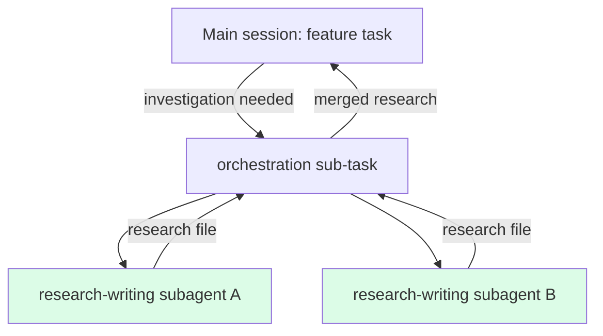

# 10 · Subagent strategy

> **TL;DR.** Read-side parallelism is permitted; write-side parallelism is forbidden. Research, audit, and review tasks may run in subagents (separate context windows reporting back digests). Implementation tasks (feature, fix, refactor, migration) run in a single thread; the Lead Engineer pattern serialises writes through a single-threaded merge protocol. This is the synthesis Cognition AI converged on after a year of multi-agent experiments and matches Anthropic's research-system pattern.

---

## 🎯 The position in one paragraph

Multi-agent setups produce coordination failure when two agents make independent decisions about the same code. They produce massive value when the work is a *breadth-first search* of a problem space — research, audit, exhaustive review. The framework's response: use subagents *aggressively* on read-side work; serialise *all* write-side work; never have two agents writing to overlapping code simultaneously.

```mermaid
flowchart LR
    subgraph 🟢 Permitted parallelism
        R1[research subagent A]
        R2[research subagent B]
        R3[audit subagent C]
        REV[review subagent D]
    end
    subgraph 🔴 Forbidden parallelism
        W1[Builder on feat A]
        W2[Builder on feat A<br/>concurrent]
    end
    subgraph 🟡 Permitted via Lead Engineer
        LE[Lead Engineer]
        LE --> W3[Builder on feat A]
        LE --> W4[Builder on feat B<br/>different files]
        LE -.serialise merges.-> W3
        LE -.serialise merges.-> W4
    end
    style W1 fill:#fee2e2
    style W2 fill:#fee2e2
```

---

## 📜 Where the position came from

This is one of the most-debated questions in agentic coding. Three positions held the field in 2025:

1. **Cognition (June 2025) — *Don't Build Multi-Agents.*** Most multi-agent setups in the world were limited to read-only subagents (web search, code search). Their argument: agents making independent decisions in parallel produce inconsistent results because they lack each other's context. Devin runs a single agent thread for writes.

2. **Anthropic (June 2025) — *How we built our multi-agent research system.*** Their Research system uses an orchestrator-worker pattern. A Lead Researcher decomposes a query, spawns parallel subagents (each in its own context window), and synthesises results. Internal evaluations: 90.2% improvement over single-agent on breadth-first tasks.

3. **Cognition's reversal (April 2026) — *Multi-Agents: What's Actually Working.*** Walden Yan now writes that a narrower class works, where agents contribute intelligence while writes stay single-threaded.

The synthesis: **read-side parallelism is fine; write-side parallelism causes coordination failure.** Anthropic's own engineering docs reinforce this — multi-agent systems excel at problems that can be divided into parallel strands of research but are less effective for tightly interdependent tasks such as coding.

Swarm adopts this synthesis as a hard rule.

---

## 🟢 Read-side: subagents are encouraged

Read-side work explores a problem space and produces a digest. The subagent operates in isolation, doesn't write to the codebase, and reports back through a structured artefact (a research file, an audit, a review verdict).

| Use a subagent for…                  | Why                                                                |
| ------------------------------------ | ------------------------------------------------------------------ |
| Research a third-party library's API | Subagent's context fills with the library; main session stays clean |
| Audit a large codebase area          | Subagent walks the area exhaustively without polluting main context |
| Review a worker's branch             | Skeptic-stance review benefits from a fresh context window         |
| Investigate a multi-system bug       | Subagent traces the issue across modules without losing main thread |
| Survey UX competitor behaviours      | Surveyor explores the web; main session stays focused              |

The subagent's deliverable is a *digest* — the research file, the audit, the verdict. The main session reads the digest, not the subagent's full context. This is exactly the pattern the conditioning pipeline already enforces — the main session reads a doc, not a transcript.

### How read-side subagents fit the framework

A subagent is, in framework terms, just a child task with the same conditioning pipeline. The Lead Engineer pattern handles this naturally:



Main session continues with the merged research as a new linked doc. Context isolation achieved; coordination cost minimal because the subagents don't write code.

---

## 🔴 Write-side: single-threaded only

Write-side work is forbidden in parallel. The Lead Engineer pattern *serialises* multiple write-side workers through:

1. **Disjoint scopes** — each worker's branch touches a non-overlapping set of files.
2. **Sequential merges** — the Lead Engineer merges branches one at a time, never in parallel.
3. **Per-merge validation** — `{{cmdValidate}}` and `{{cmdTest}}` after every merge.

Even when scopes appear disjoint, the Lead Engineer assumes they aren't until validation says so. The merge order matters; the per-merge validation catches the cases where "appears disjoint" was wrong.

Concretely, **two Builders must never be writing to the same file at the same time.** The framework's enforcement: workers operate in distinct worktrees on distinct branches, and the merge protocol is serial (see [`08-recursion-and-delegation.md`](08-recursion-and-delegation.md)).

---

## 🤝 The orchestrator-worker pattern, applied to coding

When work is genuinely decomposable, the Lead Engineer pattern works exactly like Anthropic's research orchestrator-worker model:

| Anthropic Research                       | Swarm Lead Engineer                                  |
| ---------------------------------------- | ---------------------------------------------------- |
| Lead Researcher decomposes a query       | Lead Engineer decomposes a complex ask                |
| Subagents explore in parallel            | Workers implement in parallel (in separate worktrees) |
| Each subagent has its own context window | Each worker has its own worktree + agent CLI session  |
| Citation Agent verifies sources          | Skeptic-stance Lead Engineer verifies branches        |
| Lead Researcher synthesises results      | Lead Engineer merges branches                         |

The crucial difference: in research, the workers' outputs are *independent* (digests of different sources). In coding, the workers' outputs are *interdependent* (changes to a shared codebase). The framework's response is to *constrain decomposition* so the dependencies are visible (disjoint file scopes) and *serialise the integration* (sequential merges with per-merge validation).

---

## 🚦 Per-task-type guidance

The framework's recommendation by task type:

| Task type                                 | Subagent default     | Notes                                                                   |
| ----------------------------------------- | -------------------- | ----------------------------------------------------------------------- |
| **research-writing**                      | ✅ Subagent          | Read-side; benefits from context isolation                              |
| **audit-writing**                         | ✅ Subagent          | Read-side; the Auditor explores widely                                  |
| **review** / **deepen-audit**             | ✅ Subagent          | Read-side; the Skeptic benefits from fresh context                      |
| **bug-report-writing**                    | ✅ Subagent          | Read-side (the bug isn't fixed in this task)                            |
| **spec-writing**                          | ⚖️ Either            | Often beneficial as subagent (Architect surveys patterns); main session works too |
| **documentation**                         | ⚖️ Either            | Light enough that subagent overhead may exceed benefit                  |
| **feature**, **fix**, **refactor**, **rewrite**, **migration**, **upgrade**, **performance**, **testing**, **integration**, **kickback** | ⛔ Single-threaded | Write-side; never parallelise                                           |
| **orchestration**                         | n/a                  | The Lead Engineer *spawns* subagents; the orchestration task itself is single-threaded |

When in doubt: read-side ⇒ subagent; write-side ⇒ single-threaded.

---

## 💸 Cost considerations

Multi-agent systems consume roughly **15× more tokens than single-agent chats** (per the Anthropic engineering docs). This cost is *fine* for research workflows where the value is the breadth-first search, but *punishing* for routine implementation work where the value is incremental change.

The framework's per-task-type defaults reflect this: implementation tasks default to single-threaded (low token cost, high coherence); research/audit/review tasks default to subagents (higher token cost, but the cost buys context isolation that single-session can't match).

A project that runs every task as a subagent will spend ~15× more tokens for marginal benefit. A project that runs every task in the main thread will hit context-pollution failures on long-running investigations. The defaults are calibrated to avoid both extremes.

---

## 🚫 The forbidden pattern: parallel writers on shared code

The clearest anti-pattern. Two Builders, both editing `src/auth/oauth.ts`, in separate worktrees, in parallel.

What goes wrong:

1. Builder A adds `validateSCA()` between lines 42–60. Builder B adds `validatePKCE()` between lines 42–60 (different logic, same range).
2. Both branches pass `{{cmdValidate}}` and `{{cmdTest}}` independently.
3. Merge: Builder A's branch merges first. Now Builder B's branch has a conflict in lines 42–60.
4. The Lead Engineer (or worse, a third agent) tries to resolve the conflict by combining both helpers. The resolution is plausible but introduces a subtle ordering bug — `validateSCA()` runs before `validatePKCE()` instead of the spec's required order.
5. Tests pass on the merged branch (the test suite doesn't cover this ordering). The bug ships.

The framework's response:

- The Lead Engineer's decomposition rule: **disjoint file scopes**. Two workers must not touch the same file. If the work requires both, they're not independent — collapse to one worker (single-threaded) or split the file first.
- The merge protocol: **serial merges** with per-merge validation. Conflicts are surfaced immediately; resolution happens with the full context, not in parallel.
- The Skeptic-stance review: catches resolution-introduced bugs by reading the merged diff with hostility.

---

## 🛠️ The session-start hook

Subagent strategy works only if the framework actually *fires* subagents at the right moments. Otherwise it sits in the docs as advice nobody acts on.

The framework recommends a **session-start hook**: a short bootstrap injected by the agent CLI (Claude Code hook, Codex skill auto-load, or AGENTS.md leading instruction) that says, in effect:

> First action: read your task file. If your task type is research-writing, audit-writing, review, deepen-audit, or bug-report-writing, you may run as a subagent — this is the default. If your task is implementation, you run in the main thread. Then proceed.

The hook lives at the *agent CLI* layer, not in the framework. But the framework specifies what the hook should say. See [`reference/agents-md.md`](../reference/agents-md.md) for the recommended language.

---

## ❓ Open questions

The frontier research flagged two open questions about subagent strategy:

1. **Should subagents map 1-to-1 to task types, or should Swarm define a separate "subagent recipe" layer?** Anthropic's docs treat subagents as orthogonal to agents — a subagent is a context-isolation mechanism, not a task type. Swarm's current position (above) treats them as a *mode* a task type runs in (subagent vs main thread). This is simpler; whether it's right will become clear with more usage.

2. **Where do AI-native review patterns (security review agent, dependency-graph audit agent) fit?** They're Reviews in the catalogue, but the field is treating them as recurring background tasks rather than ad-hoc Reviews. The current position: they're `review` tasks scheduled by the project's CI, not a new task type. If practice diverges, the catalogue grows.

---

## See also

- [`08-recursion-and-delegation.md`](08-recursion-and-delegation.md) — the Lead Engineer pattern in detail
- [`12-prior-art.md`](12-prior-art.md) — the field landscape and the Cognition/Anthropic synthesis
- [`personas/the-lead-engineer.md`](../personas/the-lead-engineer.md) — the persona that coordinates subagents
- [`reference/agents-md.md`](../reference/agents-md.md) — where the session-start hook lives
- [ADR 0010](../adrs/0010-write-side-single-threaded.md) — the design decision
