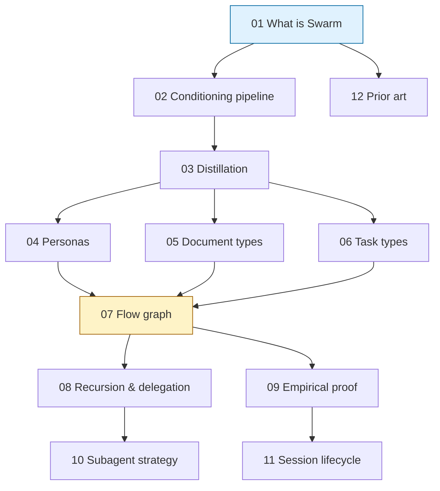

# 📚 Concepts

> The **why** of Swarm. These documents explain the framework's ideas, in the order a thoughtful reader would want to encounter them.

Each concept doc opens with a **TL;DR**, surfaces the essentials in the next section, and reserves depth for below. The 30-second skim, the 5-minute read, and the 30-minute deep dive all work — see [Principle: progressive disclosure](../PRINCIPLES.md).

---

## Reading order

---

## The list

| #   | Document                                                                       | What you'll learn                                                                       |
| --- | ------------------------------------------------------------------------------ | --------------------------------------------------------------------------------------- |
| 01  | [What is Swarm](01-what-is-swarm.md)                                           | The problem, the pitch, the framework/CLI distinction                                   |
| 02  | [The conditioning pipeline](02-conditioning-pipeline.md)                       | The central mechanism: source doc → task type → persona → conditioned task file         |
| 03  | [Distillation](03-distillation.md)                                             | The verbosity gradient and accountable distillation discipline                          |
| 04  | [Personas](04-personas.md)                                                     | Why mindsets, not roles. How they compose and hand off                                  |
| 05  | [Document types](05-document-types.md)                                         | The four core doc types and their epistemic stances                                     |
| 06  | [Task types](06-task-types.md)                                                 | The 18 task types and why each one earns its place                                      |
| 07  | [The flow graph](07-flow-graph.md)                                             | The deterministic mapping at the conceptual level (the operational table is in [reference](../reference/flow-graph.md)) |
| 08  | [Recursion and delegation](08-recursion-and-delegation.md)                     | The Lead Engineer pattern and the merge protocol                                        |
| 09  | [Empirical proof](09-empirical-proof.md)                                       | The Show-Don't-Tell discipline and the hard-gate Self-review                            |
| 10  | [Subagent strategy](10-subagent-strategy.md)                                   | Read-side parallelism, write-side single-threaded, and what it means for Swarm          |
| 11  | [Session lifecycle](11-session-lifecycle.md)                                   | What survives between sessions; how a fresh agent picks up where the last one left off  |
| 12  | [Prior art](12-prior-art.md)                                                   | How Swarm relates to Spec Kit, BMAD, Superpowers, Anthropic's research system, and AGENTS.md |
