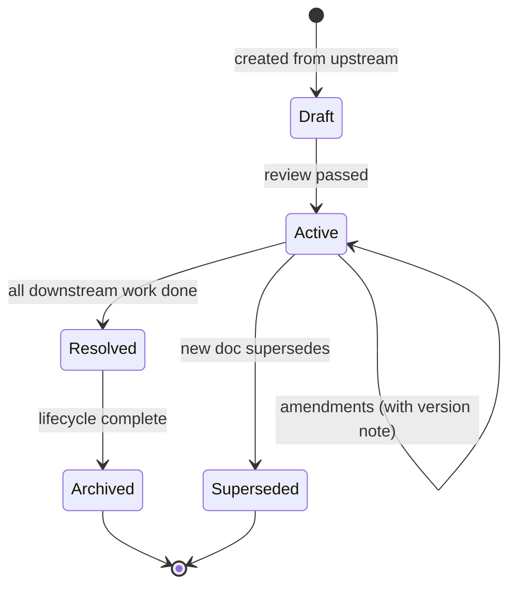

# 📄 Documents

> The four core source documents in Swarm — plus the extended catalogue of specialised variants. Each doc has a distinct *epistemic stance*; they cannot collapse into one another.

For the conceptual frame, see [`concepts/05-document-types.md`](../concepts/05-document-types.md).

---

## 🧭 The four core types

| Doc                                | Epistemic stance                | Spawns task type      | Authoring persona              |
| ---------------------------------- | ------------------------------- | --------------------- | ------------------------------ |
| [📜 spec.md](spec.md)              | Forward-looking, prescriptive   | `feature`             | The Architect                  |
| [📊 audit.md](audit.md)            | Present-looking, observational  | `refactor`            | The Auditor                    |
| [🐛 bug-report.md](bug-report.md)  | Past-looking, evidential        | `fix`                 | The Bug Hunter                 |
| [📚 research.md](research.md)      | Outward-looking, citational     | `spec-writing`        | The Researcher / The Surveyor  |

These four are the **canonical source documents**. Every project running Swarm should have all four directories under `.agents/`.

---

## 🛠️ Extended types

[Extended doc types](extended.md) are specialisations projects adopt when the structure earns its keep:

| Doc                  | Specialises                  | When                                                           |
| -------------------- | ---------------------------- | -------------------------------------------------------------- |
| **ADR**              | spec (decision-only)         | Architecturally significant decisions                         |
| **constitution.md**  | spec (project-wide)          | The project's non-negotiable baselines                         |
| **migration plan**   | spec (mechanical change)     | Large-scale API replacements                                   |
| **benchmark report** | audit (perf-specialised)     | Optimisation tasks needing a measured baseline                 |
| **cleanup list**     | audit (deletion-specialised) | Janitor's deletion-safe-to-prove list                          |
| **test plan**        | spec (test scope)            | Coverage projects too large for one task                       |
| **audit brief**      | spec (small, up-front)       | When the audit's scope needs declaring before audit-writing    |
| **research question** | spec (small, up-front)      | When the research's framing needs declaring before research-writing |
| **review scope**     | spec (small, up-front)       | When a review needs more context than fits in a task file      |

---

## 🧬 The shared base skeleton

All doc types share a base. Per-type templates extend it.

```markdown
# <Title>

## Context
Why this doc exists. The triggering ask. The audience.

## Linked docs
- Upstream sources
- Related documents

## <Type-specific main content>
(Different per doc type)

## Decisions
Significant choices made while writing this doc, with rationale.

## Open questions
- [ ] **[CRITICAL]** Questions that block downstream work
- [ ] **[MINOR]** Questions worth recording but not blocking

## Distillation Loss Statement
(For docs distilled from upstream — see concepts/03-distillation.md)
```

The base is documented at [`reference/document-base.md`](../reference/document-base.md).

---

## 🚦 Lifecycle



| Doc type        | Active until                                          | Then archived to                |
| --------------- | ----------------------------------------------------- | ------------------------------- |
| spec            | Feature ships                                          | `.agents/specs/shipped/`        |
| audit           | Every "Needed" closes                                  | `.agents/audits/resolved/`      |
| bug-report      | Fix ships + regression test exists                     | `.agents/bugs/closed/`          |
| research        | (born terminal — superseded by newer research)        | (left in place; no archive)     |

---

## 🚫 Forbidden compositions

The framework refuses:

- **A spec that contains current-state observations.** That's an audit. Split.
- **An audit that prescribes new behaviour.** That's a spec. Split.
- **A bug-report that fixes the bug.** Bug-report is a meta-task; the fix is downstream.
- **A research file that doubles as a spec.** The transition is `spec-writing` — separate task.
- **One doc with multiple `## Recommendation` sections covering different concerns.** Split.

These rules are enforced by [`skills/documentation-gatekeeper.md`](../skills/documentation-gatekeeper.md).

---

## 🛡️ Author / reviewer matrix

| Persona                  | Primary author of                        | Secondary reviewer of           |
| ------------------------ | ---------------------------------------- | ------------------------------- |
| The Architect            | spec, ADR, constitution                  | research                        |
| The Researcher           | research (technical)                     | ADR                             |
| The Surveyor             | research (UX/market)                     | spec                            |
| The Bug Hunter           | bug-report                               | audit                           |
| The Auditor              | audit, cleanup list                      | bug-report, constitution        |
| The Lead Engineer        | migration plan, orchestration tracker    | spec                            |
| The Performance Surgeon  | benchmark report                         | spec                            |
| The Test Author          | test plan                                | spec                            |
| The Skeptic              | review report                            | every code-producing branch     |

Full matrix: [`reference/compatibility-matrix.md`](../reference/compatibility-matrix.md).

---

## See also

- [`concepts/05-document-types.md`](../concepts/05-document-types.md) — the conceptual frame
- [`concepts/03-distillation.md`](../concepts/03-distillation.md) — how docs distil into one another
- [`reference/document-base.md`](../reference/document-base.md) — the shared skeleton
- [`skills/documentation-gatekeeper.md`](../skills/documentation-gatekeeper.md) — boundary enforcement
- [ADR 0001](../adrs/0001-four-doc-types.md) — why four
