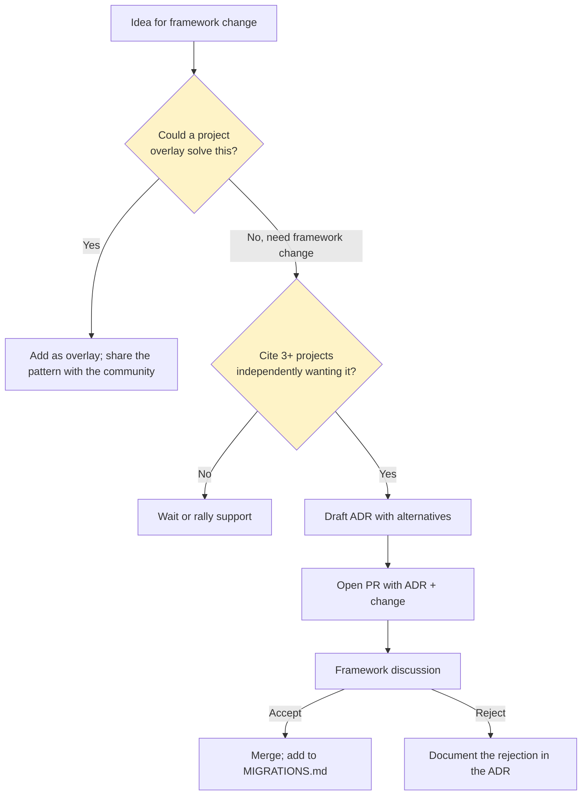

# 📒 Guide: Extending the framework

> The contributor's-eye view of how Swarm grows. New doc types, new task types, new personas, new placeholders. The conformance impact of each. The bar for accepting a proposal.

---

## ⚡ TL;DR

The framework grows slowly. Catalogue additions (new persona, new task type, new doc type) require evidence (3+ projects independently want it), an ADR (alternatives considered), and a migration path. Most needs are better served by *project-level overlays* than by framework changes.

---

## 🪞 The bar

Adding to the framework is harder than adding to your project. The framework's value is its *small, memorisable, deterministic surface*. Inflating the catalogue erodes that value.

Before proposing a framework addition:

1. **Try a project-level overlay first** ([`customizing-personas.md`](customizing-personas.md), [`writing-skills.md`](writing-skills.md)). If your need is local, an overlay is the right answer.
2. **Talk to other adopters.** If only your project needs the addition, it's not framework-shaped; it's project-shaped.
3. **Write an ADR draft** with the alternatives considered. The ADR is what shows the work.

The bar quantitatively: at least 3 independent projects (different teams, different stacks) must articulate the same need before a framework addition is on the table.

---

## ➕ Proposing a new persona

Process:

1. **Try the existing 13 first.** Spend 5+ sessions trying to make the work fit one of the framework personas. Often the existing persona, used properly, suffices.
2. **Try an overlay first.** If your project genuinely needs the new persona, add it as an overlay (per [`customizing-personas.md`](customizing-personas.md)). Use it for a few months.
3. **Cite multiple projects.** Your project + at least 2 others must independently want the same persona.
4. **Draft the ADR.** Use the ADR template ([`documents/extended.md`](../documents/extended.md#-adr)). The ADR enumerates the alternatives considered (folding into existing personas) and the reason they were rejected.
5. **Submit the proposal.** Open a PR with the ADR + the proposed persona profile.
6. **Conformance impact.** A new persona requires:
   - The persona profile in `docs/personas/<persona>.md`
   - Updates to `personas/README.md` (the catalogue)
   - Updates to `reference/compatibility-matrix.md`
   - Updates to `reference/flow-graph.md` (which task types route here)
   - An entry in `MIGRATIONS.md` (with a note for adopters)

---

## ➕ Proposing a new task type

Process:

1. **Try folding into an existing task type.** New task types collapse into existing ones surprisingly often (see the "task types we considered and rejected" list in [`concepts/06-task-types.md`](../concepts/06-task-types.md)).
2. **Cite ubiquity.** "Agents do this all the time across many projects." Vague handwaves don't qualify.
3. **Draft the ADR** with alternatives.
4. **Conformance impact.** A new task type requires:
   - A page at `docs/tasks/<type>.md`
   - A template at `scaffold/.agents/templates/task-<type>.md` (in implementing CLIs)
   - Updates to `concepts/06-task-types.md` (the conceptual catalogue)
   - Updates to `reference/flow-graph.md` (the routing table)
   - Updates to `reference/compatibility-matrix.md`
   - An entry in `MIGRATIONS.md`

---

## ➕ Proposing a new doc type

The bar for new doc types is *very* high. Four core types capture the four epistemic stances; new doc types either repeat an existing stance (fold into existing) or invent a new stance (which is a major change).

Process:

1. **Identify the epistemic stance.** Forward-looking-prescriptive (spec)? Present-looking-observational (audit)? Past-looking-evidential (bug-report)? Outward-looking-citational (research)? If your proposed type matches one of the four, fold into it.
2. **Try an *extended* type first.** ADR, constitution, migration plan, benchmark report, cleanup list, test plan, audit brief, research question, review scope — these are specialisations of the four. If your need fits as an extended type, it doesn't need a new core type.
3. **Cite the new epistemic stance.** A genuinely new doc type captures a kind of claim the four don't.
4. **Draft the ADR with alternatives.** This will be a substantial ADR.
5. **Conformance impact.** A new doc type requires updates throughout — concepts, documents, tasks (which task types spawn from it), reference matrices.

In practice, the framework expects to graduate at most one new core doc type in the next several years. Most needs are met by extended types.

---

## ➕ Proposing a new placeholder

Smaller change; lower bar.

Process:

1. **Check the existing catalogue** ([`reference/template-placeholders.md`](../reference/template-placeholders.md)). Often the need is met by an existing slot.
2. **Check the reserved namespaces.** If you're a CLI vendor or a project, prefix with your namespace (`<vendor>:<name>` or `project:<name>`) and you don't need framework approval.
3. **For framework-namespace placeholders** (no prefix or `cmd*`), open an ADR proposing the addition. The ADR cites use cases and confirms the placeholder doesn't collide with existing semantics.
4. **Conformance impact.** A new placeholder requires:
   - Updates to `reference/template-placeholders.md`
   - Updates to any task templates that should use it
   - An entry in `MIGRATIONS.md`

---

## ➕ Proposing a new cross-cutting skill

Cross-cutting skills are the framework's standing disciplines (`manage-task`, `documentation-gatekeeper`, etc.). A new one is a major change.

Process:

1. **Try writing it as a project-level skill first.** Most "cross-cutting" needs are project-cross-cutting, not framework-cross-cutting.
2. **Cite the framework-level discipline.** A new cross-cutting skill captures a discipline that *every project* should have, regardless of stack or domain.
3. **Draft the ADR with alternatives.** Why isn't this discipline already covered by the existing 6?
4. **Conformance impact.** A new cross-cutting skill requires:
   - The skill at `docs/skills/<name>.md`
   - Updates to relevant persona profiles (which now reference it)
   - Updates to relevant task templates (which now auto-load it)
   - Updates to `reference/flow-graph.md`
   - An entry in `MIGRATIONS.md`

---

## 🪞 Proposing changes to existing artefacts

Changes to existing personas / task types / doc types / skills / placeholders also require ADRs (the existing ADR is amended or superseded). Changes are categorised by impact:

| Change                                                            | Impact level                                       |
| ----------------------------------------------------------------- | -------------------------------------------------- |
| Adding a section to a persona profile                             | Minor — adopters update at their own pace         |
| Adding a hard constraint to a persona profile                     | Major — may break in-flight tasks                 |
| Tightening the routing for a task type                            | Major — adopters with overrides must check        |
| Renaming a placeholder                                            | Major — adopters must update their AGENTS.md      |
| Adding a verification gate slot                                   | Minor — adopters add the binding when they need it |
| Removing a verification gate slot                                 | Major — adopters must migrate                     |
| Updating a worked example                                         | Patch — no adopter action needed                  |

Major changes always include a migration path in `MIGRATIONS.md`.

---

## 🪜 The proposal flow

---

## 🪞 Examples of changes the framework has accepted

(Hypothetical examples; serves as a calibration for the bar.)

- **Add `[CRITICAL]` / `[MINOR]` open-question markers** — a small change; affects all doc types; ADR cites usage across multiple frameworks (Spec Kit, BMAD).
- **Adopt the AGENTS.md open standard** — moderate change; ADR cites cross-tool portability; most adopters simply rename their existing entry-point file.
- **Adopt the iron-law + red-flags pattern in persona profiles** — moderate change; ADR cites Superpowers's adoption; existing personas updated; adopters update at their own pace.

---

## 🚫 Examples of changes the framework has *not* accepted

- **Add a "Deployer" persona** — folds into Builder + Migrator; not a distinct mindset.
- **Add a `code → spec` flow** — violates the unidirectional-distillation principle.
- **Add a runtime / TUI / executable** — violates [Principle 1](../PRINCIPLES.md#1--documentation-first-not-tooling-first).
- **Bake `pnpm` into the templates** — violates [Principle 2](../PRINCIPLES.md#2--language--and-runtime-agnostic-at-the-framework-level).

---

## 🪞 Versioning and migration

The framework uses semver:

- **Major** — scaffold-breaking changes (new required template; renamed persona; removed placeholder). Adopters must follow the `MIGRATIONS.md` for the version.
- **Minor** — additive changes (new optional doc type; new persona overlay graduated to canonical; new placeholder).
- **Patch** — clarifications, examples, typo fixes; no adopter action needed.

Every release that touches the scaffold (templates, persona profiles, skill files) gets a `MIGRATIONS.md` entry detailing what changed and what the adopter should do.

See [ADR 0015](../adrs/0015-versioning-scheme.md).

---

## 🛠️ The conformance checker (when it ships)

A future addition: a conformance checker that validates a project against the framework's structural rules. Adding to the framework includes adding rules to the checker. New rule = new check + a fixture demonstrating violation + the failure message.

---

## See also

- [`PRINCIPLES.md`](../PRINCIPLES.md) — the load-bearing constraints
- [`NON-GOALS.md`](../NON-GOALS.md) — what's out of scope
- [`adrs/`](../adrs/) — the design decisions the framework is built on
- [`MIGRATIONS.md`](../../MIGRATIONS.md) — adopter migration path per release
- [`customizing-personas.md`](customizing-personas.md) — the project-level alternative
- [`writing-skills.md`](writing-skills.md) — the skill-level alternative
