# 📒 Guide: Session resumption

> Picking up where the last session left off. The task file is the resumption record. The discipline that makes resumption work is *updating Next steps before stopping*.

---

## ⚡ TL;DR

A session can end mid-task — context window fills, human pauses, model session times out. The next session starts from scratch in terms of model context, but the task file is the **complete resumption record**. A fresh agent reading the task file is in the same epistemic position as the previous agent at the moment they stopped.

---

## 🪜 Before you stop

The agent's *last action* before ending a session is to update `## Next steps`. This is enforced by the [`manage-task`](../skills/manage-task.md) skill's pre-pause hook.

A good `## Next steps` entry includes:

1. **What's done so far** (cite the Progress checklist state)
2. **What's the next concrete action**
3. **Any verification commands that need re-running** to confirm worktree state matches what the previous session reported
4. **Any open `[pending]` assumptions** the next session needs to resolve
5. **Any blockers** that prevent immediate progress

---

## 🪞 Worked example

A Janitor is on batch 3 of 6 in a refactor. Context is filling up; the agent decides to pause.

The agent's last actions:

```markdown
## Progress checklist

- [x] Audit read in full
- [x] Before/after state filled in
- [x] Shim contracts identified and documented
- [x] Refactor batch 1
- [x] `pnpm validate-deps` after batch 1 (output pasted above)
- [x] Refactor batch 2
- [x] `pnpm validate-deps` after batch 2 (output pasted above)
- [ ] Refactor batch 3 ← **in progress; 4 of 12 files done**
- [ ] (per batch …)
- [ ] Final `pnpm validate-deps` clean

## Next steps

- **Resume at batch 3, file 5 of 12.** Files 1-4 (`src/auth/middleware/{auth,session,csrf,oauth}.ts`) are done; the rest of batch 3 is in `src/auth/middleware/` plus `src/auth/utils/`.

- **First action on resume:** Run `pnpm validate-deps` to confirm the worktree state matches the last paste above. If output diverges, investigate the discrepancy before continuing.

- After completing batch 3 (all 12 files), run `pnpm validate-deps` and paste output as the new batch-3 checkpoint.

- Continue with batch 4: `src/api/legacy/auth.ts` and 9 others (full list in the audit at `.agents/audits/auth-legacy.md` §4.2).

- Open `[pending]` assumption: "the `legacyTokenAdapter` shim can be removed in batch 6" — verify by `git grep -n 'legacyTokenAdapter' src/` before deletion. If any callers remain, do not remove; promote to follow-up cleanup task.

- The audit's findings #1, #2, #4 are addressed in the work so far; #3 is deferred to a separate cleanup task per `## Decisions` (see entry from yyyy-mm-dd).
```

A fresh agent reading this can resume *exactly* where the previous one stopped.

---

## 🪜 The fresh agent's first actions

When a fresh session starts in an existing worktree (status `active`):

1. **Read the task file.** This is the standing convention from AGENTS.md.
2. **Re-adopt the persona.** Load the persona profile named in the `> **PERSONA:**` blockquote.
3. **Read the linked source docs** in full. Don't trust the previous session's summarisation; read the docs.
4. **Read `## Decisions`, `## Findings`, `## Assumptions`, `## Next steps`** in that order.
5. **Re-run any verification commands `## Next steps` flags.** Confirm the worktree state matches what the previous session claimed.
6. **Continue from the next concrete action** in `## Next steps`.

The fresh agent does *not*:

- Re-investigate areas the previous session already documented
- Re-make decisions the previous session recorded in `## Decisions`
- Skip the verification re-run (the worktree could have been changed by external action — git pull, manual edits, etc.)

---

## 🪜 What the framework gets right

The framework provides a *resumption record*. It does not solve:

- **Context-window overflow during a single session.** When the model's context fills mid-session, the model has to summarise or drop earlier content. The framework can't prevent this; it provides a *resumption point* if the agent has to restart.
- **Cross-worktree state.** Two parallel worktrees don't share state. The Lead Engineer's task file is the cross-worktree coordination point.
- **Cross-project memory.** A finding in project A doesn't apply to project B automatically.

These are real limits. The framework is honest about them — see [`NON-GOALS.md`](../NON-GOALS.md).

---

## ⚠️ Common resumption pitfalls

| Pitfall                                                                            | Fix                                                                |
| ---------------------------------------------------------------------------------- | ------------------------------------------------------------------ |
| Previous session ended without updating `## Next steps`                           | The pre-pause hook in `manage-task` enforces this; check that it fired |
| Fresh agent skips reading the linked source docs ("the previous agent summarised") | Re-read in full; summarisation isn't the source                   |
| Fresh agent doesn't re-run verification commands                                   | Worktree state is presumed-stale until verified                    |
| Previous session left `[pending]` assumptions unresolved                           | Resolve or surface as a blocker in the new session                 |
| Fresh agent re-discovers a finding the previous session already documented         | Read `## Findings` first; don't re-investigate                    |
| Worktree was force-pushed or rebased between sessions                              | The fresh agent's `git status` and `git log` quickly reveal this; investigate before continuing |

---

## 🪞 The lifecycle in one diagram

```mermaid
stateDiagram-v2
    [*] --> Scaffolded
    Scaffolded --> Active: agent reads file + adopts persona
    Active --> Paused: session ends mid-task (Next steps updated)
    Paused --> Active: fresh agent reads file
    Active --> SelfReview: agent declares work complete
    SelfReview --> Done: hard gate passes; findings promoted
    Done --> [*]
```



The Active ↔ Paused transition is the resumption pattern. The framework's discipline is what makes it work.

---

## See also

- [`concepts/11-session-lifecycle.md`](../concepts/11-session-lifecycle.md) — the full lifecycle in detail
- [`skills/manage-task.md`](../skills/manage-task.md) — the skill that owns this discipline
- [`reference/task-base.md`](../reference/task-base.md) — the resumption-record sections (`## Decisions`, `## Findings`, `## Assumptions`, `## Next steps`, `## Self-review`)
- [`tasks/`](../tasks/) — every task template embeds the resumption structure
