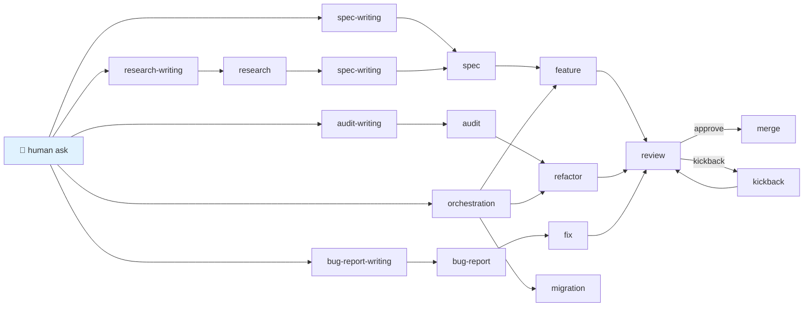

# 📋 Tasks

> The 18 task types in Swarm. Each task type has a default lead persona, an attached skill set, named verification gate slots, and a template. Each one earns its place by being something agents do *constantly* across projects, languages, and stacks.

For the conceptual frame, see [`concepts/06-task-types.md`](../concepts/06-task-types.md).

---

## ⚡ TL;DR

Pick a source document and the framework picks the task type. Pick a task type and the framework picks the persona. The agent reads one conditioned task file and proceeds. There are 18 types in three families — implementation, authoring, process.

---

## 🗂️ The catalogue

### 💻 Implementation tasks (output: code or merged change)

| Task                                  | Lead persona              | Source doc                                   |
| ------------------------------------- | ------------------------- | -------------------------------------------- |
| [feature](feature.md)                 | The Builder               | spec                                         |
| [fix](fix.md)                         | The Skeptic               | bug-report                                   |
| [refactor](refactor.md)               | The Janitor               | audit                                        |
| [rewrite](rewrite.md)                 | The Builder               | spec (with explicit behaviour delta)         |
| [migration](migration.md)             | The Migrator              | migration plan / spec                        |
| [upgrade](upgrade.md)                 | The Migrator              | migration plan                               |
| [performance](performance.md)         | The Performance Surgeon   | benchmark report / spec / audit              |
| [testing](testing.md)                 | The Test Author           | spec / audit / bug-report                    |
| [integration](integration.md)         | The Builder               | spec (SDK / API / MCP wiring)                |
| [kickback](kickback.md)               | (original persona)        | original source + Skeptic notes              |

### ✍️ Authoring tasks (output: a source document)

| Task                                              | Lead persona               | Source doc                    |
| ------------------------------------------------- | -------------------------- | ----------------------------- |
| [spec-writing](spec-writing.md)                   | The Architect              | research / audit (optional)   |
| [audit-writing](audit-writing.md)                 | The Auditor                | audit brief / human ask       |
| [research-writing](research-writing.md)           | The Researcher / Surveyor  | research question / human ask |
| [bug-report-writing](bug-report-writing.md)       | The Bug Hunter             | human ask / agent observation |

### 🔁 Process tasks (output: decision, review, coordination, doc)

| Task                                          | Lead persona             | Source doc                            |
| --------------------------------------------- | ------------------------ | ------------------------------------- |
| [review](review.md)                           | The Skeptic              | another agent's branch                |
| [deepen-audit](deepen-audit.md)               | The Skeptic              | existing audit                        |
| [orchestration](orchestration.md)             | The Lead Engineer        | multiple source docs                  |
| [documentation](documentation.md)             | The Documentarian        | spec / audit / task scope             |

---

## 🧬 The shared task skeleton

All 18 task types extend a common base — see [`reference/task-base.md`](../reference/task-base.md) for the full skeleton. Every template includes:

- **Metadata** (slug, branch, persona, source, gates)
- **Objective** (one paragraph)
- **Linked docs**
- **Required skills**
- **Constraints**
- **Plan**
- **Progress checklist**
- **Decisions / Findings / Assumptions / Blockers**
- **Validation gates** (with `[Paste output]` placeholders)
- **Self-review** (HARD GATE)
- **Next steps**

Type-specific templates add sections — e.g., `<behavior_delta>` in rewrite, `<wave_plan>` in migration, `<worker_tracker>` in orchestration.

---

## 🚦 The flow graph (how task types route)

Full operational tables: [`reference/flow-graph.md`](../reference/flow-graph.md).

---

## 📐 The persona × task matrix

| Task                         | Lead persona                    | Secondary (handoff)                   |
| ---------------------------- | ------------------------------- | ------------------------------------- |
| feature                      | 🟦 The Builder                  | 🟥 The Skeptic                        |
| fix                          | 🟥 The Skeptic                  | (kickback returns to original)        |
| refactor                     | 🟫 The Janitor                  | 🟥 The Skeptic                        |
| rewrite                      | 🟦 The Builder                  | 🟥 The Skeptic                        |
| migration                    | 🟫 The Migrator                 | 🟥 The Skeptic (per wave)             |
| upgrade                      | 🟫 The Migrator                 | 🟥 The Skeptic (per wave)             |
| performance                  | 🟨 The Performance Surgeon      | 🟥 The Skeptic                        |
| testing                      | 🟩 The Test Author              | 🟥 The Skeptic                        |
| integration                  | 🟦 The Builder                  | 🟥 The Skeptic                        |
| kickback                     | (original persona)              | 🟥 The Skeptic (re-review)            |
| spec-writing                 | 🟪 The Architect                | —                                     |
| research-writing (technical) | 🟩 The Researcher               | —                                     |
| research-writing (UX/market) | 🟩 The Surveyor                 | —                                     |
| audit-writing                | 🟦 The Auditor                  | —                                     |
| bug-report-writing           | 🟥 The Bug Hunter               | —                                     |
| review                       | 🟥 The Skeptic                  | —                                     |
| deepen-audit                 | 🟥 The Skeptic                  | —                                     |
| orchestration                | 🟧 The Lead Engineer            | 🟥 The Skeptic (merge-gate)           |
| documentation                | 🟦 The Documentarian            | 🟥 The Skeptic                        |

---

## 🛠️ Auto-loaded skills per task type

Two skills always: `manage-task` and `documentation-gatekeeper`. Plus:

| Task type          | Additional skills                                           |
| ------------------ | ----------------------------------------------------------- |
| feature            | `write-feature`, `empirical-proof`                          |
| fix                | `write-fix`, `adversarial-review`, `empirical-proof`        |
| refactor           | `write-refactor`, `empirical-proof`                         |
| rewrite            | `write-rewrite`, `empirical-proof`                          |
| spec-writing       | `write-spec`, `distillation-discipline`                     |
| research-writing   | `write-research`, `distillation-discipline`                 |
| audit-writing      | `write-audit`, `adversarial-review`                         |
| bug-report-writing | `write-bug-report`, `adversarial-review`, `empirical-proof` |
| migration          | `write-refactor` (overlap), `empirical-proof`               |
| performance        | `empirical-proof`                                           |
| testing            | `empirical-proof`                                           |
| documentation      | `distillation-discipline`, `empirical-proof`                |
| review             | `adversarial-review`, `empirical-proof`                     |
| deepen-audit       | `write-audit`, `adversarial-review`, `empirical-proof`      |
| orchestration      | `adversarial-review`, `empirical-proof`                     |

Project-specific skills attach in addition based on description-matching.

---

## See also

- [`concepts/06-task-types.md`](../concepts/06-task-types.md) — the conceptual frame
- [`reference/flow-graph.md`](../reference/flow-graph.md) — the routing tables
- [`reference/task-base.md`](../reference/task-base.md) — the shared skeleton
- [`reference/template-placeholders.md`](../reference/template-placeholders.md) — what `{{cmdX}}` and `{{slug}}` mean
- [`personas/`](../personas/) — the per-persona pages
