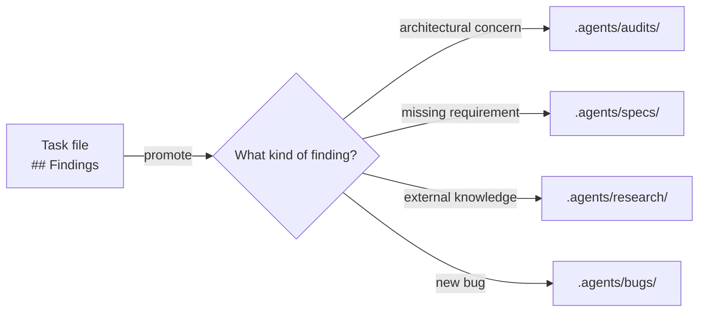

# 01 · The documentation-first workflow

> **TL;DR.** Before any code changes, the agent reads its **task file** at `.agents/tasks/<slug>.md`. The task file may name a suggested persona, lists the skills worth loading, links the source doc, and binds the verification commands. Everything that follows — implementation, validation, self-review — is conditioned by what's in that one file. **The task is the source of truth; source documents ground it.**

---

## The five-step shape of every session

1. **Read the task file.** It exists *before* the agent starts work; the launcher (the Swarm CLI or any compatible tool) scaffolds it from the source document. Reading the task file first is the standing convention in `AGENTS.md`.
2. **Load the skills the work needs.** Each skill in `.agents/skills/` carries a directive `description`; load the ones whose triggers match the task in front of you. There is **no always-loaded skill** — discipline is pulled in on demand. If the task file names a suggested persona in its `> **PERSONA:**` blockquote, load `persona-<slug>/SKILL.md` when one of the eight persona skills fits; otherwise the matching workflow skill (e.g. `write-feature` for a Builder, `write-bug-report` for a Bug Hunter) carries that mindset. The persona's hard constraints supersede default helpfulness for the entire session.
3. **Read the source doc** in `## Linked docs`. This is the spec / audit / bug-report / research that grounds the task. If it's missing, the task is mis-scoped — surface as a `## Blocker`.
4. **Plan, then act.** Fill in `## Plan` before implementation begins. Update `## Progress checklist`, `## Decisions`, `## Findings` as you go. Run periodic verification gates and paste outputs.
5. **Self-review hard gate.** At task close, every question in `## Self-review` has a written answer; every `[Paste output]` placeholder is filled with verbatim verification output. Promote durable findings upstream. Mark `status: done`.

---

## No always-loaded skill — the task file carries the discipline

Earlier versions of this framework shipped two skills that loaded on every session. They are gone. Their discipline did not disappear; it moved into structures that are always present anyway:

- **Task-file lifecycle and promotion discipline** (formerly the `manage-task` skill) now lives in the **task file's own structure**. The shared skeleton (`.agents/templates/task-base.md`) and the per-type task templates encode pre-flight metadata, in-flight maintenance, and the pre-close gate. The `## Self-review` hard gate and the `## Findings` → promotion step are sections of the task file itself, not a separate skill that has to be loaded to fire.
- **Flow-graph routing and forbidden-flow rules** (formerly the `documentation-gatekeeper` skill) are now **recommended-routing documentation** (`05-flow-graph.md`), not an enforced gatekeeper. They describe the conditioning model a launcher *may* apply deterministically and that the directive skill `description`s reproduce in-session. They are guidance, not a refusal mechanism.

The agent reads its task file first (per `AGENTS.md`), then loads the skills whose `description`s match the work. Nothing loads unconditionally.

---

## Documentation-first means *which document* matters

The four core source-doc types map to four epistemic stances (see `02-file-types.md`):

| Source doc      | Epistemic stance                | Spawns task type    |
| --------------- | ------------------------------- | ------------------- |
| `spec.md`       | Forward-looking, prescriptive   | `feature`           |
| `audit.md`      | Present-looking, observational  | `refactor`          |
| `bug-report.md` | Past-looking, evidential        | `fix`               |
| `research.md`   | Outward-looking, citational     | `spec-writing`      |

Picking the wrong source-doc type for the work means the wrong task type, the wrong suggested persona, and the wrong validation gates. When a doc is unclear (e.g., a spec that contains too much current-state observation), the recommended response is explicit reclassification rather than guessing — the launcher or the agent asks before proceeding.

---

## Distillation flows downhill only

Information moves from broad/external (research) to narrow/actionable (task) to terminal output (code, docs):

```
research → spec/audit/bug-report → task → code/docs
```

**Reverse flow is the anti-pattern.** Specifically:

- ❌ Implementing directly from research (skipping the spec) — research is *input*; spec is *contract*.
- ❌ Back-filling a spec from finished code — specs are forward-looking. The right artefact for "what was built" is documentation.
- ❌ Leaving durable findings only in the task file — task files are gitignored; durable findings get *promoted* to audits/specs/research before close.

These are recommended-routing rules (`05-flow-graph.md`), reproduced in the directive skill `description`s. They are the framework's conditioning model, not a gatekeeper that refuses you.

---

## Promotion: the upstream protocol

When a task discovers something durable — an architectural concern, a missing requirement, a hidden bug — the agent **promotes** the finding upstream before the task closes:



The task file is gitignored (`.agents/tasks/` is in your `.gitignore`). Anything captured only in the task file is lost when the worktree is deleted. Promotion is the discipline that prevents loss.

---

## Empirical proof, every time

Every Self-review section is a **hard gate**. Every claim is backed by **pasted command output** — verbatim, the actual lines from the actual run. Paraphrase is not proof.

```markdown
- `{{cmdValidate}}` (last 2 lines):
  ```
  ✓ 247 files passed
  Done in 12.4s
  ```
```

Bad:

```markdown
- `{{cmdValidate}}` (last 2 lines): All checks passed ✅
```

The cost of pasting two lines is trivial. The cost of trusting an unverified claim compounds. See `04-standards.md` for the full Show-Don't-Tell discipline.

---

## Trivial vs structured tasks

The framework allows trivial tasks (a one-line doc fix, a typo, a tiny test addition) to be launched from a **task scope** alone — a one-paragraph capture in the task file's `## Objective` — with no separate source doc.

The threshold is judgement-based:

- **Has structured content** (lists of items, repro steps, target metrics, acceptance criteria) → needs a separate source doc
- **Is a paragraph of prose** → task scope is enough

When in doubt, write the source doc. The cost of structure is small; the cost of ambiguity compounds.

---

## See also

- `02-file-types.md` — what each document type contains
- `03-workflow.md` — step-by-step session flow
- `04-standards.md` — writing and execution standards
- `05-flow-graph.md` — the recommended routing graph
- `.agents/templates/task-base.md` — the shared task skeleton that carries lifecycle and promotion discipline
- `.agents/skills/empirical-proof/SKILL.md` — the Show-Don't-Tell proof discipline
- `.agents/skills/` — the shipped skills (7 of the 13 persona mindsets ship as `persona-*` skills; the rest are carried by the matching workflow skill)
