# 03 · Step-by-step session flow

> **TL;DR.** A session has five stages: scaffolded → active → (paused if interrupted) → self-review → done (or kicked-back / abandoned). The task file is updated at every stage; it's the resumption record across sessions.

---

## The lifecycle

```mermaid
stateDiagram-v2
    [*] --> Scaffolded: launcher creates conditioned task file
    Scaffolded --> Active: agent reads file + adopts persona
    Active --> Active: work proceeds, checkpoints fire
    Active --> Paused: session ends mid-task
    Paused --> Active: fresh session resumes from task file
    Active --> SelfReview: agent declares work complete
    SelfReview --> Active: hard gate fails (claim unsupported)
    SelfReview --> Done: hard gate passes; durable findings promoted
    SelfReview --> KickedBack: Skeptic review fails (separate task)
    Active --> Abandoned: blocker is unresolvable
    Done --> [*]: worktree closed
    KickedBack --> [*]: handed off
    Abandoned --> [*]: documented + closed
```



---

## Stage 1: Scaffolded

The launcher creates `.agents/tasks/{{slug}}.md`. By the time the agent sees it:

- Metadata is filled in (slug, branch, base, worktree, created, status `active`)
- Persona is named in the `> **PERSONA:**` blockquote
- Source doc(s) are linked
- Required skills list is populated
- Verification gate slots are bound to project commands (per AGENTS.md)
- Constraints include the persona's forbidden actions
- Self-review checklist is pre-written with empty answer slots

The task file is **the agent's first read**. No separate prompt, no separate config.

---

## Stage 2: Active

The agent works. The framework's expectations:

| Expectation                    | What it looks like                                                              |
| ------------------------------ | ------------------------------------------------------------------------------- |
| **Plan first**                 | Fill in `## Plan` before implementation                                         |
| **Update progress**            | Mark items in `## Progress checklist` as they complete                          |
| **Record decisions**           | Significant choices in `## Decisions` with rationale                            |
| **Capture findings**           | Codebase discoveries in `## Findings` (and *promote* durable ones)             |
| **Surface assumptions**        | Mark `[pending]` initially; promote to `[confirmed]` when verified              |
| **Surface blockers**           | Anything preventing confident progress in `## Blockers` *immediately*           |
| **Run gates at checkpoints**   | Periodic verifications fire as the work proceeds; outputs paste into Self-review |

The task file evolves continuously. By design, the file at any moment is a complete resumption record.

---

## Stage 3: Paused (between sessions)

A session can end mid-task. The agent's *last action* before stopping is to update `## Next steps`:

```markdown
## Next steps

- **What's done so far:** (cite the Progress checklist state)
- **First action on resume:** Run `{{cmdValidate}}` to confirm worktree state matches the last paste in `## Self-review`. If divergent, investigate before continuing.
- **Next concrete action:** (e.g., "continue with batch 4: src/auth/middleware/")
- **Open `[pending]` assumptions:** (anything not yet resolved)
- **Blockers:** (anything that prevents immediate progress)
```

A fresh agent reading this can resume *exactly* where the previous session stopped.

---

## Stage 4: Self-review (the hard gate)

The agent declares work complete. Self-review becomes the gate:

1. **Read the persona's Self-review questions** (in the task template).
2. **Write answers** below each question.
3. **Paste verification outputs** verbatim in `### Verification outputs`.
4. **Promote durable findings** upstream (to audits/specs/research/bug-reports). The `manage-task` skill checks this.
5. **Verify all gates satisfied** — every question answered, every output pasted, every `[pending]` resolved or surfaced.

If any gate fails, the agent returns to Active until the gate can be satisfied.

Three terminal outcomes:

| Outcome      | What it means                                                                                  |
| ------------ | ---------------------------------------------------------------------------------------------- |
| **Done**     | Self-review answered fully; durable findings promoted; status updated to `done`                |
| **Kicked-back** | Self-review surfaces a blocker requiring different scope/persona; new task spawned          |
| **Abandoned** | The task is unsalvageable; recorded in `## Decisions` with rationale; status `abandoned`     |

---

## Stage 5: Terminal (worktree closed)

After Self-review passes:

1. **Promote durable findings** (the pre-close gate enforces this)
2. **Hand off to downstream** — most code-producing tasks hand off to a Skeptic review task
3. **Close the worktree** — branch merged (or kicked back, or abandoned), worktree removed, gitignored task file deleted

---

## The fresh agent's first actions (when resuming a paused task)

When a fresh session starts in an existing worktree (status `active`):

1. **Read the task file.** Standing convention from AGENTS.md.
2. **Re-adopt the persona.** Load `.agents/skills/personas/SKILL.md` and the named persona profile.
3. **Read the linked source docs in full.** Don't trust the previous session's summarisation.
4. **Read `## Decisions`, `## Findings`, `## Assumptions`, `## Next steps`** in that order.
5. **Re-run any verification commands** `## Next steps` flags. Confirm worktree state matches.
6. **Continue from the next concrete action** in `## Next steps`.

The fresh agent does *not*:

- Re-investigate areas the previous session already documented
- Re-make decisions the previous session recorded in `## Decisions`
- Skip the verification re-run

---

## What the framework does *not* solve

- **Context-window overflow during a single session.** When the model's context fills mid-session, the model has to summarise or drop. The framework provides a *resumption point* if the agent has to restart.
- **Cross-worktree state.** Two parallel worktrees don't share state. The Lead Engineer's task file is the cross-worktree coordination point.
- **Cross-project memory.** A finding in project A doesn't apply to project B automatically.

These are real limits. The framework is honest about them.

---

## See also

- `01-process.md` — the documentation-first workflow
- `02-file-types.md` — what each document type contains
- `04-standards.md` — writing and execution standards
- `05-flow-graph.md` — the deterministic routing graph
- `.agents/skills/manage-task/SKILL.md` — the lifecycle-managing skill
- `.agents/templates/task-base.md` — the shared task skeleton
